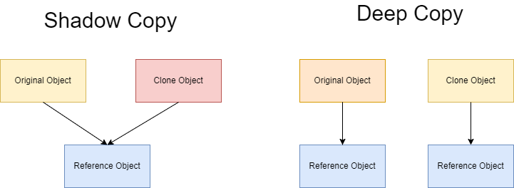

# Essential C++ Notes

> 第一次阅读：
>
> 第二次阅读：2023.4.6


## 第一章 C++编程基础

### 1.1 编写C++程序

```c++
using namespace std;
```

**std是标准库所在的命名空间的名称**。

> 在C++中，命名空间(namespace)是一种避免名称冲突的机制。标准库std是一个常用的命名空间，其中定义了很多常用的函数和对象。为了方便使用这些函数和对象，可以使用`using namespace std;`语句来引入整个std命名空间。

[using namespace std详解](https://blog.csdn.net/quyafeng2011/article/details/68921750)

标准库提供任何事物（诸如string class以及cin、cout这两个iostream类对象）被封装在命名空间std内。

**所谓命名空间（namespace）是一种将库名称封装起来的方法。**通过这种方法，可以避免和应用程序命名发生冲突的问题（所谓命名冲突是指在应用程序内两个不同实体[entity]具有相同名称，导致程序无法区分二者。命名冲突发生时，程序必须等到该命名冲突获得解析[resolve]之后，才继续执行）。命名空间像是在众多名称的可见范围之间竖起的一道道围墙。

如果要在程序中使用string class以及cin、cout这两个iostream对象，我们不仅需要包括`<string>`及`<iostream>`头文件，还得让命名空间std内的名称曝光。而所谓的using directive: 

```c++
using namespace std
```

就是将命名空间的名称曝光的最简单方法。


### 1.2 对象的定义和初始化

构造函数语法（constructor syntax）

```c++
int count(0);		//等价于int count = 0;
```

**模板类**（template class）允许我们在“不必指明data member类型”的情况下定义类。

模板类机制使程序员得以直到使用template class时才决定真正的数据类型。程序员可以先插入一个代名，稍后再绑定实际的数据类型。


### 1.3 撰写表达式

略


### 1.4 条件语句和循环语句

略


### 1.5 如何运用array和vector

array数组，在定义时数组容量必须是一个常量const类型

```c++
elemtype array_name[size];

int nums[] = {1, 2, 3, 4, 5};	//数组初始化
```

对于vector是一个模板类，在使用时需要支出对应的元素类型

```c++
vector<ElemType> vec;

vector<int> vec(nums, nums + 5);	//对于vector不支持使用数组的方式来初始化列表，但是可以利用数组初始化vector
```

在C++11中可以利用:和for_each来遍历

```c++
void display(int x){
    cout << x << " ";
}

int main(){
    int nums[] = {1, 2, 3, 4, 5};
    vector<int> vec(nums, nums + 5);

    for (int i : nums)  cout << i << " ";		//Output : 1 2 3 4 5 
    cout << endl;

    for_each(vec.begin(), vec.end(), display);	//Output : 1 2 3 4 5 
    cout << endl;

    return 0;
}
```


### 1.6 指针带来的弹性 ❤

> [指针和自由空间.md](C:\Users\hp-pc\Desktop\C++\指针和自由空间.md)

**指针实际上就是地址，&取地址操作，*提领 解引用（取值，取得“位于该指针所指内存地址上”的对象）**

一个未指向任何对象的指针，其地址值为0，称为null空指针。

```c++
type_of_object_pointed_to * name_of_pointer_object;
//指针的形式，需要指向的类型  指针变量名

vector<int> *pv;	//一个指向“元素类型为int”的vector指针

//指针在调用之前可能未指向任何对象，需要先检验pv的值是否为0
pv && *pv
```

利用`vector<int>*`来访问不同的vector

利用数组初始化vector			`vector<int> nums(arr, arr + n);`

```c++
#include <iostream>
#include <string>
#include <vector>
using namespace std;

const int seq_size = 18;
int elem_seq[seq_size] = {
	1, 2, 3,	//Fibonacci
	3, 4, 7,	//Lucas
	2, 5, 12,	//Pell
	3, 6, 10,	//Triangular
	4, 9, 16,	//Square
	5, 12, 22	//Pentagonal
};

vector<int> Fibonacci(elem_seq, elem_seq+3), Lucas(elem_seq+3, elem_seq+6), Pell(elem_seq+6, elem_seq+9),
Triangular(elem_seq+9, elem_seq+12), Square(elem_seq+12, elem_seq+15), Pentagonal(elem_seq+15, elem_seq+18);//数列的初始化

const int max_seq = 6;
string seq_names[max_seq] = {   //数列名
    "Fibonacci",
    "Lucas",
    "Pell",
    "Triangular",
    "Square",
    "Pentagonal"
};

vector<int>* seq_addrs[max_seq] = {		//seq_addr是一个数组，每一个数组元素是一个vector<int>指针
    &Fibonacci, &Lucas, &Pell,
    &Triangular, &Square, &Pentagonal
};

int main(){
    //利用指针来遍历数组中的元素		(*cur)当前的vector<int>，在使用[]对vector进行访问
    for (vector<int>* cur : seq_addrs){
        for (int i = 0; i < (*cur).size(); i++)
            cout << (*cur)[i] << " ";
        cout << endl;
    }

    return 0;
}
```


**指针函数和函数指针**

- 指针函数，返回的是一个指针，但它的主体是一个函数
- 函数指针，主体是一个指针，指向的是一个函数（指向函数的指针）

```c++
const vector<int>* fibon_seq(int size);
//定义了一个指针函数
//定义了一个函数fibno_seq，它的返回值类型是const vector<int>*，一个指向vector<int>的指针，返回一个fibon数组
const vector<int>* lucas_seq(int size);
const vector<int>* pell_seq(int size);
const vector<int>* triang_seq(int size);
const vector<int>* square_seq(int size);
const vector<int>* pent_seq(int size);

bool fibon_elem(int pos, int &elem){
    const vector<int> *pseq = fibon_seq(pos);
    if (!pseq){
        elem = 0;
        return false;
    }
    elem = (*pseq)[pos - 1];
    return true;
}
```

对不同的数列，难道也需要定义pell_elem吗。

在上面的代码中和数列相关的是**fibon_seq**，如果可以消除这个关联，那么就不必提供多个类似的fibon_elem。


**函数指针（pointer to function），其形式相当复杂。他必须指明函数的返回值类型和参数列表。**

函数指针的定义必须将*放在某个位置，表示这份定义所表现的是一个指针。

```c++
const vector<int>* *seq_ptr (int);
//错误的定义，将一个指针指向了另一个指针，后者指向了const vector

const vector<int>* (*seq_ptr) (int);
//const vector<int>* 函数的返回值类型，(*seq_ptr)指向seq_ptr函数的指针，int函数的形参
```

现在，seq_ptr可以指向“具有所列返回类型及参数列表”的任何一个函数。

**重写**fibon_elem使他变成更加通用的seq_elem

```c++
bool seq_elem(int pos, int &elem, const vector<int>* (*seq_ptr)(int)){
	 const vector<int>* pseq = seq_ptr(pos);	//调用seq_ptr所指的函数
	 if (!pseq){
	 	elem = 0;
	 	return false;
	 }
	 elem = (*pseq)[pos-1];
	 return true;
}
```

由函数指针指向的函数，其调用方式和一般函数相同

```c++
#include <iostream>
using namespace std;

int add(int a, int b)
{
    return a + b;
}

int substract(int a, int b)
{
    return a - b;
}

int main()
{
    int x = 5, y = 3;
    int (*pf)(int, int);	//函数指针的定义
    pf = add;			   //pf指向一个函数，pf = 函数名
    cout << "pf point to add: " << pf(x, y) << endl;	//调用所值的函数，pf(参数列表)

    pf = substract;
    pf(x, y);
    cout << "pf point to substract: " << pf(x, y) << endl;

    return 0;
}
```

**指针函数**

`const vector<int>* cur = seq_ptr(pos);`

```c++
const vector<int>* fibon_seq(int size)
{
	static vector<int> elems;	//静态变量
	if (size <= 0 || size > 1024)
	{
		cout << "invalid size" << endl;
		return nullptr;
	}
	for (int i = elems.size(); i <= size; i++)
	{
		if (i < 2)	elems.push_back(1);
		else  elems.push_back(elems[i - 1] + elems[i - 2]);
	}
	return &elems;				//函数的返回值类型是一个指针，这里返回地址&
}

const vector<int>* square_seq(int size)
{
	static vector<int> elems;
	if (size <= 0 || size > 1024)
	{
		cout << "invalid size" << endl;
		return nullptr;
	}
	for (int i = elems.size(); i <= size; i++)
	{
		elems.push_back((i+1) * (i+1));
	}
	return &elems;
}

//							    函数指针 返回值类型const vector<int>*
bool seq_elem(int pos, int &elem, const vector<int> * (*seq_ptr)(int))
{
	const vector<int>* cur = seq_ptr(pos);
	if (!cur)
	{
		elem = 0;
		return false;
	}
	elem = (*cur)[pos - 1];
	return true;
}

int main()
{
	int pos = 12, elem;
	const vector<int>* (*seq_ptr) (int);
	seq_ptr = fibon_seq;
	cout << (*seq_ptr(pos))[pos-1] << endl;
	cout << seq_elem(pos, elem, seq_ptr) << endl;
	cout << elem;
	return 0;
}
```

示例

```c++
//利用指针函数和函数指针来简化代码
#include <iostream>
#include <vector>
using namespace std;

//指针函数，返回一个const vector<int>*的指针，存储了对应的斐波那契数列
const vector<int>* fibon_seq(int size) {
	static vector<int> fibonacci;	//static vector<int>静态vector<int>变量
	if (size < 0 || size > 1024) {
		cout << "fibonacci invalid size" << endl;
		return nullptr;
	}
	for (int i = fibonacci.size(); i < size; i++) {
		if (i < 2)
			fibonacci.push_back(1);
		else
			fibonacci.push_back(fibonacci[i - 1] + fibonacci[i - 2]);
	}
	return &fibonacci;
}

const vector<int>* square_seq(int size) {
	static vector<int> square;
	if (size < 0 || size > 1024) {
		cout << "Square invalid size" << endl;
		return nullptr;
	}
	for (int i = square.size(); i < size; i++) {
		square.push_back((i+1) * (i+1));
	}
	return &square;
}

//利用函数指针来写函数				参数是一个函数指针即指向函数的一个指针
bool getElement(int pos, int& elem, const vector<int>* (*pf) (int)) {
	const vector<int>* elems = pf(pos);	//函数指针的返回值类型，在调用函数时这里使用的是pos，所以并不需要传函数指针中的参数
	if (!elems) {	//空指针则返回false
		elem = 0;
		return false;
	}
	elem = (*elems)[pos - 1];
	return true;
}

int main() {
	int pos = 3, elem;
	if (getElement(pos, elem, fibon_seq)) {	//获取fiboncci数列的第pos个元素
		cout << "Fibonacci pos element : " << elem << endl;
	}
	const vector<int>* (*pf)(int);	//s首先定义一个函数指针，在复制
	pf = square_seq;
	if (getElement(pos, elem, pf)) {	   //获取square数列的第pos个元素
		cout << "Square pos element : " << elem << endl;
	}
	return 0;
}
```


### 1.7 文件的读写

要对文件进行读写，首先需要包含fstream头文件

```c++
#include <fstream>	//file stream文件流, iostream文件输入输出流
```

**写文件**步骤如下：

1. 包含头文件   

    `#include <fstream>`

2. 创建流对象  

    `ofstream ofs;`

3. 打开文件

    `ofs.open("文件路径", 打开方式);`

    上面2、3步也可以合二为一:	`ofstream ofs("文件路径", 打开方式)`

4. 写数据

    `ofs << "写入的数据";		//cout << "output stream" << endl;文件输出流`

5. 关闭文件

    `ofs.close();` 


**文件打开方式：**

| 打开方式    | 解释                       |
| ----------- | -------------------------- |
| ios::in     | 为**读**文件而打开文件     |
| ios::out    | 为**写**文件而打开文件     |
| ios::ate    | 初始位置：文件尾           |
| ios::app    | 追加方式写文件             |
| ios::trunc  | 如果文件存在先删除，再创建 |
| ios::binary | 二进制方式                 |


**注意：** 文件打开方式可以配合使用，利用 `|` 操作符

**例如：**用二进制方式写文件 `ios::binary |  ios:: out`

使用追加ios::app的方式打开文件时，文件位置可能会位于末尾。如果我们事先没有重新定位，就试着读取文件内容，那么立刻就会遇上”文件结束”的状况。

**seekg可将ifs重新定位至文件的前起始处，由于此文件是以追加的模式打开的，因此任何的写入操作都会将数据添加到文件的末尾。`ifs.seekg(0)`**

#### （1）将数据写入一个文件

```c++
ofstream outfile(filename);	
/*
* 如果filename文件不存在，则创建该文件
* 如果当前文件已经存在，那么该文件将被用来写入，而文件中的原始数据将被丢弃
*/
```

以追加的方式打开文件

```c++
ofstream outfile(filename, ios_base::app);
/*
* 当文件打开失败时，outfile的值为false
*/
```

将数据写到文件中

```c++
ofstream outfile(filename);

if (!outfile){
	cout << "Can't open this file" << endl;
}else{
	outfile << "将要写入的文件写到filename文件中" << endl;
}
```


#### （2）以只读的方式打开文件

**读文件**步骤如下：

1. 包含头文件   

    `#include <fstream>`

2. 创建流对象  

    `ifstream infile;`

3. 打开文件并判断文件是否打开成功

    `infile.open("文件路径", 打开方式);`

4. 读数据

    四种方式读取

5. 关闭文件

    `infile.close();`


```c++
ifstream infile(filename);
/*
* 当文件打开失败时，infile的值为false
*/
```

读取文件中的内容

```c++
#include <fstream>
#include <iostream>
#include <string>
using namespace std;

int main()
{
	ifstream infile(filename);
	if (!infile)
	{
		cout << "The file open file" << endl;
	}else
	{
		string name;
		int nt, nc;
		while(infile >> name) 	//infile >> name返回值是从infile读到的class object，一旦读到文件末尾，将返回false
		{
			infile >> nt >> nc;
			if (name == "danny")
			{
				cout << "Welcome back, " << name << "\n Your current score is " << nc
					<< " out of " << nt << "\n Good luck" << endl;
			}
		}
	}
	return 0;
}
```

**示例：**

```C++
#include <fstream>
#include <string>
void test01()
{
	ifstream ifs;
	ifs.open("test.txt", ios::in);

	if (!ifs.is_open())	//可能文件会打开失败
	{
		cout << "文件打开失败" << endl;
		return;
	}

	//第一种方式
	//char buf[1024] = { 0 };	逐字符读取
	//while (ifs >> buf)
	//{
	//	cout << buf << endl;
	//}

	//第二种
	//char buf[1024] = { 0 };	逐行读取
	//while (ifs.getline(buf, sizeof(buf)))
	//{
	//	cout << buf << endl;
	//}

	//第三种
	//string buf;				逐行读取
	//while (getline(ifs, buf))
	//{
	//	cout << buf << endl;
	//}

	char c;
	while ((c = ifs.get()) != EOF)
	{
		cout << c;
	}

	ifs.close();


}

int main() {

	test01();
	system("pause");
	return 0;
}
```

总结：

- 读文件可以利用 ifstream  ，或者fstream类
- **利用is_open函数可以判断文件是否打开成功**
- close 关闭文件 


#### （3）同时读写一个文件

```c++
fstream iofile(filename, ios_base::in | ios_base::app)
//对文件进行读写，其中以追加的方式来写入文件
```

读写文件

```c++
if (!iofile){
	cout << "Can't open this file" << endl;
}else{
	iofile.seekg(0);	//在开始读写之前，将文件重新定位到起始处
}
```

以追加的方式来打开文件，文件位置会位于末尾。如果没有重新定位，就试着读取文件内容，那么会马上遇到“文件结束”的状况。

这时并不能从文件中读取信息。seekg()可以将iofile重新定位到文件的起始处。


#### （4）二进制文件

以二进制的方式对文件进行读写操作

打开方式要指定为 `ios::binary`


##### 1）写文件

二进制方式写文件主要利用流对象调用成员函数**write**

函数原型 ：`ostream& write(const char * buffer,int len);`

参数解释：字符指针buffer指向内存中一段存储空间，len是读写的字节数


**示例：**

```C++
#include <fstream>
#include <string>

class Person
{
public:
	char m_Name[64];
	int m_Age;
};

//二进制文件  写文件
void test01()
{
	//1、包含头文件

	//2、创建输出流对象
	ofstream ofs("person.txt", ios::out | ios::binary);
	
	//3、打开文件
	//ofs.open("person.txt", ios::out | ios::binary);

	Person p = {"张三"  , 18};

	//4、写文件
	ofs.write((const char *)&p, sizeof(p));

	//5、关闭文件
	ofs.close();
}

int main() {

	test01();

	system("pause");

	return 0;
}
```

总结：

* 文件输出流对象 可以通过write函数，以二进制方式写数据


##### 2）读文件

二进制方式读文件主要利用流对象调用成员函数read

函数原型：`istream& read(char *buffer,int len);`

参数解释：字符指针buffer指向内存中一段存储空间。len是读写的字节数

示例：

```C++
#include <fstream>
#include <string>

class Person
{
public:
	char m_Name[64];
	int m_Age;
};

void test01()
{
	ifstream ifs("person.txt", ios::in | ios::binary);
	if (!ifs.is_open())
	{
		cout << "文件打开失败" << endl;
	}

	Person p;
	ifs.read((char *)&p, sizeof(p));

	cout << "姓名： " << p.m_Name << " 年龄： " << p.m_Age << endl;
}

int main() {

	test01();

	system("pause");

	return 0;
}
```


- 文件输入流对象 可以通过read函数，以二进制方式读数据


## 第二章 面向过程的编程风格

### 1、如何编写函数

语法：

```c++
返回值类型  函数名 （形参列表）{
	//函数体
}
```

函数必须先声明，才能被调用。函数声明让编译器得以检查后续出现的使用方式是否正确---是否有足够多的参数、返回值类型是否一致等。

示例：

函数的声明：`bool fibo_elem(int, int &);`

函数的实现：

```c++
bool fibo_elem(int pos, int &elem){
	if (pos <= 0 || pos > 1024){
		elem = 0;
		return false;
	}
    elem = 1;
    int a = 1, b = 1;
    for (int i = 3; i <= pos; i++){
        elem = a + b;
        a = b;
 	    b = elem;
    }
    return true;
}
```

​	

### 2、调用函数

#### （1）参数传递

函数参数的两个传递方式：**值传递（pass bu value）和地址传递（pass by reference）**。

示例：

```c++
#include <iostream>
#include <string>
#include <vector>
using namespace std;

void swap(int x, int y) {
	int temp = x;
	x = y;
	y = temp;
}

int main()
{
	int nums[] = { 9, 8, 7, 6, 5, 4, 3, 2, 1, 0 };
    int n = sizeof(nums) / sizeof(nums[0]);
	//使用冒泡排序对数组从小到大进行排序
	for (int i = 0; i < n; i++) {
		for (int j = i + 1; j < n; j++) {   //每次将值最大的元素移动到数组的末尾
			if (nums[i] > nums[j])
				swap(nums[i], nums[j]);
		}
	}
	for (int i : nums)	cout << i << " ";
	return 0;
}
```

上面输出的结果是：9 8 7 6 5 4 3 2 1 0，和我们想要的结果并不相同

这是因为在swap中参数传递的方式是**值传递**，将实参的值拷贝一份送到形参列表中，对于函数调用时形参的改变并不会影响到原来的实参，想要修改原来的实参，那么就需要使用**地址传递**。

当我们调用一个函数时，会在内存中建立起一块特殊区域，称为“**程序堆栈**（program stack）”。这块区域为提供了每个函数参数的存储空间，它也提供了函数所定义的每个对象的内存空间---我们称这些对象为local object（**局部对象**），一旦函数完成，这块内存就会被释放，或者说从程序堆栈中被pop（弹出）。

对于地址传递，因为传递的是实参列表中参数的**地址**，所以在函数体中对形参的修改会影响实参的值。

将上面的swap代码进行修改：

```
void swap(int &x, int &y) {
	int temp = x;
	x = y;
	y = temp;
}
```

**通过引用的方式来传递参数**

- 希望对传入的对象进行修改，像上面的swap函数一样，如果需要对传入的参数进行修改可以使用&的方式传递参数
- 降低复制大型对象的额外负担，在leetcode中通过需要传入题目给定的nums数组，如果不需要对数组进行修改，使用const vector<int> &nums的方式比直接传入nums的方式快很多


#### （2） 引用

##### 1）引用的基本使用

> 引用变量是别名，即已存在变量的另一个名称。对于编译器来说，引用和指针一样，也是通过存储对象的地址来实现的。实际可以将引用视为具有自动间接寻址的**常量指针**，编译器自动为引用使用 * 运算符。
>
> 引用不能为空，且引用所绑定的对象一旦初始化绑定就不能改变.
>
> 引用相当于变量的别名，在内存中不占内存空间

**作用： **给变量起别名

**语法：** `数据类型 &别名 = 原名`


**示例：**

```C++
int main() {

	int a = 10;
	int &b = a;

	cout << "a = " << a << endl;
	cout << "b = " << b << endl;

	b = 100;	//实际上是将a的值改为100

	cout << "a = " << a << endl;
	cout << "b = " << b << endl;
	return 0;
}
```


##### 2）引用注意事项

* 引用必须初始化
* 引用在初始化后，不可以改变

示例：

```C++
int main() {

	int a = 10;
	int b = 20;
	//int &c; //错误，引用必须初始化
	int &c = a; //一旦初始化后，就不可以更改
	c = b; 		//这是赋值操作，不是更改引用（将b的值赋给a）
    
    /*
    *	常量指针
    *	指针指向的对象不能通过这个指针来修改，也就是说常量指针可以被赋值为变量的地址，之所以叫做常量指针，是限制了通过这个指针修改变量的值。
    *	虽然常量指针指向的对象不能变化，可是因为常量指针本身是一个变量，因此，可以被重新赋值。
    */

	cout << "a = " << a << endl;
	cout << "b = " << b << endl;
	cout << "c = " << c << endl;

	system("pause");

	return 0;
}
```


##### 3）引用做函数参数

**作用：**函数传参时，可以利用引用的技术让形参修饰实参

**优点：**可以简化指针修改实参


**示例：**

```C++
//1. 值传递
void mySwap01(int a, int b) {
	int temp = a;
	a = b;
	b = temp;
}

//2. 地址传递
void mySwap02(int* a, int* b) {
	int temp = *a;
	*a = *b;
	*b = temp;
}

//3. 引用传递(想要修改形参中的值，就必须加上引用，程序在传递参数时会将实参中的值拷贝到形参中，有时候影响程序的运行速度，可以通过在形参上加引用来将实参进行传递，如果不想修改实参的值，可以使用const 和 &来避免实参被修改)
void mySwap03(int& a, int& b) {	
	int temp = a;
	a = b;
	b = temp;
}

int main() {

	int a = 10;
	int b = 20;

	mySwap01(a, b);
	cout << "a:" << a << " b:" << b << endl;

	mySwap02(&a, &b);
	cout << "a:" << a << " b:" << b << endl;

	mySwap03(a, b);
	cout << "a:" << a << " b:" << b << endl;

	system("pause");

	return 0;
}

```

> **总结：通过引用参数产生的效果同按地址传递是一样的。引用的语法更清楚简单**
>
> **使用`const &`引用传递可以降低复制对象时产生的开销（在leetcode中利用&来减少拷贝变量带来的额外开销）**


##### 4）引用做函数返回值

作用：引用是可以作为函数的返回值存在的

注意：**不要返回局部变量引用**

**用法：函数调用作为左值**

**示例：**

```C++
//返回局部变量引用
int& test01() {		//编译器warming:reference to local variable ‘a’ returned
	int a = 10; //局部变量（局部变量存放在栈区）
	return a;
}

//返回静态变量引用
int& test02() {
	static int a = 20;
	return a;
}

int main() {

	//不能返回局部变量的引用
	int& ref = test01();
	cout << "ref = " << ref << endl;	//不能正确运行，Segmentation fault
	cout << "ref = " << ref << endl;

	//如果函数做左值，那么必须返回引用
	int& ref2 = test02();
	cout << "ref2 = " << ref2 << endl;	//输出20
	cout << "ref2 = " << ref2 << endl;

	test02() = 1000;	//等价于static int a = 1000，但是a是局部的静态变量

	cout << "ref2 = " << ref2 << endl;	//输出1000
	cout << "ref2 = " << ref2 << endl;

	system("pause");

	return 0;
}
```


##### 5）引用的本质

本质：**引用的本质在c++内部实现是一个指针常量.**

讲解示例：

```C++
//发现是引用，转换为 int* const ref = &a;
void func(int& ref){
	ref = 100; // ref是引用，转换为*ref = 100
}
int main(){
	int a = 10;
    
    //自动转换为 int* const ref = &a; 指针常量是指针指向不可改，也说明为什么引用不可更改，所指向的值可以更改
	int& ref = a; 
	ref = 20; //内部发现ref是引用，自动帮我们转换为: *ref = 20;
    
	cout << "a:" << a << endl;
	cout << "ref:" << ref << endl;
    
	func(a);	//a和ref的值都是100
	return 0;
}
```

结论：C++推荐用引用技术，因为语法方便，引用本质是指针常量，但是所有的指针操作编译器都帮我们做了


##### 6）常量引用

**作用：**常量引用主要用来修饰形参，防止误操作

在函数形参列表中，可以加==const修饰形参==，防止形参改变实参

**示例：**

```C++
//引用使用的场景，通常用来修饰形参
void showValue(const int& v) {
	//v += 10;
	cout << v << endl;
}

int main() {

	//int& ref = 10;  引用本身需要一个合法的内存空间，因此这行错误
	//加入const就可以了，编译器优化代码，int temp = 10; const int& ref = temp;
	const int& ref = 10;

	//ref = 100;  //加入const后不可以修改变量
	cout << ref << endl;

	//函数中利用常量引用防止误操作修改实参
	int a = 10;
	showValue(a);

	system("pause");

	return 0;
}
```


#### （3）作用域及范围

函数内定义的对象，只存在于函数执行期间，如果将这些所谓的局部对象的地址返回，会导致运行时错误。

函数是暂时存放在程序堆栈之上，局部对象存放在这部分区域。当函数执行完毕，这块区域的内容就会被丢弃。

```c++
vector<int> fibon_seq(int size){
    vector<int> res;
    if (size <= 0 || size > 1024){
        cout << "size error" << endl;
        return res;
    }
    res.resize(size);
    for (int i = 0; i < size; i++){
        if (i < 2)  res[i] = 1;
        else    res[i] = res[i-1] + res[i-2];
    }
    return res;
}
```

如果返回的是vector<int>& 或者vector<int> *会导致错误。但是可以返回res，因为将res以传值的方式进行返回，不会产生问题，返回的是对象的副本，它在函数之外仍然存在。


#### （4）动态内存管理

**堆区**：由程序员分配和释放，若程序员不释放，程序结束时由操作系统回收

C++中利用==**new**==操作符在堆区开辟数据

堆区开辟的数据，由程序员手动开辟，手动释放，释放利用操作符 ==delete==

语法：` new 数据类型`

**利用new创建的数据，会返回该数据对应的类型的指针**


**示例1： 基本语法**

```c++
int* func()
{
	int* a = new int(10);
	return a;
}

int main() {

	int *p = func();

	cout << *p << endl;
	cout << *p << endl;

	//利用delete释放堆区数据
	delete p;
    
	return 0;
}
```


**示例2：开辟数组**

```c++
//堆区开辟数组
int main() {

	int* arr = new int[10];

	for (int i = 0; i < 10; i++)
	{
		arr[i] = i + 100;
	}

	for (int i = 0; i < 10; i++)
	{
		cout << arr[i] << endl;//等价于*(p+i)
	}
	//释放数组 delete 后加 []
	delete[] arr;

	system("pause");

	return 0;
}
```

如果由于某种原因，程序员不想使用delete表达式，由heap分配而来的对象就永远不会被释放，这称为memory leak（内存泄露）


### 3、提供默认参数值

#### （1）函数默认参数

在C++中，函数的形参列表中的形参是可以有默认值的。

语法：` 返回值类型  函数名 （参数 = 默认值）{}`

**示例：**

```C++
int func(int a, int b = 10, int c = 10) {
	return a + b + c;
}

//1. 如果某个位置参数有默认值，那么从这个位置往后，从左向右，必须都要有默认值
//2. 如果函数声明有默认值，函数实现的时候就不能有默认参数
int func2(int a = 10, int b = 10);
int func2(int a, int b) {
	return a + b;
}

int main() {

	cout << "ret = " << func(20, 20) << endl;
	cout << "ret = " << func(100) << endl;

	system("pause");

	return 0;
}
```

示例：

```c++
#include <iostream>
#include <fstream>
#include <vector>
using namespace std;

void bubble_sort(vector<int>& nums, ofstream* ofil = 0) {
	int n = nums.size();
	for (int i = 0; i < n; i++) {
		for (int j = i + 1; j < n; j++) {
			if (nums[i] > nums[j]) {
				if (ofil) {
					(*ofil) << "nums[i] and nums[j] need to swap, nums[i]: " << nums[i] << ", nums[j]: " << nums[j] << endl;
				}
				swap(nums[i], nums[j]);
			}
		}
	}
}

int main() {
	ofstream ofil("test.txt", ios::app);
	int arr[5] = { 5, 4, 3, 2, 1 };
	vector<int> nums(arr, arr + 5);
	bubble_sort(nums, &ofil);
	for (int i : nums)	cout << i << " ";
	return 0;
}
```

> **需要注意的是**：在bubble_sort()函数中，第二个参数声明为ofstream对象的pointer而不是reference，只有这样才可以将pointer的默认值设置为0，表示没有指向任何ofstream对象。reference不同于pointer，无法被设置为0，因此reference必须指向某个对象。

**对于函数的默认参数，如果当前形参有默认参数，那么它之后的参数也必须要有默认参数，否则在编译时编译器会提示参数不够等错误。默认值只能够设置一次，在函数声明或函数实现时提供**

**为了提高函数的可见性，一般将函数的默认参数放在函数声明处而不是定义处。**


#### （5）函数占位参数

C++中函数的形参列表里可以有占位参数，用来做占位，调用函数时必须填补该位置

**语法：** `返回值类型 函数名 (数据类型){}`

**示例：**

```C++
//函数占位参数 ，占位参数也可以有默认参数
void func(int a, int) {
	cout << "this is func" << endl;
}

int main() {

	func(10,10); //占位参数必须填补
	system("pause");
	return 0;
}
```


### 4、使用局部静态对象

之前使用的fibon_seq()函数每次会从头开始计算fibonacci数列，等到第二次调用时仍然会从头开始计算。但实际上并不需要，例如第一次调用fibon_seq(24)，之后在调用fibon_seq(8)、 fibon_seq(12)时，可以使用第一次调用fibon_seq(24)得到的结果。

可以通过使用局部静态对象来存储计算结果，之后在调用函数时在数组中进行查找或修改即可

```c++
vector<int>& fibon_seq(int pos) {		//以引用的方式返回局部静态对象
	static vector<int> nums;		   //使用局部静态对象
	if (pos <= 0 || pos > 1024) {
		cout << "Invalid position" << endl;
	}
	for (int i = nums.size(); i <= pos; i++) {
		if (i == 0 || i == 1)
			nums.push_back(1);
		else
			nums.push_back(nums[i - 1] + nums[i - 2]);
	}
	return nums;					  //返回nums
}

vector<int> nums = fibon_seq(24);	    //函数调用
```

第二种方式：

```c++
const vector<int>* fibon_seq(int pos) {
	static vector<int> nums;
	if (pos <= 0 || pos > 1024) {
		cout << "Invalid position" << endl;
	}
	for (int i = nums.size(); i <= pos; i++) {
		if (i == 0 || i == 1)
			nums.push_back(1);
		else
			nums.push_back(nums[i - 1] + nums[i - 2]);
	}
	return &nums;
}

const vector<int>* nums= fibon_seq(24);		//函数调用
```


### 5、声明inline函数

#### （1）inline 函数工作原理

**inline 函数工作原理：**

- 内联函数不是在调用时发生控制转移关系，而是**在编译阶段将函数体嵌入到每一个调用该函数的语句块中，编译器会将程序中出现内联函数的调用表达式用内联函数的函数体来替换**。函数调用时，需要切换栈帧寄存器，同时栈中压入参数、返回值，然后进行跳转，这些都需要开销，而内联函数则可以不要这些开销，直接将内联函数中函数体直接插入或者替换到该函数调用点。

- 普通函数是将程序执行转移到被调用函数所存放的内存地址，当函数执行完后，返回到执行此函数前的地方。转移操作需要保护现场，被调函数执行完后，再恢复现场，该过程需要较大的资源开销。

- 虽然内联函数在调用时直接进行展开，但实际在编译后代码中存在内联函数的定义，可以供编译器进行调用。普通函数可以有指向它的函数指针，内敛函数也可以有指向它的函数指针。

    

#### （2）内联函数的优缺点:

**内联函数具有以下优点：**

- **不会产生函数调用开销**。节省了调用函数时在堆栈上推送/弹出变量的开销。节省了函数返回调用的开销。当你内联一个函数时，你可以让编译器对函数体执行上下文特定的优化，其他优化可以通过考虑调用上下文和被调用上下文的流程来获得，而对于普通函数不会有这种优化。

**内联函数的缺点：**

- 从内联函数中添加的变量会消耗额外的寄存器，在内联函数之后，如果要使用寄存器的变量数量增加，则可能会在寄存器变量资源利用方面产生开销。在函数调用点替换内联函数体时，函数使用的变量总数也会增加，用于存储变量的寄存器数量也会增加。因此，如果在函数内联变量数量急剧增加之后，它肯定会导致寄存器利用率的开销。
- 如果你使用太多的内联函数，那么二进制可执行文件的大小会很大，因为相同的代码重复。
    过多的内联也会降低指令缓存命中率，从而降低从缓存内存到主内存的指令获取速度。
- 如果有人更改内联函数内的代码，内联函数可能会增加编译时间开销，那么所有调用位置都必须重新编译，因为编译器需要再次替换所有代码，否则它将继续使用旧功能.
- 内联函数可能会导致抖动，因为内联可能会增加二进制可执行文件的大小。内存抖动会导致计算机性能下降。


#### （3）inline 函数的使用场景：

内联函数一般只适用于比较短小，处理较为简单的函数。内联只是对编译器的请求，而不是命令。

编译器可以忽略内联请求。编译器可能不会在以下情况下执行内联：

- 如果函数包含循环（for, while, do-while）；
- 如果一个函数包含静态变量；
- 如果一个函数是递归的；
- 如果函数返回类型不是 void，并且函数体中不存在 return 语句；
- 如果函数包含 switch 或 goto 语句；


#### （4）内联可以去除函数只能定义一次的限制：

内联函数可以在程序中定义不止一次， 但是 inline 函数的定义在某个源文件中只能出现一次，而且在所有源文件中，其定义必须是完全相同的。一般情况下，我们可以在头文件中定义 inline 函数，所有 include 该头文件，如果修改了头文件中的 inline 函数时，使用了该头文件的所有源文件都必须重新编译。比如我们可以在定义以下两个文件包含相同的函数。

```c++
#include <stdio.h>
#include <stdlib.h>
#include <string.h>

inline int min(int a, int b) {
    return a + b;
}

// a.cpp
#include <stdio.h>
#include <stdlib.h>
#include <string.h>

inline int min(int a, int b) {
    return a + b;
}

int main() {
    int a = 10, b = 9;
    min(a, b);
    return 0;
}
```


引入内联函数的目的是为了解决程序中函数调用的效率问题，程序在编译器编译的时候，编译器将程序中出现的内联函数的调用表达式用内联函数的函数体进行替换，而对于其他的函数，都是在运行时候才被替代。这其实就是个空间代价换时间的i节省。所以内联函数一般都是1-5行的小函数。在使用内联函数时要留神：

- 1.在内联函数内不允许使用循环语句和开关语句；
- 2.内联函数的定义必须出现在内联函数第一次调用之前；
- 3.类结构中所在的类说明内部定义的函数是内联函数


### 6、重载函数

#### （1）函数重载概述

**作用：**函数名可以相同，提高复用性

**函数重载满足条件：**

* 同一个作用域下
* 函数名称相同
* 函数参数**类型不同**  或者 **个数不同** 或者 **顺序不同**

**注意:**  函数的返回值不可以作为函数重载的条件


**示例：**

```C++
//函数重载需要函数都在同一个作用域下
void func()
{
	cout << "func 的调用！" << endl;
}
void func(int a)
{
	cout << "func (int a) 的调用！" << endl;
}
void func(double a)
{
	cout << "func (double a)的调用！" << endl;
}
void func(int a ,double b)
{
	cout << "func (int a ,double b) 的调用！" << endl;
}
void func(double a ,int b)
{
	cout << "func (double a ,int b)的调用！" << endl;
}

//函数返回值不可以作为函数重载条件
//int func(double a, int b)
//{
//	cout << "func (double a ,int b)的调用！" << endl;
//}


int main() {

	func();
	func(10);
	func(3.14);
	func(10,3.14);
	func(3.14 , 10);
	
	system("pause");

	return 0;
}
```


#### （2）函数重载注意事项

* **引用作为重载条件**
* **函数重载碰到函数默认参数**


**示例：**

```C++
//函数重载注意事项
//1、引用作为重载条件

void func(int &a)
{
	cout << "func (int &a) 调用 " << endl;
}

void func(const int &a)
{
	cout << "func (const int &a) 调用 " << endl;
}


//2、函数重载碰到函数默认参数

void func2(int a, int b = 10)
{
	cout << "func2(int a, int b = 10) 调用" << endl;
}

void func2(int a)
{
	cout << "func2(int a) 调用" << endl;
}

int main() {
	
	int a = 10;
	func(a); //调用无const
	func(10);//调用有const


	//func2(10); //碰到默认参数产生歧义，需要避免

	system("pause");

	return 0;
}
```


#### （3）重载、重写、隐藏的区别

##### 1）函数重载（在一个类的内部）

重载是指同一可访问区内被声明几个具有不同参数列（参数的类型、个数、顺序）的同名函数，根据参数列表确定调用哪个函数，重载不关心函数返回类型。

```c++
class A
{
public:
    void fun(int tmp);
    void fun(float tmp);        // 重载 参数类型不同（相对于上一个函数）
    void fun(int tmp, float tmp1); // 重载 参数个数不同（相对于上一个函数）
    void fun(float tmp, int tmp1); // 重载 参数顺序不同（相对于上一个函数）
    int fun(int tmp);            // error: 'int A::fun(int)' cannot be overloaded 错误：注意重载不关心函数返回类型
};
```


##### 2）函数隐藏（发生在子类和父类之间）

函数隐藏是指派生类的函数屏蔽了与其同名的基类函数，只要是与基类同名的成员函数，不管参数列表是否相同，基类函数都会被隐藏

```c++
#include <iostream>
using namespace std;

class Base
{
public:
    void fun(int tmp, float tmp1) { cout << "Base::fun(int tmp, float tmp1)" << endl; }
};

class Derive : public Base
{
public:
    void fun(int tmp) { cout << "Derive::fun(int tmp)" << endl; } // 隐藏基类中的同名函数
};

int main()
{
    Derive ex;
    ex.fun(1);       // Derive::fun(int tmp)
    ex.fun(1, 0.01); // error: candidate expects 1 argument, 2 provided
    //正确的调用 ex.Base::fun(1, 0.01)
    return 0;
}
```

说明: 上述代码中 ex.fun(1, 0.01); 出现错误，说明派生类中将基类的同名函数隐藏了。若是想调用基类中的同名函数，可以加上类型名指明 ex.Base::fun(1, 0.01);，这样就可以调用基类中的同名函数。


##### 3）函数重写（覆盖，发生在子类和父类中）

函数覆盖是指派生类中存在重新定义的函数。函数名、参数列表、返回值类型都必须同基类中被重写的函数一致，只有函数体不同。派生类调用时会调用派生类的重写函数，不会调用被重写函数。重写的基类中被重写的函数必须有 virtual 修饰

```c++
#include <iostream>
using namespace std;

class Base
{
public:
    virtual void fun(int tmp) { cout << "Base::fun(int tmp) : " << tmp << endl; }
};

class Derived : public Base
{
public:
    virtual void fun(int tmp) { cout << "Derived::fun(int tmp) : " << tmp << endl; } // 重写基类中的 fun 函数
};
int main()
{
    Base *p = new Derived();
    p->fun(3); // Derived::fun(int) : 3
    return 0;
}
```


### 7、定义并使用模板函数

#### （1）C++ 模板编程

模板是 C++ 编程语言的一个特性，它允许函数和类使用**泛型类型**进行操作。这允许一个函数或类在许多不同的数据类型上工作，而无需为每个类型重写。C++ 模板是泛型编程的基础，**泛型编程即以一种独立于任何特定类型的方式编写代码**，C++ 中使用 **template** 关键字。模板是创建泛型类或函数的蓝图或公式。库容器，比如迭代器和算法，都是泛型编程的例子，它们都使用了模板的概念。
共有三种模板：**函数模板、类模板以及自 C++ 14 以来的变量模板:**


##### 1）函数模板:

**函数模板**：通过定义一个函数模板，可以避免为每一种类型定义一个新函数。
对于函数模板而言，模板类型参数可以用来指定返回类型或函数的参数类型，以及在函数体内用于变量声明或类型转换。
**函数模板实例化**：当调用一个模板时，编译器用函数实参来推断模板实参，从而使用实参的类型来确定绑定到模板参数的类型

函数模板的行为类似于函数，只是模板可以有许多不同类型的参数。

一个函数模板代表一个函数族。使用类型参数声明函数模板的格式是：

```c++
template<class identifier> declaration;
template<typename identifier> declaration;
```

**解释：**

template  ---  声明创建模板

typename/class  --- 表面其后面的符号是一种数据类型

identifier    ---   通用的数据类型，名称可以替换，通常为大写字母


上述两种表达方式完全相同，引入后一种时为了防止混淆。比如 C++ 标准库包含 max(x, y) 返回较大的 x 和的函数模板 y 。

该函数模板可以这样定义:

```c++
template<typename T> 
T max(T &a, T &b) { 
    return a > b ? a : b; 
}

std :: cout << max ( 3 , 7 ) << '\n' ;         
std :: cout << max ( 3.0 , 7.0 ) << '\n' ;         
```

**这个单一的函数定义适用于许多数据类型**。具体来说，它适用于定义了 >（大于运算符）的所有数据类型。除了限制对一个函数描述的更改并使代码更易于阅读之外，函数模板的使用减少了源代码的编写，与为特定程序中使用的所有**不同数据类型**编写单独的函数相比，模板不会产生更小的目标代码，实际编译器在编译时，会为根据不同的类型编译产生不同的函数。

```c++
#include<iostream>
using namespace std;

template <typename T>
T add_fun(const T & tmp1, const T & tmp2){
    return tmp1 + tmp2;
}

int main(){
    int var1, var2;
    cin >> var1 >> var2;
    cout << add_fun(var1, var2);

    double var3, var4;
    cin >> var3 >> var4;
    cout << add_fun(var3, var4);
    return 0;
}
```


函数模板的注意事项：

* **自动类型推导**，必须推导出一致的数据类型T，才可以使用


* 模板必须要确定出T的数据类型，才可以使用


**示例：**

```C++
//利用模板提供通用的交换函数
template<class T>
void mySwap(T& a, T& b)
{
	T temp = a;
	a = b;
	b = temp;
}


// 1、自动类型推导，必须推导出一致的数据类型T,才可以使用
void test01()
{
	int a = 10;
	int b = 20;
	char c = 'c';

	mySwap(a, b); // 正确，可以推导出一致的T
	//mySwap(a, c); // 错误，推导不出一致的T类型
}


// 2、模板必须要确定出T的数据类型，才可以使用
template<class T>
void func()
{
	cout << "func 调用" << endl;
}

void test02()
{
	//func(); //错误，模板不能独立使用，必须确定出T的类型
	func<int>(); //利用显示指定类型的方式，给T一个类型，才可以使用该模板
}

int main() {

	test01();
	test02();
	system("pause");
	return 0;
}
```

总结：

* 使用模板时必须确定出通用数据类型T，并且能够推导出一致的类型


###### i、普通函数与函数模板的区别

**普通函数与函数模板区别：**

* 普通函数调用时可以发生自动类型转换（隐式类型转换）
* 函数模板调用时，如果利用自动类型推导，不会发生隐式类型转换
* 如果利用显示指定类型的方式，可以发生隐式类型转换


**示例：**

```C++
//普通函数
int myAdd01(int a, int b)
{
	return a + b;
}

//函数模板
template<class T>
T myAdd02(T a, T b)  
{
	return a + b;
}

//使用函数模板时，如果用自动类型推导，不会发生自动类型转换,即隐式类型转换
void test01()
{
	int a = 10;
	int b = 20;
	char c = 'c';
	
	cout << myAdd01(a, c) << endl; //正确，将char类型的'c'隐式转换为int类型  'c' 对应 ASCII码 99

	//myAdd02(a, c); // 报错，使用自动类型推导时，不会发生隐式类型转换

	myAdd02<int>(a, c); //正确，如果用显示指定类型，可以发生隐式类型转换
}

int main() {

	test01();

	system("pause");

	return 0;
}
```

总结：建议使用显示指定类型的方式，调用函数模板，因为可以自己确定通用类型T


###### ii、普通函数与函数模板的调用规则

调用规则如下：

1. 如果函数模板和普通函数都可以实现，**优先调用普通函数**
2. 可以通过空模板参数列表来强制调用函数模板
3. 函数模板也可以发生重载
4. 如果函数模板可以产生更好的匹配，优先调用函数模板


**示例：**

```C++
//普通函数与函数模板调用规则
void myPrint(int a, int b)
{
	cout << "调用的普通函数" << endl;
}

template<typename T>
void myPrint(T a, T b) 
{ 
	cout << "调用的模板" << endl;
}

template<typename T>
void myPrint(T a, T b, T c) 
{ 
	cout << "调用重载的模板" << endl; 
}

void test01()
{
	//1、如果函数模板和普通函数都可以实现，优先调用普通函数
	// 注意 如果告诉编译器  普通函数是有的，但只是声明没有实现，或者不在当前文件内实现，就会报错找不到
	int a = 10;
	int b = 20;
	myPrint(a, b); //调用普通函数

	//2、可以通过空模板参数列表来强制调用函数模板
	myPrint<>(a, b); //调用函数模板

	//3、函数模板也可以发生重载
	int c = 30;
	myPrint(a, b, c); //调用重载的函数模板

	//4、 如果函数模板可以产生更好的匹配,优先调用函数模板
	char c1 = 'a';
	char c2 = 'b';
	myPrint(c1, c2); //调用函数模板
}

int main() {

	test01();
	system("pause");
	return 0;
}
```

总结：既然提供了函数模板，最好就不要提供普通函数，否则容易出现二义性


###### iii、模板的局限性

**局限性：**

* 模板的通用性并不是万能的


**例如：**

```c++
template<class T>
void f(T a, T b)
{ 
    a = b;
}
```

在上述代码中提供的赋值操作，如果传入的a和b是一个数组，就无法实现了


再例如：

```C++
template<class T>
void f(T a, T b)
{ 
    if(a > b) { ... }
}
```

在上述代码中，如果T的数据类型传入的是像Person这样的自定义数据类型，也无法正常运行

因此C++为了解决这种问题，提供模板的重载，可以为这些**特定的类型**提供**具体化的模板**


**示例：**

```C++
#include<iostream>
#include <string>
using namespace std;

class Person
{
public:
	Person(string name, int age)
	{
		this->m_Name = name;
		this->m_Age = age;
	}
	string m_Name;
	int m_Age;
};

//普通函数模板
template<class T>
bool myCompare(T& a, T& b)
{	
    return a > b;
}

void test01()
{
	int a = 10;
	int b = 20;
	//内置数据类型可以直接使用通用的函数模板
	bool ret = myCompare(a, b);
	if (ret)
	{
		cout << "a == b " << endl;
	}
	else
	{
		cout << "a != b " << endl;
	}
}

void test02()
{
	Person p1("Tom", 10);
	Person p2("Tom", 10);
	//自定义数据类型，不会调用普通的函数模板
	//可以创建具体化的Person数据类型的模板，用于特殊处理这个类型
	bool ret = myCompare(p1, p2);
	if (ret)
	{
		cout << "p1 == p2 " << endl;
	}
	else
	{
		cout << "p1 != p2 " << endl;
	}
}

int main() {

	test01();
	test02();
	system("pause");
	return 0;
}
```

总结：

* 利用具体化的模板，可以解决自定义类型的通用化
* 学习模板并不是为了写模板，而是在STL能够运用系统提供的模板


##### 2）类模板：

**类模板**：类似函数模板，类模板以关键字 template 开始，后跟模板参数列表。但是，**编译器不能为类模板推断模板参数类型，需要在使用该类模板时，在模板名后面的尖括号中指明类型**。

类模板提供了基于参数生成类的规范。类模板通常用于实现容器。类模板通过将一组给定的类型作为模板参数传递给它来实例化。C++ 标准库包含许多类模板，特别是改编自标准模板库的容器，例如 vector，list。

```c++
template <class T>
class Stack { 
private: 
    vector<T> elements;     // 元素 

public: 
    void push(T const&);  // 入栈
    void pop();               // 出栈
    T top() const;            // 返回栈顶元素
    bool empty() const{       // 如果为空则返回真。
        return elements.empty(); 
    } 
}; 
```

**示例：**

```c++
#include <iostream>
using namespace std;

template <typename T>
class Complex
{
public:
    //构造函数
    Complex(T a, T b)
    {
        this->a = a;
        this->b = b;
    }

    //运算符重载
    Complex<T> operator+(Complex &c)
    {
        Complex<T> tmp(this->a + c.a, this->b + c.b);
        cout << tmp.a << " " << tmp.b << endl;
        return tmp;
    }

private:
    T a;
    T b;
};

int main()
{
    Complex<int> a(10, 20);
    Complex<int> b(20, 30);
    Complex<int> c = a + b;

    return 0;
}
```


###### i、类模板中成员函数创建时机

类模板中成员函数和普通类中成员函数创建时机是有区别的：

* **普通类**中的成员函数**一开始**就可以创建
* **类模板**中的成员函数在**调用时**才创建

**示例：**

```C++
class Person1
{
public:
	void showPerson1()
	{
		cout << "Person1 show" << endl;
	}
};

class Person2
{
public:
	void showPerson2()
	{
		cout << "Person2 show" << endl;
	}
};

template<class T>
class MyClass
{
public:
	T obj;

	//类模板中的成员函数，并不是一开始就创建的，而是在模板调用时再生成
	void fun1() { obj.showPerson1(); }
	void fun2() { obj.showPerson2(); }

};

void test01()
{
	MyClass<Person1> m;
	m.fun1();
	//m.fun2();//语法上没有问题但编译会出错，说明函数调用才会去创建成员函数
}

int main() {

	test01();
	system("pause");
	return 0;
}
```

总结：类模板中的成员函数并不是一开始就创建的，在调用时才去创建


###### ii、类模板与继承

当类模板碰到继承时，需要注意一下几点：

* **当子类继承的父类是一个类模板时，子类在声明的时候，要指定出父类中T的类型**
* **如果不指定，编译器无法给子类分配内存**
* **如果想灵活指定出父类中T的类型，子类也需变为类模板**


**示例：**

```C++
template<class T>
class Base
{
	T m;
};

//class Son:public Base  //错误，c++编译需要给子类分配内存，必须知道父类中T的类型才可以向下继承
class Son : public Base<int> //必须指定一个类型
{
};

void test01()
{
	Son c;
}

//类模板继承类模板 ,可以用T2指定父类中的T类型
template<class T1, class T2>
class Son2 : public Base<T2>
{
public:
	Son2()
	{
		cout << typeid(T1).name() << endl;
		cout << typeid(T2).name() << endl;
	}
};

void test02()
{
	Son2<int, char> child1;
}


int main() {

	test01();
	test02();
	system("pause");
	return 0;
}
```

总结：如果父类是类模板，子类需要指定出父类中T的数据类型


###### iv、类模板成员函数类外实现

学习目标：能够掌握类模板中的成员函数类外实现

**示例：**

```C++
#include <string>
//类模板中成员函数类外实现
template<class T1, class T2>
class Person {
public:
	//成员函数类内声明
	Person(T1 name, T2 age);
	void showPerson();

public:
	T1 m_Name;
	T2 m_Age;
};

//构造函数 类外实现
template<class T1, class T2>
Person<T1, T2>::Person(T1 name, T2 age) {
	this->m_Name = name;
	this->m_Age = age;
}

//成员函数 类外实现
template<class T1, class T2>
void Person<T1, T2>::showPerson() {
	cout << "姓名: " << this->m_Name << " 年龄:" << this->m_Age << endl;
}

void test01()
{
	Person<string, int> p("Tom", 20);
	p.showPerson();
}

int main() {

	test01();

	system("pause");

	return 0;
}
```

总结：类模板中成员函数类外实现时，需要加上模板参数列表


##### 3）变量模板：

在 C++14 以后，变量也可以参数化为特定的类型，这称为变量模板。

```C++
template<typename T> 
constexpr T pi = T{3.141592653589793238462643383L}; // (Almost) from std::numbers::pi
```

使用变量模板时，必须显式地指定它的类型：

```c++
std::cout << pi<double> << '\n';
std::cout << pi<float> << '\n';
```


##### 4）函数重载与模板的区别:

**函数重载和模板都是面向对象多态特性的例子**。当多个函数执行非常**相似（不相同）**的操作时使用函数重载，当多个函数执行**相同**操作时使用模板。当模板类或者模板函数中含有静态变量时，则每个模板的实例类型都含有一个静态成员。

```c++
template <class T>
class A { 
  public: 
	static T val; 
}; 
A<int> a; // 含有静态成员 val;
A<string> b; // 含有静态成员 val;
```


##### 5）函数模板和类模板的区别

**实例化方式不同**：函数模板实例化由编译程序在处理函数调用时自动完成，类模板实例化需要在程序中显式指定。
**实例化的结果不同**：函数模板实例化后是一个函数，类模板实例化后是一个类。
**默认参数**：函数模板不允许有默认参数，类模板在模板参数列表中可以有默认参数。
**特化**：函数模板只能全特化；而类模板可以全特化，也可以偏特化。
**调用方式不同**：函数模板可以进行类型推导，可以隐式调用，也可以显式调用；类模板只能显式调用。


**函数模板调用方式举例：**

```c++
#include<iostream>
using namespace std;

template <typename T>
T add_fun(const T & tmp1, const T & tmp2){
    return tmp1 + tmp2;
}

int main(){
    int var1, var2;
    cin >> var1 >> var2;
    cout << add_fun<int>(var1, var2); // 显式调用

    double var3, var4;
    cin >> var3 >> var4;
    cout << add_fun(var3, var4); // 隐式调用
    return 0;

}
```


**示例：**

```C++
#include <string>
//类模板
template<class NameType, class AgeType = int> 
class Person
{
public:
	Person(NameType name, AgeType age)
	{
		this->mName = name;
		this->mAge = age;
	}
	void showPerson()
	{
		cout << "name: " << this->mName << " age: " << this->mAge << endl;
	}

	NameType mName;
	AgeType mAge;
};

//1、类模板没有自动类型推导的使用方式
void test01()
{
	// Person p("孙悟空", 1000); // 错误 类模板使用时候，不可以用自动类型推导
	Person <string ,int>p("孙悟空", 1000); //必须使用显示指定类型的方式，使用类模板
	p.showPerson();
}

//2、类模板在模板参数列表中可以有默认参数
void test02()
{
	Person <string> p("猪八戒", 999); //类模板中的模板参数列表 可以指定默认参数
	p.showPerson();
}

int main() {

	test01();

	test02();

	system("pause");

	return 0;
}
```

总结：

* 类模板使用只能用显示指定类型方式
* 类模板中的模板参数列表可以有默认参数


##### 6）什么是模板特化

**模板特化的原因**：模板并非对任何模板实参都合适、都能实例化，某些情况下，通用模板的定义对特定类型不合适，可能会编译失败，或者得不到正确的结果。因此，当不希望使用模板版本时，可以定义**类或者函数模板的一个特例化版本**。
**模板特化**：模板参数在某种特定类型下的具体实现。分为函数模板特化和类模板特化

**函数模板特化**：将函数模板中的**全部类型**进行特例化，称为函数模板特化。
**类模板特化**：将类模板中的**部分或全部类型**进行特例化，称为类模板特化。

**特化分为全特化和偏特化：**
**全特化**：模板中的模板参数全部特例化。
**偏特化**：模板中的模板参数只确定了一部分，剩余部分需要在编译器编译时确定。

说明：要区分下函数重载与函数模板特化
定义函数模板的特化版本，本质上是接管了编译器的工作，**为原函数模板定义了一个特殊实例，而不是函数重载**，函数模板特化并不影响函数匹配。

**实例：**

```c++
#include <iostream>
#include <cstring>
using namespace std;

//函数模板
template<class T>
bool compare(T t1, T t2)
{
    cout << "通用版本：";
    return t1 == t2;
}

template <> //函数模板特化
bool compare(char *t1, char *t2)
{
    cout << "特化版本：";
    return strcmp(t1, t2) == 0;
}

int main(int argc, char *argv[])
{
    char arr1[] = "hello";
    char arr2[] = "abc";
    cout << compare(123, 123) << endl;
    cout << compare(arr1, arr2) << endl;

    return 0;

}
/*
运行结果：
通用版本：1
特化版本：0
*/
```


### 8、函数指针带来的更大弹性

- 函数指针，主体是一个指针，指向的是一个函数（指向函数的指针）

```c++
const vector<int>* fibon_seq(int size);
//定义了一个指针函数		返回值是指针	函数是主体
//定义了一个函数fibno_seq，它的返回值类型是const vector<int>* 一个指向vector<int>的指针），返回一个fibon数组
const vector<int>* lucas_seq(int size);
const vector<int>* pell_seq(int size);
const vector<int>* triang_seq(int size);
const vector<int>* square_seq(int size);
const vector<int>* pent_seq(int size);

bool fibon_elem(int pos, int &elem){
    const vector<int> *pseq = fibon_seq(pos);//调用fibon_seq()函数
    if (!pseq){
        elem = 0;
        return false;
    }
    elem = (*pseq)[pos - 1];
    return true;
}
```

对不同的数列，难道也需要定义pell_elem吗。

在上面的代码中和数列相关的是fibon_seq，如果可以消除这个关联，那么就不必提供多个类似的fibon_elem。


**函数指针（pointer to function），其形式相当复杂。他必须指明函数的返回值类型和参数列表。**

函数指针的定义必须将*放在某个位置，表示这份定义所表现的是一个指针。

```c++
const vector<int>* *seq_ptr (int);
//错误的定义，将一个指针指向了另一个指针，后者指向了const vector

const vector<int>* (*seq_ptr) (int);
//const vector<int>* 函数的返回值类型，(*seq_ptr)指向seq_ptr函数的指针，int函数的形参
```

现在，seq_ptr可以指向“具有所列返回类型及参数列表”的任何一个函数。

**重写**fibon_elem使他变成更加通用的seq_elem

```c++
bool seq_elem(int pos, int &elem, const vector<int>* (*seq_ptr)(int)){
	//调用seq_ptr所指的函数
	 const vector<int>* pseq = seq_ptr(pos);
	 if (!pseq){
	 	elem = 0;
	 	return false;
	 }
	 elem = (*pseq)[pos-1];
	 return true;
}
```

由函数指针指向的函数，其调用方式和一般函数相同

```c++
#include <iostream>
using namespace std;

int add(int a, int b)
{
    return a + b;
}

int substract(int a, int b)
{
    return a - b;
}

int main()
{
    int x = 5, y = 3;
    int (*pf)(int, int);	//函数指针的定义
    pf = add;			   //pf指向一个函数，pf = 函数名
    cout << "pf point to add: " << pf(x, y) << endl;	//调用所值的函数，pf(参数列表)

    pf = substract;
    pf(x, y);
    cout << "pf point to substract: " << pf(x, y) << endl;

    return 0;
}
```

**指针函数**

`const vector<int>* cur = seq_ptr(pos);`

```c++
const vector<int>* fibon_seq(int size)
{
	static vector<int> elems;	//静态变量
	if (size <= 0 || size > 1024)
	{
		cout << "invalid size" << endl;
		return nullptr;
	}
	for (int i = elems.size(); i <= size; i++)
	{
		if (i < 2)	elems.push_back(1);
		else  elems.push_back(elems[i - 1] + elems[i - 2]);
	}
	return &elems;				//函数的返回值类型是一个指针，这里返回地址&
}

const vector<int>* square_seq(int size)
{
	static vector<int> elems;
	if (size <= 0 || size > 1024)
	{
		cout << "invalid size" << endl;
		return nullptr;
	}
	for (int i = elems.size(); i <= size; i++)
	{
		elems.push_back((i+1) * (i+1));
	}
	return &elems;
}

//							    函数指针 返回值类型const vector<int>*
bool seq_elem(int pos, int &elem, const vector<int> * (*seq_ptr)(int))
{
	const vector<int>* cur = seq_ptr(pos);
	if (!cur)
	{
		elem = 0;
		return false;
	}
	elem = (*cur)[pos - 1];
	return true;
}

int main()
{
	int pos = 12, elem;
	const vector<int>* (*seq_ptr) (int);
	seq_ptr = fibon_seq;
	cout << (*seq_ptr(pos))[pos-1] << endl;
	cout << seq_elem(pos, elem, seq_ptr) << endl;
	cout << elem << endl;
	return 0;
}
```

示例

```c++
//利用指针函数和函数指针来简化代码
#include <iostream>
#include <vector>
using namespace std;

//指针函数，返回一个const vector<int>*的指针，存储了对应的斐波那契数列
const vector<int>* fibon_seq(int size) {
	static vector<int> fibonacci;	//static vector<int>静态vector<int>变量
	if (size < 0 || size > 1024) {
		cout << "fibonacci invalid size" << endl;
		return nullptr;
	}
	for (int i = fibonacci.size(); i < size; i++) {
		if (i < 2)
			fibonacci.push_back(1);
		else
			fibonacci.push_back(fibonacci[i - 1] + fibonacci[i - 2]);
	}
	return &fibonacci;
}

const vector<int>* square_seq(int size) {
	static vector<int> square;
	if (size < 0 || size > 1024) {
		cout << "Square invalid size" << endl;
		return nullptr;
	}
	for (int i = square.size(); i < size; i++) {
		square.push_back((i+1)*(i+1));
	}
	return &square;
}

//利用函数指针来写函数				参数是一个函数指针即指向函数的一个指针
bool getElement(int pos, int& elem, const vector<int>* (*pf) (int)) {
	const vector<int>* elems = pf(pos);	
    //函数指针的返回值类型，在调用函数时这里使用的是pos，所以并不需要传函数指针中的参数
	if (!elems) {	//空指针则返回false
		elem = 0;
		return false;
	}
	elem = (*elems)[pos - 1];
	return true;
}

int main() {
	int pos = 3, elem;
	if (getElement(pos, elem, fibon_seq)) {
		cout << "Fibonacci pos element : " << elem << endl;
	}
	const vector<int>* (*pf)(int);	//s首先定义一个函数指针，再赋值
	pf = square_seq;
	if (getElement(pos, elem, pf)) {
		cout << "Square pos element : " << elem << endl;
	}
	return 0;
}
```


### 9 设定头文件

在调用seq_elem()之前，必须先声明，以便程序知道它的存在。如果他被多个文件调用，就需要进行多次声明，但实际上可以更加简洁，把函数声明放在头文件中，并在每个头文件中包含这些函数声明。

**维护一份声明，如果函数的参数、返回值类型改变时，也只需要在头文件中修改函数的声明**

```c++
//NumSeq.h	头文件
const vector<int>* fibon_seq(int size);
const vector<int>* lucas_seq(int size);
const vector<int>* pell_seq(int size);
const vector<int>* triang_seq(int size);
const vector<int>* square_seq(int size);
const vector<int>* pent_seq(int size);

bool fibon_elem(int pos, int &elem)；
```

示例

在"point.h"头文件中定义Point的数据成员和函数（不实现）

```c++
#define _CRT_SECURE_NO_WARNINGS 1
#pragma once //防止头文件重复包含
#include <iostream>

class Point {
private:
	int x, y;

public:
	void setX(int x);	//函数的声明
	void setY(int y);
	int getX();
	int getY();

	Point();
	Point(int x, int y);
	void showPoint();
};
```

在"point.cpp"中实现头文件中的函数

```c++
#include "point.h"
#include <iostream>
using namespace std;

void Point::setX(int x) {
	this->x = x;
};

void Point::setY(int y) {
	this->y = y;
};
	
int Point::getX() {
	return x6
}

int Point::getY() {
	return y;
}

Point::Point() {
	x = 0, y = 0;
}

Point::Point(int x, int y) {
	this->x = x;
	this->y = y;
}

void Point::showPoint() {
	cout << "Point's position : " << x << " " << y << endl;
}

int main() {
	Point p(1, 1);
	p.showPoint();
	return 0;
}
```

可以将上面"point.h"和"point.cpp"文件写在一个文件中"point.hpp"，在进行声明在实现

当用到头文件中的数据时，`#include "point.hpp"`

**`extern`关键字用来声明**

**Question**：为什么包含自己写的头文件"point.h"用的是双引号而不是<>呢

头文件和包含此文件的程序代码文件位于同一个磁盘目录下，我们便使用双引号。如果在不同磁盘目录下，使用尖括号。

或者说，如果此文件被认定为标准的或项目专属头文件，我们便以尖括号将文件名阔住；编译器在搜索此文件时，会现在某些默认的磁盘目录中寻找。如果文件名由成对的双引号括住，此文件便被认为是一个用户提供的头文件；搜索此文件时，会由此文件的文件所在磁盘目录找起。

****


## 第三章 泛型编程风格


**Standard Template Library（STL）**主要由两种组件构成：一是**容器**（cotainer）,包括vector、map、list、queue等类；另一种组件是用以操作这些容器的所谓**泛型算法**（generic algorithm），包括find()、sort()、replace()、merge()等。

vector 和 list 这两种容器是所谓的**顺序性容器** (sequential container)。顺序性容器会依次维护第一个、第二个……直到最后一个元素。我们在顺序性容器身上主要进行所谓的选代（iterate）操作。map和set这两种容器属于**关联容器**(associative container )。关联容器可以让我们快速查找容器中的元素值。

所谓 map 乃是一对对的key/value 组合。key用于查找，value 用来表示我们要储存或取出的数据。举例来说，电话号码即可以 map 轻松表示，电话用户名便是key，而value 与电话号码产生关联。

所谓 set，其中仅含有key。我们对它进行查询操作，为的是判断某值是否存在于其中。如果我们想要建立一组素引表，用来记录出现于新闻、故事中的字眼，我们可能会希望将一些中性字眼如 the、an、but排除掉。在让某个字眼进人素引表之前，我们要先查询 excluded_word 这么一个set，如果这个字眼在里面，我们便忽略它不再计较；反之则将它加人素引表。

**泛型算法提供了许多可作用于容器类及数组类型上的操作**。这些算法之所以被称为**泛型**(generic)，是因为它们和它们想要操作的元素类型无关。举个例子，它们和元素类型究竟是 int double 或 string全然无关。它们同样也和容器类彼此独立（不论容器是 vector、list 或 array )。

泛型算法系通过**函数模板**(function template)技术，达到 “**与操作对象的类型相互独立**”的目的。而实现“与容器无关”的诀窍，就是不要直接在容器身上进行操作。而是借由一对**iterator** （first和last），标示我们要进行迭代的元素范围。如果first等于last， 算法便只作用于 first 所指元素。如果 first不等于last，算法便会首先作用于 first 所指元素身上，并将first 递增，指向下一个位置，然后再比较 first 和last 是否相等，如此持续进行，直到first等于last为止。那么iterator究竟是什么东西呢？这是个好问题，接下来的两节内容，会试着回答这个问题。

### 3.1 指针的算术运算

在vector中寻找值为val的元素，并返回一个指针指向该值，如果不存在返回0

```c++
const int* find_element(const vector<int>&nums, int val){
    // for (int i : nums)
    //     if (i == val)   return &i;  //返回的是局部变量, warning
    for (int i = 0; i < nums.size(); i++){
        if (nums[i] == val)   
            return &nums[i];
    }
    return 0;
}
```

- 需要注意的是如果在`nums`前有const，那么在函数的返回值前也应该有const

但上面的代码只用来在**vector**中查找元素类型为整型的元素，如果需要查找其他元素类型的元素则需要编写另外的代码

**实际上利用函数模板可以实现任意类型的元素查找**

```c++
template<typename T>
const T* find(const vector<T> &vec, T val) {	
    //const关键字，如果在vec之前没有那么返回值就不需要有，但是如果在参数vec之前写了在返回值前也必须加上const
	for (int i = 0; i < vec.size(); i++) {
		if (vec[i] == val)
			return &vec[i];
	}
	return 0;
}

int main() {
	int arr[] = {1, 2, 3, 4, 5, 6 };
	vector<int> vec(arr, arr + 6);
	auto p = find(vec, 4);
	if (p)	cout << *p << endl;
	else	cout << "val not found" << endl;
	return 0;
}
```

对于**数组**而言的find函数

```c++
template<typename T>
const T* find(const T* array, int size, const T& val) {	//传入的是函数指针
    if (!array || size < 1)
        return 0;
	for (int i = 0; i < size; i++) {
		if (array[i] == val)
			return &array[i];
	}
	return 0;
}

int main() {
	int arr[] = { 1, 2, 3, 4, 5, 6 };
	double nums[] = {1.1, 1.2, 1.3, 1.4, 1.5};
	auto p1 = find(arr, 6, 4);
	if (p1)	cout << *p1 << endl;
	auto p2 = find(nums, 5, 1.0);
	if (p2)	cout << *p2 << endl;
	return 0;
}
```

虽然在函数调用时find传递的**数组名（数组的首地址）**，但是我们可以对数组进行取下标的操作，下面两种代码等价

`arr[i]`和 `*(arr+i)`，虽然arr+i是指针的算术运算，但在实际运行过程中会将“**指针所指的类型**”考虑进去。

```c++
template<typename T>
const T* find(const T* array, int size, const T& val) {
    if (!array || size < 1)
        return 0;
	for (int i = 0; i < size; i++) {
		if (*(array + i) == val)
			return array + i;
	}
	return 0;
}
```

**利用指针来取代参数size**

```c++
template<typename T>
const T* find(const T* first, const T* last, const T& val) {
	if (!first || !last)
		return 0;
	while (first != last) {
		if (*first == val)
			return first;
		first++;
	}
	return 0;
}

nt main() {
	int arr[] = { 1, 2, 3, 4, 5, 6 };
	double nums[] = {1.1, 1.2, 1.3, 1.4, 1.5};
	int* p1 = find(arr, arr+6, 4);
	if (p1)	cout << *p1 << endl;
	double* p2 = find(nums, nums+5, 1.1);
	if (p2)	cout << *p2 << endl;
	return 0;
}
```

对于vector容器而言，和array一样都是以一块连续内存存储其所有元素，所以可以使用和array一样的处理方式，将一组来表示“起始地址、结束地址”的参数传入find()，但是vector可以使用的

```c++
vector<string> svec;
find(&svec[0], &svec[svec.size()], val);
```

如果svec为空，那么会产生一个运行时错误。需要在调用find之前保证svec不空虽然这样比较安全，但是显得累赘。

通常会将“取第一个元素的地址”操作包装成函数，像下面这样：

```c++
template <typename T>
inline T* begin(const vector<T>& vec) {
	return vec.empty() ? 0 : vec[0];
}
```

对应的end()函数：

```c++
template <typename T>
inline T* end(const vector<T>& vec) {
	return vec.empty() ? 0 : vec[vec.size()];
}
```

利用编写的first函数和end函数来进行查找

```c++
template <typename T>
inline const T* begin(const vector<T>& vec) {
	return vec.empty() ? 0 : vec[0];
}

template <typename T>
inline const T* end(const vector<T>& vec) {
	return vec.empty() ? 0 : vec[vec.size()];	//vector的尾地址vec[vec.size()]
}

int main() {
	int arr[] = { 1, 2, 3, 4, 5, 6 };
	double nums[] = {1.1, 1.2, 1.3, 1.4, 1.5};
	vector<int> vec1;
	vector<double> vec2(nums, nums + 5);
	auto p1 = find(begin(vec1), end(vec1), 4);
	if (p1 != end(vec1))	cout << *p1 << endl;
	auto p2 = find(begin(vec2), end(vec2), 1.4);
	if (p2 != end(vec2))	cout << *p2 << endl;
	return 0;
}
/*
1.4
*/
```

**写一个find函数，用来处理vector、array、list类型**

list也是一个容器，但是list中的元素以一组指针相互链接(linked)：前向(forward)指针用来指向下一个元素，后向(backword)指针用来指向前一个元素。

```c++
list<int> li(arr, arr + n);

for (int i = 0; i < n; i++)
	cout << li[i] << endl;
cout << endl;
```

会报错：`no match for ‘operator[]’ (operand types are ‘std::__cxx11::list<int>’ and ‘int’)`,list中并没有[]运算符

所以指针的算术运算并不适用于list，因为指针的算数运算必须首先假设所有的元素都存在连续的空间里，才能根据当前的吱吱呢，加上元素的大小之后，指向下一个元素。但是对于list而言，其中存储的元素并不连续，所以不支持`list[i]`。

**解决这个问题的方法**

在底层指针的行为之上提供一层抽象，取代原本的“指针直接操作”方式，把底层指针的处理放在抽象层中，让用户无需面对指针操作。可以使函数只提供一份find函数，就可以处理STL所提供的所有容器类。 

****


### 3.2 了解Iterator（泛型指针）

iterator class和指针有“相同的语法”

```c++
//first、last、皆为iterator class object
while (first != last){
	cout << *first << ' ';
    first++;
}
```

好像first和last当做指针进行运算，但first、last的dereference（提领，*）运算符、inequality（不等, !=）运算符、increment（递增，++）运算符是通过iterator class内相关的**inline函数**提供。

示例

```c++
for (iter = svec.begin(); iter != svec.end(); it++)
    cout << *iter;
```

iterator的使用

```c++
string strs[] = { "12", "23", "34", "45", "56", "67" };
vector<string> svec(strs, strs + 6);
for (vector<string>::iterator it = svec.begin(); it != svec.end(); it++)
    //vector<string>::iterator it = svec.begin()可以简写为auto it = svec.begin()
    cout << *it << endl;
```

`vector<string>::iterator it`，it是一个iterator，指向vector其中vector的元素类型是string，初值指向svec的第一个元素

**::表示iterator是位于string vector定义内的嵌套**

对于`const vector<string> cs_vec`，我们需要使用`vector<string>::const_iterator iter = cs_vsc`来进行遍历

```c++
const string strs[] = { "12", "23", "34", "45", "56", "67" };
const vector<string> svec(strs, strs + 6);	//利用迭代器的方式来进行svc的初始化
for (vector<string>::const_iterator it = svec.begin(); it != svec.end(); it++)
    cout << *it << endl;
```

通过指针的提领*方式来取得迭代器it的元素值。

**如果要通过it调用string元素所提供的的操作，可以使用arrow（箭头）操作符`iter->substr(0, 1)`**


```c++
template<typename T>		//函数模板
void display(const vector<T> &vec, ostream &os){
	for (auto it = vec.begin(); it != vec.end(); it++)
		os << *it << " ";
	os << endl;
}

int main() {
	const string strs[] = { "123", "234", "345", "5678"};
	const vector<string> svec(strs, strs + 5);
	display(svec, cout);
	return 0;
}
```

**修改find函数，让它同时支持两种形式：一对指针或一对指向某种容器的iterator。**

```c++
template<typename T>			//原来用来查找vector中数值的函数模板
void display(const vector<T> &vec, ostream &os){
	for (auto it = vec.begin(); it != vec.end(); it++)
		os << *it << " ";
	os << endl;
}

template<typename T1, typename T2>//支持指针和迭代器的模板
T1 find(T1 first, T1 last, const T2& val) {
	while (first != last) {
		if (*first == val)
			return first;
		first++;
	}
	return last;
}

int main() {
	const int N = 8;
	int fibo[N] = { 1, 1, 2, 3, 5, 8, 13, 21 };

	//以fibo的8个元素作为list和vector的初值
	vector<int> vec(fibo, fibo + N);
	list<int> lic(fibo, fibo + N);

	int* p1 = find(fibo, fibo + N, 21);
	if (p1 != fibo+N)	cout << "found" << endl;
	else	cout << "not found" << endl;

	vector<int>::iterator it1 = find(vec.begin(), vec.end(), 6);
	if (it1 != vec.end())	cout << "found" << endl;
	else	cout << "not found" << endl;

	list<int>::iterator it2 = find(lic.begin(), lic.end(), 1024);
	if (it2 != lic.end())	cout << "found" << endl;
	else	cout << "not found" << endl;
	return 0;
}
```

在上述find函数中不仅可以实现对数组元素的查找，也可以实现对容器中的元素进行查找。

在标准库所提供的find_if()，能接受函数指针或者function object运算符，可以提升find()函数的弹性。

实际上一共有75个泛型算法

- **搜索算法（search algorithm）**：find()、adjacent_find()、find_if()、count_if()、binary_search()、find_first_of。

- **排序（sorting）及次序整理算法（ordering）**：sort()、merge()、partial_sort()、partition()、rand_shuffle()、reverse()、rotate()。


### 3.3 所有容器的共通操作

下面是所有容器的共通操作：

- equality ==和inequality !=，判断两个容器是否相等
- assignment =，赋值将一个容器赋值给另外一个容器
- empty()，在容器为空时返回true
- size()，返回容器中元素的个数
- clear()，清空容器中的元素
- insert()，讲一个元素或者某个范围内的元素插入到容器内
- erase()，删除单个元素或者某个范围内的元素


### 3.4 使用顺序性容器

主要的顺序性容器有vector、list、deque

- vector是一种**能够动态增长的数组**，用一块连续的内存来存放元素，vector的常用操作有：push_back()、pop_back()、front()、back()、size()、resize()、 clear()、insert()、 earse()

  

- list是一个**双向链表容器**，它允许在任意位置高效地插入、删除元素。下面是一些`list`常用的函数：

  1. `push_back()`：在`list`的末尾添加元素

  2. `push_front()`：在`list`的开头添加元素

  3. `pop_back()`：删除`list`的末尾元素

  4. `pop_front()`：删除`list`的开头元素

  5. `size()`：返回`list`中元素的数量

  6. `remove()`：从`list`中删除指定值的所有元素

  7. `sort()`：按指定顺序排序`list`中的元素

  8. `reverse()`：将`list`中的元素倒置

     

- deque容器是双端队列容器，支持在两端进行插入和删除操作。下面是deque常用函数列表：

  1. `push_front(val)`：在deque的头部插入一个元素val
  2. `push_back(val)`：在deque的尾部插入一个元素val
  3. `pop_front()`：从deque的头部移除一个元素
  4. `pop_back()`：从deque的尾部移除一个元素
  5. `front()`：返回deque头部的元素
  6. `back()`：返回deque尾部的元素
  7. `at(index)`：返回deque中索引为index的元素的引用
  8. `operator`：返回deque中索引为index的元素的引用
  9. `swap(deque2)`：交换当前deque容器和deque2容器的内容

  注意：deque容器与vector容器不同，支持在头部进行插入和删除操作。同时，deque容器也不支持随机访问元素，因此使用at()和[]访问元素时，需要注意索引是否越界。


1、定义顺序性容器的五种方式

（1）产生空的容器														 		`vector<int> vec;`

（2）定义特定大小的容器，每个元素以默认值作为初值		`vector<int> vec(n)`;

（3）定义特定大小的容器，每个元素指定初值				   	`vector<int> vec(n， -1);`

（4）通过一对迭代器来产生容器											 `int nums[4] = {1, 2, 3, 4}  vec<int> vec(nums, nums+4);`

（5）利用某个相同类型的容器来产生容器							   `vector<int> vec(nums);`


2、insert()函数的3种变形

（1）iterator insert ( iterator position, elemType value)，				   将value插入position位置之前

（2）iterator insert ( iterator position, int count, elemType value)，   在position位置之前插入count个value

（3）iterator insert ( iterator1 position, iterator2 first, iterator2 last)，在position位置之前插入[first, last)


3、erase()函数的两种变形

（1）interator erase ( iterator position )，删除position位置上的元素

（2）interator erase ( iterator first, iterator last)，删除[first, last)上的元素


### 3.5 使用泛型算法

**[算法库 | C++魔术师般的STL算法](https://www.geeksforgeeks.org/c-magicians-stl-algorithms/)**

在编程中，一些最常用的向量算法和最有用的算法被提到如下。

#### 1、Non-Manipulating Algorithms

（1）`sort(first_iterator, last_iterator)	`	

​		 //对给定向量进行**（升序）**排序。

（2）`sort(first_iterator, last_iterator, greater<int>()) `

​		//对给定的容器/向量进行**降序**排序。	`greater<int>`是一个function object

（3）`reverse(first_iterator, last_iterator)` 

​		 //对一个向量进行翻转

（4）`max_element(first_iterator, last_iterator)`	  

​		//找到一个向量的最大元素，返回的是一个**指针**，可以通过提领*max_element()的方式来获取最大值

（5）`min_element(first_iterator, last_iterator)`	   

​		//找到一个向量的最小元素，返回的是一个**指针**，可以通过提领*min_element()的方式来获取最小值

（6）`accumulate(first_iterator, last_iterator, initial value of sum) ` 

​		返回的是一个**数值**，函数的头文件在`#include <numeric>`中，//对向量的元素进行求和。

**示例**

```c++
// A C++ program to demonstrate working of sort(),
// reverse()
#include <algorithm>
#include <iostream>
#include <vector>
#include <numeric> //For accumulate operation, 函数的头文件
using namespace std;

int main()
{
	// Initializing vector with array values
	int arr[] = {10, 20, 5, 23 ,42 , 15};
	int n = sizeof(arr)/sizeof(arr[0]);//数组长度计算 = sizeof(数组名)/sizeof(数组首元素)
	vector<int> vect(arr, arr+n);	   //利用迭代器来初始化vector

	cout << "Vector is: ";
	for (int i=0; i<n; i++)
		cout << vect[i] << " ";

	// Sorting the Vector in Ascending order
	sort(vect.begin(), vect.end());

	cout << "\nVector after sorting is: ";
	for (int i=0; i<n; i++)
		cout << vect[i] << " ";

	// Sorting the Vector in Descending order
	sort(vect.begin(),vect.end(), greater<int>());

	cout << "\nVector after sorting in Descending order is: ";
	for (int i=0; i<n; i++)
		cout << vect[i] << " ";


	// Reversing the Vector (descending to ascending , ascending to descending)
	reverse(vect.begin(), vect.end());

	cout << "\nVector after reversing is: ";
	for (int i=0; i<n; i++)
		cout << vect[i] << " ";

	cout << "\nMaximum element of vector is: ";
	cout << *max_element(vect.begin(), vect.end());	//提领*

	cout << "\nMinimum element of vector is: ";
	cout << *min_element(vect.begin(), vect.end()); //提领*

	// Starting the summation from 0
	cout << "\nThe summation of vector elements is: ";
	cout << accumulate(vect.begin(), vect.end(), 0);

	return 0;
}
```

**Output**

```
Vector is: 10 20 5 23 42 15 
Vector after sorting is: 5 10 15 20 23 42 
Vector after sorting in Descending order is: 42 23 20 15 10 5 
Vector after reversing is: 5 10 15 20 23 42 
Maximum element of vector is: 42
Minimum element of vector is: 5
The summation of vector elements is: 115
```

（6）`count(first_iterator, last_iterator, x) `

​		//计算x在向量中出现的**次数**

（7）`find(first_iterator, last_iterator, x)`

​		//返回x在向量中**首次出现的位置**，如果x未在向量中，返回向量元素的最后一个位置的下一个位置（例如nums.end()）

**例子**

```c++
// C++ program to demonstrate working of count()
// and find()
#include <algorithm>
#include <iostream>
#include <vector>
using namespace std;

int main()
{
	// Initializing vector with array values
	int arr[] = {10, 20, 5, 23 ,42, 20, 15};
	int n = sizeof(arr)/sizeof(arr[0]);
	vector<int> vect(arr, arr+n);

	cout << "Occurrences of 20 in vector : ";

	// Counts the occurrences of 20 from 1st to
	// last element
	cout << count(vect.begin(), vect.end(), 20);

	// find() returns iterator to last address if
	// element not present
	find(vect.begin(), vect.end(), 5) != vect.end() ?
						cout << "\nElement found":
					cout << "\nElement not found";

	return 0;
}
```

**Output**

```
Occurrences of 20 in vector : 2
Element found
```

（8）binary_search(first_iterator, last_iterator, x) 

​		//**判断x是否出现在向量中**

（9）lower_bound(first_iterator, last_iterator, x) 

​		//返回**>=x**的迭代器

（10）upper_bound(first_iterator, last_iterator, x) 

​		//返回**>x**的迭代器

```c++
// C++ program to demonstrate working of lower_bound()
// and upper_bound().
#include <algorithm>
#include <iostream>
#include <vector>
using namespace std;

int main()
{
	// Initializing vector with array values
	int arr[] = {5, 10, 15, 20, 20, 23, 42, 45};
	int n = sizeof(arr)/sizeof(arr[0]);
	vector<int> vect(arr, arr+n);

	// Sort the array to make sure that lower_bound()
	// and upper_bound() work.
	sort(vect.begin(), vect.end());

	// Returns the first occurrence of 20
	auto q = lower_bound(vect.begin(), vect.end(), 20);

	// Returns the last occurrence of 20
	auto p = upper_bound(vect.begin(), vect.end(), 20);

	cout << "The lower bound is at position: ";
	cout << q-vect.begin() << endl;

	cout << "The upper bound is at position: ";
	cout << p-vect.begin() << endl;

	return 0;
}
```

**Output**

```
The lower bound is at position: 3
The upper bound is at position: 5
```

#### 2、Some Manipulating Algorithms

（1）`arr.erase(position to be deleted) `

​		//**删除**中的选定元素，并相应地移动向量中的元素并调整向量的大小 

（2）`arr.erase(unique(arr.begin(), arr.end()), arr.end())`

​		//删除arr中重复出现的元素

**对数组排序并去重（使得每个元素只出现一次）**

```c++
sort(nums.begin(), nums.end())
nums.earse(unique(nums.beign(), nums.end()), nums.end())
```

例子

```c++
// C++ program to demonstrate working
// of erase
#include <algorithm>
#include <bits/stdc++.h>
#include <iostream>
#include <vector>
using namespace std;

int main()
{
	// Initializing vector with array values
	int arr[] = { 5, 10, 15, 20, 20, 23, 42, 45 };
	int n = sizeof(arr) / sizeof(arr[0]);
	vector<int> vect(arr, arr + n);

	cout << "Given Vector is:\n";
	for (int i = 0; i < n; i++)
		cout << vect[i] << " ";

	vect.erase(find(vect.begin(),vect.end(),10));
	cout << "\nVector after erasing element:\n";
	for (int i = 0; i < vect.size(); i++)
		cout << vect[i] << " ";

	vect.erase(unique(vect.begin(), vect.end()),
			vect.end());
	cout << "\nVector after removing duplicates:\n";
	for (int i = 0; i < vect.size(); i++)
		cout << vect[i] << " ";

	return 0;
}
```

**Output**

```
Given Vector is:
5 10 15 20 20 23 42 45 
Vector after erasing element:
5 15 20 20 23 42 45 
Vector after removing duplicates:
5 15 20 23 42 45 
```

（3）`next_permutation(first_iterator, last_iterator) ` 

​		//向量的下一个排列（返回值是void，直接对向量内部进行修改）

[Leetcode31. 下一个排列](https://leetcode.cn/problems/next-permutation/)

（4）`prev_permutation(first_iterator， last_iterator)`

​		//向量的上一个排列

例子

```c++
// C++ program to demonstrate working
// of next_permutation()
// and prev_permutation()
#include <algorithm>
#include <iostream>
#include <vector>
using namespace std;

int main()
{
	// Initializing vector with array values
	int arr[] = {5, 10, 15, 20, 20, 23, 42, 45};
	int n = sizeof(arr)/sizeof(arr[0]);
	vector<int> vect(arr, arr+n);

	cout << "Given Vector is:\n";
	for (int i=0; i<n; i++)
		cout << vect[i] << " ";

	// modifies vector to its next permutation order
	next_permutation(vect.begin(), vect.end());
	cout << "\nVector after performing next permutation:\n";
	for (int i=0; i<n; i++)
		cout << vect[i] << " ";

	prev_permutation(vect.begin(), vect.end());
	cout << "\nVector after performing prev permutation:\n";
	for (int i=0; i<n; i++)
		cout << vect[i] << " ";

	return 0;
}
```

**Output**

```
Given Vector is:
5 10 15 20 20 23 42 45 
Vector after performing next permutation:
5 10 15 20 20 23 45 42 
Vector after performing prev permutation:
5 10 15 20 20 23 42 45 
```

（5）`distance(first_iterator，desired_position)`

 它返回所需位置与第一个迭代器的距离。此函数在查找索引时非常有用。

例子

```c++
// C++ program to demonstrate working of distance()
#include <algorithm>
#include <iostream>
#include <vector>
using namespace std;

int main()
{
	// Initializing vector with array values
	int arr[] = {5, 10, 15, 20, 20, 23, 42, 45};
	int n = sizeof(arr)/sizeof(arr[0]);
	vector<int> vect(arr, arr+n);

	// Return distance of first to maximum element
	cout << "Distance between first to max element: ";
	cout << distance(vect.begin(),
					max_element(vect.begin(), vect.end()));
	return 0;
}
```


### 3.6 如何设计一个泛型算法

设计一个返回vector中元素小于10的函数

```c++
vector<int> less_than_10(const vector<int> &nums){
    vector<int> nvec;
    for (int i : nums){
        if (i < 10)	nvec.push_back(10);
    }
}
```

但是函数的可扩展性差，只能用来查找<10的元素，利用**函数指针**来实现一个filter函数

```c++
bool less_than(int a, int b)
{
    return a < b;
}

bool gerater_than(int a, int b)
{
    return a > b;
}

//								  函数指针	函数的返回类型 (*指针) (函数参数)
vector<int> filter(const vector<int> &vec, int val, bool (*pred)(int, int))
{
    vector<int> nvec;
    for (int i : vec)
    {
        if (pred(i, val))
            nvec.push_back(i);
    }
    return nvec;
}

vector<int> vec = { 1, 2, 3, 14, 15, 4, 13, 12, 11 };
vector<int> nvec = filter(vec, 10, less_than);		//调用时传递函数名
```

使用**泛型算法**找出在容器中出现给定值的次数

```c++
template<typename InputIter, typename ElemType>
int count_occurs(InputIter first, InputIter last, ElemType val)
{
    int cnt = 0;
    for (; first != last; first++)
    {
        if (*first == val)  cnt++;
    }
    return cnt;
}
```


#### Function Object 函数对象

所谓Function object，是某种class的实例对象，这类class对function call函数调用运算符做了重载操作，如此一来function object被当成一般函数使用。

function object实现了我们原本可能以独立函数加以定义的事物。**但又何必这样呢？**

**主要是为了效率，我们可以令call运算符称为inline内联函数，从而消除“通过函数指针来调用函数”时需付出的额外代价。**


inline 是一个关键字，可以用于定义**内联函数**。

内联函数，像普通函数一样被调用，但是在调用时并不通过函数调用的机制而是**直接在调用点处展开，这样可以大大减少由函数调用带来的开销，从而提高程序的运行效率**。在内联函数出现之前，在 C/C++ 的大型工程中常见用 #define 定义一些“函数”来消除调用这些函数的开销。内联函数设计的目的之一，**就是取代 #define 的这项功能**。由于使用 #define 定义的“函数”，编译器不会检查其参数的正确性等，而使用 inline 定义的函数，可以指定参数类型，则会被编译器校验）。内联函数可以在头文件中被定义，并被多个 .cpp 文件 include，而不会有重定义错误。这也是设计内联函数的主要目的之一。

- 使用方法：**类内定义成员函数默认是内联函数**，**除了虚函数以外**，因为虚函数是在运行时决定的，在编译时还无法确定虚函数的实际调用。

- 在类内定义成员函数，可以不用在函数头部加 inline 关键字，因为编译器会自动将类内定义的函数（构造函数、析构函数、普通成员函数等）声明为内联函数，代码如下:

  ```c++
  #include <iostream>
  using namespace std;
  
  class A{
  public:
      int var;
      A(int tmp){ 
        var = tmp;
      }
      void fun(){ 
          cout << var << endl;
      }
  };
  
  int main()
  {    
      return 0;
  }
  ```

  

  类外定义成员函数，若想定义为内联函数，需用关键字声明
  **当在类内声明函数，在类外定义函数时，如果想将该函数定义为内联函数，则可以在类内声明时不加 inline 关键字，而在类外定义函数时加上 inline 关键字**。关键字 inline 必须与函数定义体放在一起才能使函数成为内联，如果只是 inline 放在函数声明前面不起任何作用。

  ```c++
  #include <iostream>
  using namespace std;
  
  class A{
  public:
      int var;
      A(int tmp){ 
        var = tmp;
      }
      void fun();
  };
  
  inline void A::fun(){			//类内定义类外声明需要加上inline关键字
      cout << var << endl;
  }
  
  int main()
  {    
      return 0;
  }
  ```

  


**概念：**

* 重载**函数调用操作符**的类，其对象常称为**函数对象**
* **函数对象使用重载的()时**，行为类似函数调用，也叫**仿函数**

**本质：**

函数对象(仿函数)是一个**类**，不是一个函数

**函数对象使用**

**特点：**

* 函数对象在使用时，可以像**普通函数**那样调用, 可以有**参数**，可以有**返回值**

* 函数对象超出普通函数的概念，函数对象可以有自己的状态

  ```c++
  template<class ElemType>
  class MyAdd{
  public:
      ElemType operator() (const ElemType &a, const ElemType &b){
          return a + b;
      }
  };
  
  int main(){
      MyAdd<int> myadd;
      cout << myadd(10, 20) << endl;
      return 0;
  }
  ```

  

* 函数对象可以作为**参数**传递

  ```c++
  template<class ElemType>
  class MyPrint{
  public:
      int cnt = 0;
      void operator() (const ElemType &val){
          cout << val << endl;
          cnt++;
      }
  
  };
  
  void doPrint(MyPrint<string> myPrint, string str){
      myPrint(str);
  }
  
  int main(){
      doPrint(MyPrint<string> (), "hello world");	//匿名对象要加上()
      return 0;
  }
  ```

  


#### Predicate 谓词

**概念：**

* 返回**bool**类型的仿函数称为**谓词**
* 如果operator()接受一个参数，那么叫做一元谓词
* 如果operator()接受两个参数，那么叫做二元谓词


 **一元谓词**

**示例：**

```C++
#include <vector>
#include <algorithm>

//1.一元谓词
struct GreaterFive{
	bool operator()(int val) {
		return val > 5;
	}
};

void test01() {

	vector<int> v;
	for (int i = 0; i < 10; i++)
		v.push_back(i);

	vector<int>::iterator it = find_if(v.begin(), v.end(), GreaterFive());
	if (it == v.end()) 
		cout << "没找到!" << endl;
	else 
		cout << "找到:" << *it << endl;
}

int main() {
	test01();
	system("pause");
	return 0;
}
```

总结：参数只有一个的谓词，称为一元谓词

```c++
bool is_odd(int x) {
    return x % 2 != 0;
}

std::vector<int> v = {2, 4, 7, 8, 9};
auto it = std::find_if(v.begin(), v.end(), is_odd);		//传递函数名
if (it != v.end()) {
    std::cout << "Found odd number: " << *it << std::endl;
}


class HasLetterA {
public:
    bool operator()(const std::string& str) const {
        return str.find('A') != std::string::npos;
    }
    
    operator bool() const {
        return true;
    }
};

std::vector<std::string> v = {"apple", "banana", "cherry"};
auto it = std::find_if(v.begin(), v.end(), HasLetterA());  //传递匿名类
if (it != v.end()) {
    std::cout << "Found string with letter A: " << *it << std::endl;
}
```

**在上述代码中的为什么在调用谓词时不用传递参数**

**在上述代码中，调用谓词时不用传递参数，是因为算法函数会在调用谓词时将容器中的元素作为参数传递给谓词函数或函数对象**。例如，在上面的代码中，std::find_if函数会依次将容器v中的每个元素作为参数传递给is_odd函数或HasLetterA函数对象。具体来说，std::find_if函数会在容器中查找第一个使谓词函数或函数对象返回true的元素，并返回该元素的迭代器。**因此，在调用std::find_if函数时，只需要传递一个指向容器起始位置和容器结束位置的迭代器，并将谓词函数或函数对象作为第三个参数即可**。

需要注意的是，由于谓词函数或函数对象的参数类型可以不同，因此需要根据实际情况选择合适的谓词函数或函数对象，并保证函数或函数对象的参数类型与容器中元素的类型相符合。此外，由于算法函数会依次对容器中的每个元素调用谓词函数或函数对象，因此谓词函数或函数对象的执行效率也很重要，应该尽量避免过于复杂的计算。


**二元谓词**

**示例：**

```C++
#include <vector>
#include <algorithm>
//二元谓词
class MyCompare
{
public:
	bool operator()(int num1, int num2)
	{
		return num1 > num2;
	}
};

void test01()
{
	vector<int> v = {10, 40, 20, 30, 50};
	//默认从小到大
	sort(v.begin(), v.end());
	for (vector<int>::iterator it = v.begin(); it != v.end(); it++)
		cout << *it << " ";
	cout << endl;
	cout << "----------------------------" << endl;

	//使用函数对象改变算法策略，排序从大到小
	sort(v.begin(), v.end(), MyCompare());
	for (vector<int>::iterator it = v.begin(); it != v.end(); it++)
		cout << *it << " ";
	cout << endl;
}

int main() {

	test01();
	system("pause");
	return 0;
}
```

总结：参数只有两个的谓词，称为二元谓词


**内建函数对象**

**内建函数对象意义**

**概念：**

* STL内建了一些函数对象


**分类:**

* 算术仿函数

* 关系仿函数

* 逻辑仿函数

**用法：**

* 这些仿函数所产生的对象，用法和一般函数完全相同
* 使用内建函数对象，需要引入头文件 `#include<functional>`


**算术仿函数**

六个算术运算：`plus<type>, minus<type>, negate<type>, multiplies<type>, divides<type>, modules<type>`

**功能描述：**

* 实现四则运算
* 其中negate是一元运算，其他都是二元运算

**仿函数原型：**

* `template<class T> T plus<T>`                //加法仿函数
* `template<class T> T minus<T>`              //减法仿函数
* `template<class T> T multiplies<T>`    //乘法仿函数
* `template<class T> T divides<T>`         //除法仿函数
* `template<class T> T modulus<T>`         //取模仿函数
* `template<class T> T negate<T>`           //取反仿函数

**示例：**

```C++
cout << negate<int>()(50) << endl;	//匿名类
cout << plus<int> ()(20, 30) << endl;
```

总结：使用内建函数对象时，需要引入头文件 `#include <functional>`


**关系仿函数**

六个关系仿函数：`less<type>, less_equal<type>, geater<type>, gerater_equal<type>, equal_to<type>, not_equal<type>`

**功能描述：**

- 实现关系对比

**仿函数原型：**

* `template<class T> bool equal_to<T>`                    //等于
* `template<class T> bool not_equal_to<T>`            //不等于
* `template<class T> bool greater<T>`                      //大于
* `template<class T> bool greater_equal<T>`          //大于等于
* `template<class T> bool less<T>`                           //小于
* `template<class T> bool less_equal<T>`               //小于等于

**示例：**

```C++
#include <functional>
#include <vector>
#include <algorithm>

class MyCompare
{
public:
	bool operator()(int v1,int v2)
		return v1 > v2;
};

void test01()
{
	vector<int> v = {10, 40, 20, 30, 50};
	for (vector<int>::iterator it = v.begin(); it != v.end(); it++)
		cout << *it << " ";
	cout << endl;

	//自己实现仿函数
	//sort(v.begin(), v.end(), MyCompare());
	//STL内建仿函数  大于仿函数
	sort(v.begin(), v.end(), greater<int>());

	for (vector<int>::iterator it = v.begin(); it != v.end(); it++)
		cout << *it << " ";
	cout << endl;
}

int main() {
	test01();
	system("pause");
	return 0;
}
```

总结：关系仿函数中最常用的就是greater<>大于


**逻辑仿函数**

三个逻辑仿函数：`logical_and<type>, logical_or<type>, logical_not<type>`

**功能描述：**

- 实现逻辑运算

**函数原型：**

* `template<class T> bool logical_and<T>`              //逻辑与
* `template<class T> bool logical_or<T>`                //逻辑或
* `template<class T> bool logical_not<T>`              //逻辑非


**示例：**

```C++
#include <vector>
#include <functional>
#include <algorithm>
void test01()
{
	vector<bool> v = {true, false, true, false};
	for (vector<bool>::iterator it = v.begin();it!= v.end();it++)
		cout << *it << " ";
	cout << endl;

	//逻辑非  将v容器搬运到v2中，并执行逻辑非运算
	vector<bool> v2;
	v2.resize(v.size());
	transform(v.begin(), v.end(),  v2.begin(), logical_not<bool>());
	for (vector<bool>::iterator it = v2.begin(); it != v2.end(); it++)
		cout << *it << " ";
	cout << endl;
}

int main() {
	test01();
	system("pause");
	return 0;
}
```

总结：逻辑仿函数实际应用较少，了解即可


#### Function Object Adapter

在上述代码中外界必须传入两个值，当第一个数小于第二个数时，返回true。

在理想情况下，我们需要做的是将`less<type>`转换为一个一元运算符，可以通过“将第二个参数绑定到用户指定的数值”。

函数对象适配器，会对函数对象进行修改。所谓的**绑定适配器**会将函数对象的参数绑定到指定值，是二院函数对象转换为一元函数对象。

```c++
vector<int> filter(const vector<int> &vec, int val, const less<int>& lt){
    vector<int> nvec;
    for (auto it = vec.begin(); it != vec.end(); it++){
        //bind2nd(less<int>, val)会把val绑定于less<int>的第二个参数上，于是less<int>会将每个元素拿来和val比较
        it = find_if(it, vec.end(), bind2nd(lt, val));
        if (it != vec.end())
            nvec.push_back(*it);
    }
    return nvec;
}

int main(){
    int nums[] = {1, 2, 3, 4, 5, 6, 4, 3, 2, 1};
    int n = sizeof(nums) / sizeof(nums[0]);
    vector<int> arr(nums, nums + n);
    vector<int> nvec = filter(arr, 5, less<int>());
    for (int i : nvec)  cout << i << " ";
    cout << endl; 
    return 0;
}
```

之前传入的函数指针`bool (*pred) (int, int)`，通过函数对象绑定器可以将二元运算符变为一元运算符。

利用函数模板，是的filter更加泛型化

```c++
template<typename InputIterator, typename OuputIterator, typename ElemType, typename Comp>
OuputIterator filter(InputIterator first, InputIterator last, OuputIterator at, const ElemType &val, Comp pred){
    for (; first != last; first++){
        first = find_if(first, last, bind2nd(pred, val));
        if (first != last)  *at++ = *first;
        else    break;
    }
    return at;
}
```

下面的实现和上面等价

```c++
//利用函数模板和谓词，让函数变得更加通用
template<typename InputIter, typename OutputIter, typename ElemType, typename Comp>
OutputIter filter(InputIter first, InputIter last, OutputIter out, ElemType val, Comp pred){
    for (; first != last; first++){
        if (pred(*first, val))
            *out++ = *first;
    }
    return out;
}
```

**调用filter函数**

```c++
int main(){
    int nums[] = {1, 2, 3, 4, 5, 6};
    int n = sizeof(nums) / sizeof(nums[0]);
    vector<int> arr(nums, nums + n);
    
    int res[n] = {0};		//这里要将数组的大小初始化
    vector<int> vec(n);

    auto it1 = filter(nums, nums + n, res, 4, less<int>());
    auto it2 = filter(arr.begin(), arr.end(), vec.begin(), 3, greater<int>());

    for (int i : res)   cout << i << " ";
    cout << endl; 
    for (int i : vec)   cout << i << " ";
    cout << endl; 

    return 0;
}
```


summary:

- 刚开始编写了一个<10元素的函数
- 利用函数指针，能让用户以指定的方式进行比较
- 利用函数模板，使得函数更加通用，通过函数对象可以使某组行为传递给函数，比函数指针更加高效。
- 最后函数和元素类型无关，也和比较操作无关，更和容器的类型无关，使得函数变成了一个简单的泛型算法。


### 3.7 使用map

map，翻译为映射，也是常用的STL容器。
**map可以将任何基本类型(包括STL容器)映射到任何基本类型(包括STL容器)**  

（有时候用unordered_map不可以实现，但却用map可以，例如将二维坐标映射map<pair<int, int>>mp可以，但unordered_map会报错，而**unordered_map是一个基于哈希表实现的关联容器**，它使用**哈希函数**将键映射到桶中，然后在桶中进行查找。它的优点是在无序的情况下可以快速进行查找、插入和删除操作，时间复杂度为O(1)。）

在C++中，unordered_map是基于哈希表实现的，因此它的键类型必须满足以下要求：

- 支持哈希函数计算；
- 支持相等运算符（==）比较。

```c++
#include <map>
using namespace std;
```

#### 1、map的定义

```c++
map<typename1, typename2> mp;
     键的类型   值的类型
map<string, int> mp;
map<set<int>, int> mp;
```

#### 2、map容器内元素的访问

**(1)、通过下标进行访问**

mp[key] = value	 **map中的键是唯一的**

**(2)、通过迭代器访问**

```c++
auto it = mp.begin()
	//访问键it->first
	//访问值it->second
```

**map会按照键的大小，从小到大自动排序（内部通过红黑树来实现）**

#### 3、map常用函数实例解析

**(1)、find()**

find(key)返回键为key的映射的迭代器，时间复杂度$O(logN)$，其中N为map中元素的个数

**(2)、earse()**

**1)、删除单个元素**

```c++
mp.erase(it)	//it为需要删除元素的迭代器
mp.erase(key)	//key为欲删除的键
```

**2)、删除一个区间内的所有元素**

```c++
mp.erase(first, last)	//删除[first, last)区间内的所有元素
```

**(3)、size()**

**size()获取mp中映射到个数**

**(4)、clear()**

clear()用来清空map中的所有元素，时间复杂度O(N)，其中N为map中元素的个数

**(5)、count()**

count用来返回特定项在map中出现的次数，`mp.count[key]`

#### 4、map的常见用途

- 1)、建立char、string和int之间的映射，使用map可以减少代码量

- 2)、需要判断大整数或者其他类型的数据是否存在的题目，可以吧map当bool数组只用

- 3)、字符串和字符串之间的映射

**map中的键和值是唯一的，而如果一个键需要对应多个值，就只能使用multimap**
**不对map中的键进行排序，可以使用unordered_map来加快程序的运行**** 

#### 5、map和unordered_map的异同

[C++中unordered_map的用法详解](https://blog.csdn.net/zou_albert/article/details/106983268?ops_request_misc=%257B%2522request%255Fid%2522%253A%2522165521772716782390547218%2522%252C%2522scm%2522%253A%252220140713.130102334..%2522%257D&request_id=165521772716782390547218&biz_id=0&utm_medium=distribute.pc_search_result.none-task-blog-2~all~top_positive~default-1-106983268-null-null.142^v14^pc_search_result_control_group,157^v14^new_3&utm_term=unordered_map&spm=1018.2226.3001.4187)

**map**

- 优点：有序性，这是map结构最大的优点，其元素的有序性在很多应用中都会简化很多的操作。**红黑树**，内部实现一个红黑书使得map的很多操作在$lg_n$的时间复杂度下就可以实现，因此效率非常的高。
- 缺点：空间占用率高，因为map内部实现了红黑树，虽然提高了运行效率，但是因为每一个节点都需要额外保存父节点，孩子节点以及红/黑性质，使得每一个节点都占用大量的空间
  适用处：对于那些有顺序要求的问题，用map会更高效一些。

**unordered_map**

- 优点：内部实现了哈希表，因此其查找速度是常量级别的。
- 缺点：哈希表的建立比较耗费时间

适用处：对于查找问题，unordered_map会更加高效一些，因此遇到查找问题，常会考虑一下用unordered_map

**note**
对于unordered_map或者unordered_set容器，其遍历顺序与创建该容器时输入元素的顺序是不一定一致的，遍历是按照哈希表从前往后依次遍历的


### 3.8  使用set

**set翻译为集合，是一个内部自动排序且不含重复元素的容器**

```c++
#include <set>
using namespace std;
```

#### 1、set的定义

`set<typename> name;`

#### 2、set容器内元素的访问

**set只能通过迭代器进行访问**

只有vector和string这两个STL容器支持*(it + i)的访问方式

```c++
set<typename> ::iterator it; //等价于-> auto it

for (auto it = st.begin(); it != st.end(); it++){
	cout << *it << endl;
}
```

#### 3、set常用函数实例解析

**(1) insert()**

insert(x)可以将x插入到set容器内，并自动递增排序和去重，时间复杂度$O(logN)$

**(2) find()**

```c++
find(value)	//返回set中值为value的迭代器
auto it = st.find(value)
st.find(value) != st.end() //则说明st中存在value的元素,如不存在则返回st.end()
```

**(3) erase()**

1) **删除单个元素**

​		erase(it)删除迭代器it处的元素，时间复杂度O(1) 

​		erase(value)，value为需要删除的元素值，时间复杂度为O(logn)

2) **删除一个区间的所有元素**

​		erase(first, last)删除[first, last)之内的所有元素，时间复杂度O(last-first)

set内部使用红黑树来实现，erase的时间复杂度为O(logn)

**(4) size()**

size()用来获得set内元素的个数，时间复杂度O(1) 

**(5) clear()**

clear()用来清空set内的所有元素，时间复杂度O(1) 

**(6) lower_bound()、upper()_bound()**

lower_bound(x)，返回>=x的第一个元素的迭代器
upper_bound(x)，返回>x的第一个元素的迭代器 

#### 4、 set的常见用途

**set的主要作用是自动排序并去重**
**使用vector来实现去重和自动排序:**

```c++
sort(nums.begin(), nums.end()) 		
nums.earse(unique(nums.begin(), nums.end()), nums.end())
```

**1)元素不唯一**

​		使用multiset

**2)去重，但是不排序**

​		使用unordered_set	#inclue <unordered_set> 


### 3.9 如何使用iterator Inserter

对于之前的filter容器，用来存储结果的array和vector都事先开辟了大小，显然目的端的容器太大了。另外一种解法是先定义一种空容器，没放有元素插入进来，再加以扩展。

C++中的inserter adapter是一种迭代器适配器，它可以在容器中插入元素而不需要显式地指定位置。这样可以使代码更加简洁和可读。inserter adapter通过在容器上调用成员函数insert()来实现元素插入。由于insert()函数的工作方式取决于容器类型，因此在使用inserter adapter时需要确保指定正确的迭代器类型。

C++标准库提供了三种inserter adapter：

- 1、back_inserter

  back_inserter()可以在容器的尾部插入元素，会以容器的push_back()函数来取代assign运算符。在使用back_inserter adapter时，需要使用back_inserter函数将其转换为一个迭代器。支持的容器有：vector、deque和list。

  ```c++
  int nums[] = {1, 2, 3, 4, 5, 6};
  int n = sizeof(nums) / sizeof(nums[0]);
  vector<int> arr(nums, nums + n);
  
  int res[n] = {0};		//这里要将数组的大小初始化
  vector<int> vec;		//vec是一个空的vector容器
  
  auto it1 = filter(nums, nums + n, res, 5, greater<int>());
  auto it2 = filter(arr.begin(), arr.end(), back_inserter(vec), 5, less<int>());
  //back_insert，。
  ```

  

- 2、inserter

  inserter()会以容器的insert函数来取代assign运算符。inserter接受两个参数，一个是容器，一个是iterator，之前容器内插入操作起点。支持的容器有：vector、list、set、map等。

  ```c++
  vector<int> nvec;
  auto it3 = filter(arr.begin(), arr.end(), inserter(nvec, nvec.end()), 4, less<int>());
  for (int i : nvec)   cout << i << " ";
  cout << endl;
  ```

  

- 3、front_inserter

  front_inserter()会以容器的push_front()函数来取代assign运算符。inserter接受容器这一个个参数，在之前容器的开始出插入。支持的容器有：list、deque等。

  ```c++
  list<int> ilist;
      auto it3 = filter(arr.begin(), arr.end(), front_inserter(ilist), 4, less<int>());
      for (int i : ilist)   cout << i << " ";
      cout << endl;
  ```


### 3.10 使用iostream Iterator

利用标准库定义的输入及输出的iostream iterator类，来进行元素的读写。

- istream iterator，来对元素进行读取。
- ostream iterator，来对元素进行写入。


## 第4章 基于对象的编程风格

一般而言，class由两部分组成：一组公开的操作函数和运算符，以及一组私有的实现细节。这些操作函数和运算符被称为class's member function(成员函数)，并代表这个class的公开接口。


### 4.1 如何实现一个类

> 1.定义类名称和访问修饰符
>
> 首先，需要定义类的名称，并且可以选择使用public、private或protected关键字来限制对类的成员的访问权限。例如：
>
> ```c++
> class MyClass {
> public:
>     // public成员
> private:
>     // private成员
> protected:
>     // protected成员
> };		//！注意末尾的分号
> ```
>
> 2.定义类的成员
>
> 然后，需要定义类的成员变量和成员函数。成员变量是类中的数据，而成员函数是类中的操作。例如：
>
> ```c++
> class MyClass {
> public:
>     int myVar; // 成员变量
> 
>     void myFunc() { // 成员函数
>         // 函数体
>     }
> private:
>     int myVar2; // 私有成员变量
> };
> ```
>
> 3.实现类的成员函数
>
> 类中的成员函数可以在类的定义内部进行实现，也可以在类的定义外部进行实现。例如：
>
> ```c++
> class MyClass {
> public:
>     void myFunc(); // 声明成员函数
> 
> private:
>     int myVar;
> };
> 
> // 在类的定义外部实现成员函数
> void MyClass::myFunc() {	//双冒号::类作用域解析运算符
>     // 函数体
> }
> ```
>
> 4.创建对象
>
> 最后，可以创建类的对象，并使用它的成员变量和成员函数。例如：
>
> ```c++
> MyClass myObj; 		// 创建对象
> myObj.myVar = 42;   // 使用成员变量
> myObj.myFunc();	    // 调用成员函数
> ```
>
> 以上就是实现C++类的基本步骤。请注意，在实现类时，还可以使用其他C++特性，例如构造函数、析构函数、继承等。

**实现一个Satck类**

[stack.h] 包含了Stack类的定义 

```c++
#include <vector>
#include <string>
using namespace std;

class Stack{
public:
    //任何操作函数如果执行成功就返回true，pop和peek会将字符串内容置于elem内
    bool push (const string &);
    bool pop (string &elem);
    bool peek (string &elem);
    
    bool empty ();
    bool full ();

    //size()定义与class中，其他member则仅仅是声明
    int size() {
        return stack.size();
    }

private:
    vector<string> stack;
};
```

[stack.cpp] 利用.cpp文件来实现stack类

```c++
#include "stack.h"
#include <iostream>
using namespace std;

bool Stack::push(const string &str){
    stack.push_back(str);
    return true;
}

bool Stack::pop(string &elem){
    if (this->empty())  return false;
    elem = stack.back();
    stack.pop_back();
    return true;
}

bool Stack::peek(string &elem){
    if (this->empty())  return false;
    elem = stack.back();
    return true;
}

bool Stack::empty(){
    return stack.empty();
}

int main(){
    Stack st;
    st.push("123"), st.push("456"), st.push("789");
    cout << "stack size : " << st.size() << endl;
    while (st.empty() == false){
        cout << "stack peek : ";
        string str, temp;
        st.peek(str);
        st.pop(temp);
        cout << str << endl;
    }
    return 0;
}
```


### 4.2 什么是构造函数和析构函数

每个数列都很合适设计为class，一个数列的class object可以表现出该数列在某范围内的元素。默认情形下，起始位置为1，例如：

```c++
Fibonacci fib1(7, 3);
```

定义了拥有7个元素的Fiboncci object，起始位置为3

```c++
Pell po1(10);
```

定义了拥有10个元素的Pellobject，起始位置为默认值1

```c++
Fibonacci fib2( fib1 );
```

定义了拥有7个元素的Fiboncci object fib2，并以fib1作为fib2的初值


```c++
class Triangular{
public:
    // ...
private:
    int length, beg_pos, next;	//分别是元素个数、起始位置、下一个迭代目标
}
```


**构造函数**

构造函数和类名相同，并且没有返回值，可以被重载

```c++
class Triangular{
public:
    //一组重载的构造函数
    Triangular();	//default constructors
    Triangular( int len );	
    Triangular (int len, int beg_pos);
    // ...
}
```

编译器根据传入的参数自动选择相应的构造函数

```c++
Triangular t;	//默认构造函数
Triangular t2( 10, 3 );	//调用带有两个参数的构造函数
Triangular t3 = 8; 	//会调用带有一个参数的构造函数
```

但是线面的代码会产生问题

```c++
Triangular t5();	
//对于C++编译器而言，需要兼容C，所以当前行的作用是声明一个t5函数，返回值是一个Triangular类，且不需要向函数中传递参数
```

默认构造函数

```c++
Triangular::Triangular(){
	length = 1, beg_pos = 1, next =  0;
}
```

**形参具有默认值的构造函数，此时不再需要提供默认构造函数和只有一个参数的构造函数，否则会产生歧义**

```c++
Triangular::Triangular(int len = 1, int bp = 1){
	length = len, beg_pos = bp, next =  0;
}
```

形参不提供默认值的构造函数

```c++
Triangular::Triangular(int len, int bp){
	length = max(len, 1);
	beg_pos = max(beg_pos, 1);
	next =  beg_pos - 1;
}
```

简而言之

```c++
Triangular::Triangular()`
Triangular::Triangular(int len)
Triangular::Triangular(int len, int bp)

//都可以利用下面一行来代替，并且使用了下面一行上面3行不需要提供

Triangular::Triangular(int len = 1, int bp = 1)
```


#### 4.2.1 构造函数和析构函数

对象的**初始化和清理**也是两个非常重要的安全问题

​	一个对象或者变量没有初始状态，对其使用后果是未知

​	同样的使用完一个对象或变量，没有及时清理，也会造成一定的安全问题


c++利用了**构造函数**和**析构函数**解决上述问题，这两个函数将会被编译器**自动调用**，完成对象初始化和清理工作。

对象的初始化和清理工作是编译器强制要我们做的事情，因此如果**我们不提供构造和析构，编译器会提供**

**编译器提供的构造函数和析构函数是空实现。**


* 构造函数：主要作用在于创建对象时为**对象的成员属性赋值**，构造函数由编译器自动调用，无须手动调用。
* 析构函数：主要作用在于对象**销毁前**系统自动调用，执行一些清理工作。


**构造函数语法：**`类名(){}`

1. 构造函数，没有返回值也不写void
2. 函数名称与类名相同
3. **构造函数可以有参数，因此可以发生重载**
4. 程序在调用对象时候会自动调用构造，无须手动调用，而且只会调用一次


**析构函数语法：** `~类名(){}`

1. 析构函数，没有返回值也不写void
2. 函数名称与类名相同,在名称前加上符号  **~**
3. 析构函数不可以有参数，因此不可以发生重载
4. 程序在对象销毁前会自动调用析构，无须手动调用，而且只会调用一次


```C++
class Person
{
public:
	//构造函数
	Person()
	{
		cout << "Person的构造函数调用" << endl;
	}
	//析构函数
	~Person()
	{
		cout << "Person的析构函数调用" << endl;
	}

};

void test01()
{
	Person p;
}

int main() {
	
	test01();
	system("pause");
	return 0;

```


#### 4.2.2 构造函数的分类及调用

两种分类方式：

​	按**参数**分为： 有参构造和无参构造

​	按**类型**分为： 普通构造和拷贝构造

三种调用方式：

​	括号法

​	显示法

```c++
Person p2();	//注意1：调用无参构造函数不能加括号，如果加了编译器认为这是一个函数声明
```

​	隐式转换法

```c++
//注意2：不能利用 拷贝构造函数 初始化匿名对象 编译器认为是对象声明
//Person p5(p4);
```


**示例：**

```C++
//1、构造函数分类
// 按照参数分类分为 有参和无参构造   无参又称为默认构造函数
// 按照类型分类分为 普通构造和拷贝构造

class Person {
public:
	//无参（默认）构造函数
	Person() {
		cout << "无参构造函数!" << endl;
	}
	//有参构造函数
	Person(int a) {
		age = a;
		cout << "有参构造函数!" << endl;
	}
	//拷贝构造函数
	Person(const Person& p) {
		age = p.age;
		cout << "拷贝构造函数!" << endl;
	}
	//析构函数
	~Person() {
		cout << "析构函数!" << endl;
	}
public:
	int age;
};

//2、构造函数的调用
//调用无参构造函数
void test01() {
	Person p; //调用无参构造函数
}

//调用有参的构造函数
void test02() {

	//2.1  括号法，常用
	Person p1(10);
	//注意1：调用无参构造函数不能加括号，如果加了编译器认为这是一个函数声明
	//Person p2();

	//2.2 显式法
	Person p2 = Person(10); 
	Person p3 = Person(p2);
	//Person(10)单独写就是匿名对象  当前行结束之后，马上析构

	//2.3 隐式转换法
	Person p4 = 10; // Person p4 = Person(10); 
	Person p5 = p4; // Person p5 = Person(p4); 

	//注意2：不能利用 拷贝构造函数 初始化匿名对象 编译器认为是对象声明
	Person p6(p4);
}

int main() {

	test01();
	//test02();
	system("pause");
	return 0;
}
```


#### 4.2.3 拷贝构造函数调用时机


C++中拷贝构造函数调用时机通常有三种情况

* **使用一个已经创建完毕的对象来初始化一个新对象**
* **值传递的方式给函数参数传值**
* **以值方式返回局部对象**


**示例：**

```C++
class Person {
public:
	Person() {
		cout << "无参构造函数!" << endl;
		mAge = 0;
	}
	Person(int age) {
		cout << "有参构造函数!" << endl;
		mAge = age;
	}
	Person(const Person& p) {
		cout << "拷贝构造函数!" << endl;
		mAge = p.mAge;
	}
	//析构函数在释放内存之前调用
	~Person() {
		cout << "析构函数!" << endl;
	}
public:
	int mAge;
};

//1. 使用一个已经创建完毕的对象来初始化一个新对象
void test01() {

	Person man(100); //p对象已经创建完毕
	Person newman(man); //调用拷贝构造函数
	Person newman2 = man; //拷贝构造

	//Person newman3;
	//newman3 = man; //不是调用拷贝构造函数，赋值操作
}

//2. 值传递的方式给函数参数传值
//相当于Person p1 = p;
void doWork(Person p1) {}
void test02() {
	Person p; //无参构造函数
	doWork(p);
}

//3. 以值方式返回局部对象
Person doWork2()
{
	Person p1;
	cout << (int *)&p1 << endl;
	return p1;
}

void test03()
{
	Person p = doWork2();
	cout << (int *)&p << endl;
}


int main() {

	//test01();
	//test02();
	test03();
	return 0;
}
```


#### 4.2.4 构造函数调用规则

默认情况下，c++编译器至少给一个类添加3个函数

1．**默认构造函数**(无参，函数体为空)

2．**默认析构函数**(无参，函数体为空)

3．**默认拷贝构造函数**，对属性进行值拷贝


构造函数调用规则如下：

* 如果用户定义有参构造函数，c++不在提供默认无参构造，但是会提供默认拷贝构造（建议在提供有参构造函数时同时提供相应的无参构造函数）


* 如果用户定义拷贝构造函数，c++不会再提供其他构造函数


示例：

```C++
class Person {
public:
	//无参（默认）构造函数
	Person() {
		cout << "无参构造函数!" << endl;
	}
	//有参构造函数
	Person(int a) {
		age = a;
		cout << "有参构造函数!" << endl;
	}
	//拷贝构造函数
	Person(const Person& p) {
		age = p.age;
		cout << "拷贝构造函数!" << endl;
	}
	//析构函数
	~Person() {
		cout << "析构函数!" << endl;
	}
public:
	int age;
};

void test01()
{
	Person p1(18);
	//如果不写拷贝构造，编译器会自动添加拷贝构造，并且做浅拷贝操作
	Person p2(p1);
	cout << "p2的年龄为： " << p2.age << endl;
}

void test02()
{
	//如果用户提供有参构造，编译器不会提供默认构造，会提供拷贝构造
	Person p1; //此时如果用户自己没有提供默认构造，会出错
	Person p2(10); //用户提供的有参
	Person p3(p2); //此时如果用户没有提供拷贝构造，编译器会提供

	//如果用户提供拷贝构造，编译器不会提供其他构造函数
	Person p4; //此时如果用户自己没有提供默认构造，会出错
	Person p5(10); //此时如果用户自己没有提供有参，会出错
	Person p6(p5); //用户自己提供拷贝构造
}

int main() {

	test01();
	system("pause");
	return 0;
}
```


#### 4.2.5 深拷贝与浅拷贝

深拷贝和浅拷贝的区别
如果一个类拥有资源，该类的对象进行复制时，如果资源重新分配，就是深拷贝，否则就是浅拷贝。

**深拷贝：该对象和原对象占用不同的内存空间，既拷贝存储在栈空间中的内容，又拷贝存储在堆空间中的内容。**
**浅拷贝：该对象和原对象占用同一块内存空间，仅拷贝类中位于栈空间中的内容**



当类的成员变量中有指针变量时，最好使用深拷贝。因为当两个对象指向同一块内存空间，如果使用浅拷贝，当其中一个对象的删除后，该块内存空间就会被释放，另外一个对象指向的就是垃圾内存。

```c++
#include <iostream>
using namespace std;

class Test
{
private:
	int *p;

public:
	Test(int tmp)
	{
		this->p = new int(tmp);
		cout << "Test(int tmp)" << endl;
	}
	~Test()
	{
		if (p != NULL)
		{
			delete p;
		}
		cout << "~Test()" << endl;
	}
};

int main()
{
	Test ex1(10);	
	Test ex2 = ex1; 
	return 0;
}
/*
运行结果：
Test(int tmp)
~Test()
*/
```

深拷贝

```c++
#include <iostream>
using namespace std;

class Test
{
private:
	int *p;

public:
	Test(int tmp)
	{
		p = new int(tmp);
		cout << "Test(int tmp)" << endl;
	}
	~Test()
	{
		if (p != NULL)
		{
			delete p;
		}
		cout << "~Test()" << endl;
	}
	Test(const Test &tmp) // 定义拷贝构造函数
	{
		p = new int(*tmp.p);	//这里用的是*tmp
		cout << "Test(const Test &tmp)" << endl;
	}

};

int main()
{
	Test ex1(10);	
	Test ex2 = ex1; 
	return 0;
}
/*
Test(int tmp)
Test(const Test &tmp)
~Test()
~Test()
*/
```

编译器生成的默认拷贝函数均大部分都是**浅拷贝**，所有在特定场景下需要禁止编译器生成默认拷贝构造函数。在遇到需要使用堆内存的构造函数中，我们需要特别注意浅拷贝和深拷贝的使用方式，防止两个不同的对象指向同一块内存区域。


深浅拷贝是面试经典问题，也是常见的一个坑


**浅拷贝：简单的赋值拷贝操作**


**深拷贝：在堆区重新申请空间，进行拷贝操作**


**示例：**

```C++
class Person {
public:
	//无参（默认）构造函数
	Person() {
		cout << "无参构造函数!" << endl;
	}
	//有参构造函数
	Person(int age ,int height) {
		
		cout << "有参构造函数!" << endl;

		m_age = age;
		m_height = new int(height);
		
	}
	//拷贝构造函数  
	Person(const Person& p) {
		cout << "拷贝构造函数!" << endl;
		//如果不利用深拷贝在堆区创建新内存，会导致浅拷贝带来的重复释放堆区问题
		m_age = p.m_age;
		m_height = new int(*p.m_height);
		
	}

	//析构函数
	~Person() {
		cout << "析构函数!" << endl;
		if (m_height != NULL)
		{
			delete m_height;
		}
	}
public:
	int m_age;
	int* m_height;
};

void test01()
{
	Person p1(18, 180);

	Person p2(p1);

	cout << "p1的年龄： " << p1.m_age << " 身高： " << *p1.m_height << endl;

	cout << "p2的年龄： " << p2.m_age << " 身高： " << *p2.m_height << endl;
}

int main() {

	test01();

	system("pause");

	return 0;
}
```

> 总结：如果属性有在堆区开辟的，一定要自己提供拷贝构造函数，防止浅拷贝带来的问题
