# C++面试突击

## **C++ 编译与内存相关**

### C++ 内存管理

面试高频指数：★★★★★

1、ELF 文件:

可执行与可链接格式 (Executable and Linkable Format) 是一种用于可执行文件、目标代码、共享库和核心转储 （core dump） 的标准文件格式，每个 ELF 文件都由一个 ELF header 和紧跟其后的文件数据部分组成，可以参考 ELF 文件的构成如下:

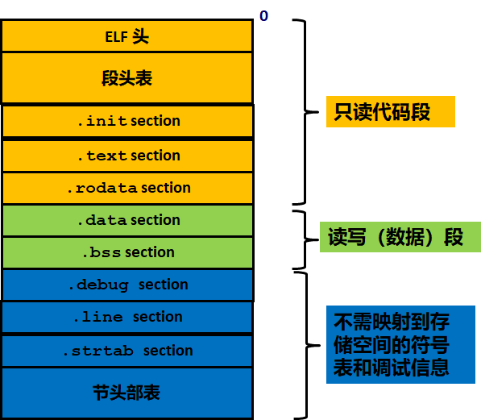

我们可以看到可执行程序内部都是分段进行存储的。

- `.text section`：代码段。通常存放**已编译程序的机器代码**，一般操作系统加载后，这部分是只读的。

- `.rodatasection`：只读数据段。此段的数据不可修改，存放程序中会使用的**常量**。比如程序中的常量字符串 
  "aasdasdaaasdasd"

- `.datasection`：数据段。主要用于存放已初始化的**全局变量、常量**。

- `.bsssection: bss `段。该段主要存储**未初始化全局变量**，仅是占位符，不占据任何实际磁盘空间。目标文件格式区分初始化和非初始化是为了空间效率。

操作系统在加载 ELF 文件时会将按照标准依次读取每个段中的内容，并将其加载到内存中，同时为该进程分配栈空间，并将 pc 寄存器指向代码段的起始位置，然后启动进程。


2、内存分区：

C++ 程序在运行时也会按照不同的功能划分不同的段，C++ 程序使用的内存分区一般包括：**栈、堆、全局/静态存储区、常量存储区、代码区。**

- **栈**：目前绝大部分 CPU 体系都是基于栈来运行程序，栈中主要存放**函数的局部变量、函数参数、返回地址**等，栈空间一般由操作系统进行默认分配或者程序指定分配，栈空间在进程生存周期一直都存在，当进程退出时，操作系统才会对栈空间进行回收。
  
- **堆**：动态申请的内存空间，就是由 **malloc** 函数或者 **new** 函数分配的内存块，**由程序控制它的分配和释放，可以在程序运行周期内随时进行申请和释放**，如果进程结束后还没有释放，操作系统会自动回收。

- **全局区/静态存储区**：主要为 .bss 段和 .data 段，**存放全局变量和静态变量**，程序运行结束操作系统自动释放，在 C 中，未初始化的放在 .bss 段中，初始化的放在 .data 段中，C++ 中不再区分了。

- **常量存储区**：.rodata 段，存放的是**常量**，不允许修改，程序运行结束自动释放。

- **代码区**：.text 段，存放代码，不允许修改，但可以执行。编译后的二进制文件存放在这里。

我们参考常见的 Linux 操作系统下的内存分布图如下:

从操作系统的本身来讲，以上存储区在该程序内存中的虚拟地址分布是如下形式（虚拟地址从低地址到高地址，实际的物理地址可能是随机的）：.text→.data→.bss→heap→unused→stack→⋯


程序实例：
以下为详细的程序实例，当然可以通过 GDB 工具来查看具体的每个变量的存放地址。

```c++
#include <iostream>
using namespace std;
/*
说明：C++ 中不再区分初始化和未初始化的全局变量、静态变量的存储区，如果非要区分下述程序标注在了括号中
*/
int g_var = 0; // g_var 在全局区（.data 段）
char *gp_var;  // gp_var 在全局区（.bss 段）

int main()
{
    int var;                    // var 在栈区
    char *p_var;                // p_var 在栈区
    char arr[] = "abc";         // arr 为数组变量，存储在栈区；"abc"为字符串常量，存储在常量区
    char *p_var1 = "123456";    // p_var1 在栈区；"123456"为字符串常量，存储在常量区
    static int s_var = 0;       // s_var 为静态变量，存在静态存储区（.data 段）
    p_var = (char *)malloc(10); // 分配得来的 10 个字节的区域在堆区
    free(p_var);
    return 0;
}
```


### 堆与栈

面试高频指数：★★★★★

**1、栈**

首先需要详细了解计算机系统中的 「Stack machine」的基本概念，了解程序中函数的调用过程。每次在**调用函数**时，会按照从右向左的顺序依次将函数调用参数压入到栈中，并在栈中压入返回地址与当前的栈帧，然后跳转到调用函数内部，pc 跳转函数内部执行该函数的指令，在此不再展开叙述，可以详细参考许多关于栈模型的资料。

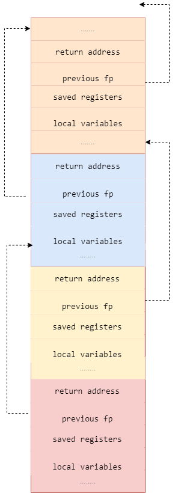


**栈溢出**:
一般情况操作系统为每个进程会固定栈空间的大小：

```c++
$ ulimit -s 
8192
```

当然实际情况，我们可以根据自己的需要来分配每个进程的栈空间。在实际编写程序时，如果出现两个函数互相调用或者递归无退出条件时，此时栈空间的就会无限增长。
当然实际的栈的分配与应用较为复杂，需要详细阅读操作系统的相关材料，栈一般还分为内核栈与用户栈，在栈顶会有一个特殊的内存页 guard，当栈一旦越界访问该特殊的 guard 页时，则会出现栈溢出的错误。


**2、堆：**

当程序在运行时，需要动态申请额外的内存来存放相应的数据和变量，此时就需要用到堆。堆的内存空间一般由操作系统或者专门内存程序来管理的。**在 C/C++ 一般用 malloc 或者 new 来从堆中申请内存，使用 free 或者 delete 来释放空间，空间释放后会有操作系统进行回收**。当然在实际的程序运行中动态内存管理非常复杂，会有许多非常复杂的技巧来处理。


**3、堆与栈的优缺点：**

- **申请方式：栈中存放的变量在编译时由编译器为其在栈上分配了空间，即程序编译后该变量在栈中使用的内存即确定，释放时也由于函数调用的返回，栈的空间会自动进行回收。堆中存放的变量由程序运行时决定的，会有操作系统或者内存管理模块来进行分配的**。

- **申请后系统响应：**
  - **分配栈空间时如果剩余空间大于申请空间则分配成功，否则分配失败栈溢出**，绝大多数情况下，栈的空间较小，一般栈上分配的变量不会占用太大的空间，且当函数返回时，当前栈帧中的变量生存周期会结束；**申请堆空间，堆在内存中呈现的方式类似于链表（记录空闲地址空间的链表），在链表上寻找第一个大于申请空间的节点分配给程序，将该节点从链表中删除**，大多数系统中该块空间的首地址存放的是本次分配空间的大小，便于释放，将该块空间上的剩余空间再次连接在空闲链表上，堆上可以分配较大的空间，如果不对申请的内存进行释放，则堆上存储的变量生存周期一直存在，直到当前进程退出。
  - **栈在内存中是连续的一块空间（向低地址扩展）最大容量是系统预定好的，且只能被当前的线程访问**；
  - **堆在内存中的空间（向高地址扩展）是不连续的，中间允许有间隔，堆中的内存并不是线程安全的，同一进程的线程都都可访问**
  
- **申请效率**：栈是有系统自动分配，申请效率高，但程序员无法控制；堆是由程序员主动申请，效率低，使用起来方便但是容易产生碎片。
  存放的内容：栈中存放的是局部变量，函数的参数；堆中存放的内容由程序员控制。


**4、实际的内存管理**

实际的内存管理可能更为复杂，一般分为两级内存管理。

- 操作系统按照段页式来管理内存，当需要创建新的进程或者线程时，操作系统会为新创建的进程分配物理页，当运行的进程需要更多的内存时，操作系统也会为其分配新的物理页并将其映射到该进程的虚拟地址空间中。
- 程序运行时，每个程序都含有一个内存管理的子程序，专门负责程序中的内存申请和释放，其中的技巧可能非常复杂，并且涉及许多内存分配的算法。


### 变量定义与生存周期

面试高频指数：★★★★★
C/C++ 变量有两个非常重要的属性：**作用域与生命周期**，这两个属性代表从空间和时间两个不同的维度来描述一个变量。

**1、作用域：**

作用域即一个变量可以被引用的范围，常见的作用域可分为 6 种：**全局作用域，局部作用域，语句作用域，类作用域，命名空间作用域和文件作用域**。从作用域来来看：

- **全局变量**：具有全局作用域。**全局变量只需在一个源文件中定义，就可以作用于所有的源文件**。其他不包含全局变量定义的源文件需要用 **extern** 关键字再次声明这个全局变量。

- **静态全局变量**：具有文件作用域。它与全局变量的区别在于如果程序包含多个文件的话，**它作用于定义它的文件里，不能作用到其它文件里**，即被 static 关键字修饰过的变量具有文件作用域。这样即使两个不同的源文件都定义了相同名字的静态全局变量，它们也是不同的变量。

- **局部变量**：具有局部作用域。它是自动对象（auto），在程序运行期间不是一直存在，而是**只在函数执行期间存在**，函数的一次调用执行结束后，变量被撤销，其所占用的内存也被收回，局部变量对于函数外部的程序来说是不可见的。当然内部实际更复杂，实际是以 {} 为作用域的。

- **静态局部变量**：具有局部作用域。它只被初始化一次，自从第一次被初始化直到程序运行结束都一直存在，它和全局变量的区别在于全局变量对所有的函数都是可见的，而**静态局部变量只对定义自己的函数体始终可见**, 只有定义该变量的函数内部可以使用访问和修改该变量。

比如以下文件定义

程序实例：
以下为详细的程序实例 a.cpp, b.cpp，分别对应的变量定义。

```c++
#include <iostream>
using namespace std;
int g_var = 0; // 全局变量
static char *gs_var;  // 静态全局变量

int main()
{
    int var;                    // 局部变量
    static int s_var = 0;       // 静态局部变量
    return 0;
}
```


```c++
#include <iostream>
using namespace std;
extern int g_var = 0; // 访问全局变量
// extern static char *gs_var;  无法访问静态全局变量

int test()
{
    g_var = 1;
}
```


**2、生命周期：**

生命周期即该变量可以被引用的时间段（生存期表示变量存在的时间）。

- **全局变量**: 全局变量**在整个程序运行期间都会一直存在**，都可以随时访问，当程序结束时，对应的变量则会自动销毁，内存会被系统回收。
- **局部变量**: 局部变量的生命周期仅限于**函数被调用期间**，当函数调用结束时，该变量会自动销毁。
- **静态局部变量**：实际上静态局部变量的作用域仅限于函数内部，它的作用域与局部变量相同，但实际上该变量**在程序运行期间是一直存在**的，生命周期贯穿于整个程序运行期间。局部静态变量只能被初始化一次。


**3、从分配内存空间看：**

不同生命周期的变量，在程序内存中的分布位置是不一样的。。我们知道程序的内存分为**代码区（.text）、全局数据区（.data，.bss，.rodata）、堆区（heap）、栈区（stack）**，不同的内存区域，对应不同的生命周期。

> C++程序在执行时，将内存大方向划分为**4个区域**
>
> - 代码区：存放函数体的二进制代码，由操作系统进行管理的
> - 全局区：存放**全局变量和静态变量static以及常量const**
> - 栈区：由编译器自动分配释放, 存放函数的参数值，局部变量等
> - 堆区：由程序员分配和释放，若程序员不释放，程序结束时由操作系统回收
>
> **内存四区意义：**
>
> 不同区域存放的数据，赋予不同的生命周期, 给我们更大的灵活编程


- 静态变量一般存储在数据段，包括 data 段、bss 段、rodata 段，其中 data 存储已经已经初始化的静态变量和全局变量，bss 存储未初始化的静态变量与全局变量。这里静态变量包括全局变量，静态全局变量，静态局部变量。
- 局部变量一般存储在栈区或者堆区。


4、注意：

- 静态变量和栈变量（存储在栈中的变量）、堆变量（存储在堆中的变量）的区别：**静态变量**会被放在程序的静态数据存储区（.data 段，bss 段，rodata 段）中（静态变量会自动初始化），这样可以在下一次调用的时候还可以**保持原来的赋值**。而**栈变量或堆变量不能保证**在下一次调用的时候依然**保持原来的值**。
- 静态变量和全局变量的区别：静态变量仅在变量的作用范围内可见，实际是依靠编译器来控制作用域。全局变量在整个程序范围内都可可见，只需声明该全局变量，即可使用。
- 全局变量定义在不要在头文件中定义：如果在头文件中定义全局变量，当该头文件被多个文件 include 时，该头文件中的全局变量就会被定义多次，编译时会因为重复定义而报错，因此不能再头文件中定义全局变量。一般情况下我们将变量的定义放在 .cpp 文件中，一般在 .h 文件使用extern 对变量进行声明。


### 内存池

面试高频指数：★★★★★

内存池是一种用于分配内存的技术，它可以提高程序的性能和效率。**C++中的内存池是一种内存管理技术，它通过预先分配一定数量的内存块来提高内存分配和释放的效率。**

具体来说，内存池通常包含两个主要部分：内存块池和对象池。内存块池是一块连续的内存空间，用于存储对象池中的对象。对象池则是从内存块池中分配对象的位置。对象池通常被实现为一个双向链表，每个节点表示一个可用的对象。

内存池的工作流程如下：

1. 内存池在程序启动时预先分配一定数量的内存块，并将其添加到内存块池中。
2. 当程序需要分配一个对象时，内存池会从对象池中取出一个可用的对象，如果对象池为空，则内存池会从内存块池中分配一个新的内存块，并将其添加到内存块池中，并从新的内存块中分配一个对象。
3. 当程序需要释放一个对象时，内存池将该对象添加到对象池中以供下次使用，而不是立即释放内存。这样可以减少频繁的内存分配和释放操作，提高程序的效率。

总之，内存池是一种优化内存分配和释放的技术，可以提高程序的性能和效率，尤其在需要频繁分配和释放对象的情况下，使用内存池可以大幅减少内存碎片和系统调用，从而提高程序的运行效率。


### 内存对齐

面试高频指数：★★★★★

**1、什么是内存对齐：**

计算机中内存的地址空间是按照 byte 来划分的，从理论上讲对任何类型变量的访问可以从内存中的任意地址开始，但实际情况是：在访问特定类型变量的时候通常在特定的内存地址访问，这就需要对这些数据在内存中存放的位置进行限制，各种类型数据按照一定的规则在空间上排列，而不是顺序的一个接一个的排放，这就是对齐。编译器将程序中的每个数据单元的地址安排在机器字的整数倍的地址指向的内存之中。


**2、为什么要内存对齐：**

**主要是由于 CPU 的访问内存的特性决定，CPU 访问内存时并不是以字节为单位来读取内存，而是以机器字长为单位，实际机器字长由 CPU 数据总线宽度决定的。**实际 CPU 运行时，每一次控制内存读写信号发生时，CPU 可以从内存中读取数据总线宽度的数据，并将其写入到 CPU 的通用寄存器中。比如 32 位 CPU，机器字长为 4 字节，数据总线宽度为 32 位，如果该 CPU 的地址总线宽度也是为 32 位，则其可以访问的地址空间为 [0,0xffffffff]。**内存对齐的主要目的是为了减少 CPU 访问内存的次数，加大 CPU 访问内存的吞吐量。**假设读取 8 个字节的数据，按照每次读取 4 个字节的速度，则 8 个字节需要 CPU 耗费 2 次读取操作。CPU 始终以字长访问内存，如果不进行内存对齐，很可能增加 CPU 访问内存的次数。

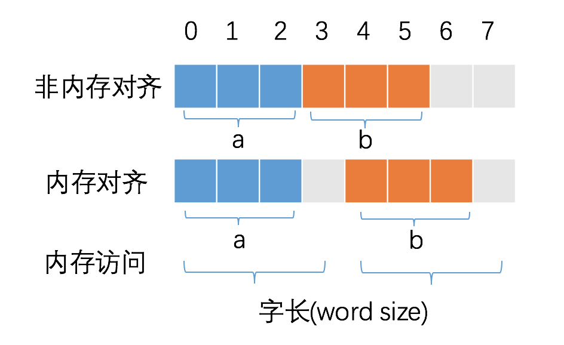

比如以上在读取变量 b 时，如果不进行内存对齐的话，会导致 CPU 读取次数为 2，在内存对齐的情况下，只需读取一次即可，当然实际的读取非对齐的内存处理更为复杂，我们参考下图中读取非对齐内存时的数据处理过程：

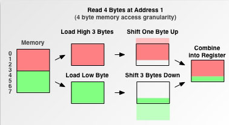

除了能够减少内存访问次数，增加内存读取的吞吐量以外，还有其他原因：

- 比如某些特定的硬件设备只能存取对齐数据，存取非对齐的数据可能会引发异常，比如对于 CPU 中 SIMD 指令，则必须要求内存严格对齐；
- 每次内存访问是原子的，如果变量的大小不超过字长，那么内存对齐后，对该变量的访问就是原子的。某些硬件设备不能保证在存取非对齐数据的时候的操作是原子操作，因此此时 CPU 需要可能需要读取多次内存，这样就破坏了变量的原子性；

- 相比于存取对齐的数据，存取非对齐的数据需要花费更多的时间，提高内存的访问效率，因为 CPU 在读取内存时，是一块一块的读取；
- 某些处理器虽然支持非对齐数据的访问，但会引发对齐陷阱（alignment trap）；
- 某些硬件设备只支持简单数据指令非对齐存取，不支持复杂数据指令的非对齐存取。


### 智能指针简介与使用

面试高频指数：★★★★★

> **智能指针是C++中的一个重要特性，它允许程序员管理动态分配的内存，避免内存泄漏和野指针等问题。智能指针是一种特殊的指针类，它会自动管理所指向的对象的内存，通常在对象不再需要时自动释放。**
>
> C++11标准引入了三种智能指针：unique_ptr、shared_ptr和weak_ptr。
>
> 1. **unique_ptr**
>
>    **unique_ptr是一种独占所有权的智能指针，它只能拥有一个指向对象的指针。**当unique_ptr被销毁时，它会自动释放它所指向的对象。
>
> 2. **shared_ptr**
>
>    **shared_ptr是一种共享所有权的智能指针，它可以有多个指向同一个对象的指针。**当最后一个shared_ptr被销毁时，它会自动释放它所指向的对象。
>
> 3. **weak_ptr**
>
>    **weak_ptr是一种弱引用智能指针，它可以指向一个shared_ptr所管理的对象，但不会影响对象的生命周期。**当最后一个shared_ptr被销毁时，weak_ptr会自动失效。


**智能指针是为了解决动态内存分配时带来的内存泄漏以及多次释放同一块内存空间而提出的。**C++ 11 中提供了智能指针的定义，所有关于智能指针的定义可以参考 `<memory>` 头文件。传统的指针在申请完成后，必须要调用 free 或者 delete 来释放指针，否则容易产生内存泄漏的问题；smart pointer 遵循 RAII 原则，当 smart pointer 对象创建时，即为该指针分配了相应的内存，当对象销毁时，析构函数会自动释放内存。**需要注意的是，智能指针不能像普通指针那样支持加减运算。**

```c++
#include <iostream>
using namespace std;

class SmartPtr {
    int* ptr; 						 //默认是private类型的
public:
    explicit SmartPtr(int* p = NULL){//构造函数
        ptr = p;
    } 	
//在 C++ 中，explicit 是一个关键字，它用于修饰类构造函数，表示该构造函数只能用于显式地创建对象，而不能用于隐式地进行类型转换
    
    ~SmartPtr() {				     //析构函数
        delete (ptr);
    }
    
    int& operator*() {			     //对运算符*进行重载
        return *ptr;
    }
};

int main()
{
    SmartPtr ptr(new int());
    *ptr = 20;
    cout << *ptr;
    return 0;
}
```

同时 smart pointer 重载了 * 和 -> 等操作，使用该对象就像 C 语言中的普通指针一样，但是区别于普通指针的它会**自动释放所申请的内存资源**。以下为智能指针的简单实现：

```c++
#include <iostream>
using namespace std;

template <class T>					//使用类模板实现智能指针类
class SmartPtr {
private:
	T* ptr; // 实际的指针
public:
	explicit SmartPtr(T* p = NULL) { ptr = p; }	//使用explict因为智能指针是一个模板类在使用时必须指定元素类型
	~SmartPtr() { delete (ptr); }
	T& operator*() { return *ptr; }
	T* operator->() { return ptr; }	//重载了->
};

int main()
{
	SmartPtr<int> ptr(new int());
	*ptr = 20;
	cout << *ptr << endl;
	return 0;
}
```


**按照常用的使用用途，智能指针有三类:**

- **unique_ptr：独享所有权的智能指针，资源只能被一个指针占有，该指针不能拷贝构造和赋值。但可以进行移动构造和移动赋值构造（调用 move() 函数），即一个 unique_ptr 对象赋值给另一个 unique_ptr 对象，可以通过该方法进行赋值。**

  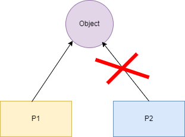

  如图所示，`object` 资源只能被 `P1` 占有，`P2` 无法对 `object` 有所有权，只能通过移动赋值给 `P2`。如下代码示例:

  ```c++
  #include <iostream>
  using namespace std;
  #include <memory>
  
  class Rectangle {
  	int length;
  	int breadth;
  
  public:
  	Rectangle(int l, int b){
  		length = l;
  		breadth = b;
  	}
  
  	int area(){
  		return length * breadth;
  	}
  };
  
  int main(){
  	unique_ptr<Rectangle> P1(new Rectangle(10, 5));
  	cout << P1->area() << endl; // This'll print 50
  
  	unique_ptr<Rectangle> P2;
  	// unique_ptr<Rectangle> P2(P1); // 无法拷贝构造
  	// P2 = P1;   // 无法赋值构造
  	P2 = move(P1);
  
  	cout << P2->area() << endl;
  	
  	// cout<<P1->area()<<endl; // 已经传递，P1 无所有权
  	return 0;
  }
  ```

  

  我们可以通过查看源代码看到该函数的**拷贝构造函数和赋值构造函数均被禁止**，只允许使用移动拷贝构造函数和移动赋值构造函数：

  ```c++
  // Disable copy from lvalue.不允许复制，体现专属所有权语义
  unique_ptr(const unique_ptr&) = delete;
  unique_ptr& operator=(const unique_ptr&) = delete;
  
  // Move constructor.体现专属所有权语义和只移型别
  // 只允许使用移动拷贝构造函数
  // 如果复制一个unique_ptr对象，会将源unique_ptr对象管理的资源release掉
  unique_ptr(unique_ptr&& __u) noexcept
  : _M_t(__u.release(), std::forward<deleter_type>(__u.get_deleter())) { }
  
  // 这个也是移动拷贝构造函数
  // 只是使用的类型是可以隐式转换的其他unique_ptr对象
  template<typename _Up, typename _Ep, typename = _Require<
  		__safe_conversion_up<_Up, _Ep>,
  typename conditional<is_reference<_Dp>::value,
  	is_same<_Ep, _Dp>,
  	is_convertible<_Ep, _Dp>>::type>>
  unique_ptr(unique_ptr<_Up, _Ep>&& __u) noexcept
  : _M_t(__u.release(), std::forward<_Ep>(__u.get_deleter()))
  { }
  
  // Assignment，也可以说明是专属所有权语义和只移型别
  unique_ptr& operator=(unique_ptr&& __u) noexcept
  {
  	// __u.release()释放并返回源unique_ptr对象管理的资源
  	// reset是将__u.release()返回的资源赋给目标（当前）unique_ptr对象
  	reset(__u.release());
  	get_deleter() = std::forward<deleter_type>(__u.get_deleter());
  	return *this;
  }
  
  // 析构函数，调用析构器析构掉管理的资源，并将__ptr指向nullptr
  ~unique_ptr()
  {
  	auto& __ptr = _M_t._M_ptr();
  	if (__ptr != nullptr)
  		get_deleter()(__ptr);
  	__ptr = pointer();
  }
  ```

  

  同时我们可以看到 `reset` 重新给其赋值，在获取资源的同时会释放原有的资源。

  ```c++
  void reset(pointer __p = pointer()) noexcept
  {
      using std::swap;
      swap(_M_t._M_ptr(), __p);
      if (__p != pointer() get_deleter()(__p);
  }
  ```

  

  

- **shared_ptr：与 unique_ptr 不同的是，shared_ptr 中资源可以被多个指针共享，但是多个指针指向同一个资源不能被释放多次，因此使用计数机制表明资源被几个指针共享。**

  

  通过 **use_count**() 查看资源的所有者的个数，可以通过 unique_ptr、weak_ptr 来构造，调用 release() 释放资源的所有权，同时将计数减一，当计数减为 0 时会自动释放内存空间，从而避免了内存泄漏。特别需要注意的是 shared_ptr 并不是线程安全的，但 shared_ptr 的计数是**原子操作**实现的，利用 atmoic CAS 指令实现。我们可以看到 share_ptr 的内存模型，当引用计数和 weak count 同时为 0 时，share_ptr 对象才会被最终释放掉。

  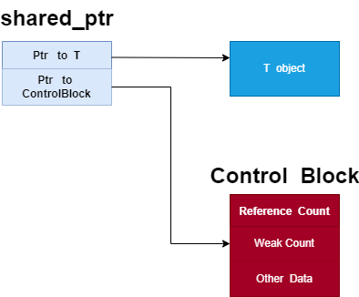

  ```c++
  #include <iostream>
  using namespace std;
  #include <memory>
  
  class Rectangle {
  	int length;
  	int breadth;
  
  public:
  	Rectangle(int l, int b)
  	{
  		length = l;
  		breadth = b;
  	}
  
  	int area()
  	{
  		return length * breadth;
  	}
  };
  int main()
  {
  
  	shared_ptr<Rectangle> P1(new Rectangle(10, 5));
  	cout << P1->area() << endl;
  	shared_ptr<Rectangle> P2;
  	P2 = P1;
  
  	cout << P2->area() << endl; // 50
  	cout << P1->area() << endl; // 50
  	cout << P1.use_count() << endl; // 2
  	return 0;
  }
  ```

  我们通过查看 shared_ptr 的源代码可以看到如下，shared_ptr 实际成员包含两个指针，一个指向对象资源的指针 ptr，另一个指向管理区域的指针 __cntrl_，具体 __cntrl_ 指向的区域包括 deleter、allocator、shared_ptr 对象的引用计数、weak_ptrs 的对象的引用计数。

  ```c++
  template<class _Tp>
  class shared_ptr {
  	typedef _Tp element_type;
  
  private:
  	element_type*      __ptr_;
  	__shared_weak_count* __cntrl_;
  
  	...
  }
  ```

  

  

- weak_ptr：指向 share_ptr 指向的对象，能够解决由 shared_ptr 带来的循环引用问题。与 shared_ptr 配合使用，将 weak_ptr 转换为 share_ptr 时，虽然**它能访问 share_ptr 所指向的资源但却不享有资源的所有权，不影响该资源的引用计数**。有可能资源已被释放，但 weak_ptr 仍然存在，share_ptr 必须等待所有引用的 weak_ptr 全部被释放才会进行释放。因此每次访问资源时都需要判断资源是否有效。

  

  shared_ptr 通过引用计数的方式来管理对象，当进行拷贝或赋值操作时，每个 shared_ptr 都会记录当前对象的引用计数，当引用计数为0时，内存将被自动释放。当对 shared_ptr 赋予新值或者被对象被销毁时，引用计数会递减。但特殊情况出现循环引用时，shared_ptr 无法正常释放资源。循环引用，即 A 指向 B，B 指向 A，在表示双向关系时，是很可能出现这种情况的。下面的示例代码即为出现了循环引用导致内存无法正常被释放。

  ```c++
  #include <iostream>
  #include <memory>
  using namespace std;
  
  class B;
  
  class A {
  public:
  	shared_ptr<B> b_;
  	A() {
  		cout << "A constructed!" << endl;
  	}
  	~A() {
  		cout << "A destructed!" << endl;
  	}
  };
  
  class B {
  public:
  	shared_ptr<A> a_;
  	B() {
  		cout << "B constructed!" << endl;
  	}
  	~B() {
  		cout << "B destructed!" << endl;
  	}
  };
  
  int main()
  {
  	auto classA = make_shared<A>();
  	auto classB = make_shared<B>();
  	classA->b_ = classB;
  	classB->a_ = classA;
  	cout << "A: " << classA.use_count() << endl;
  	cout << "B: " << classB.use_count() << endl;
  	return 0;
  }
  ```

  程序结果运行如下:

  ```c++
  A constructed!
  B constructed!
  A: 2
  B: 2
  ```

  为了解决上述的循环引用问题，才出现了 weak_ptr，我们知道 shared_ptr A 被赋值给 shared_ptr B 时，A 的引用计数加 1；但是 shared_ptr A 被赋值给 weak_ptr C 时，A 的引用计数不变。weak_ptr 在使用时是与 shared_ptr 绑定的，weak_ptr 不影响对象 shared_ptr 的引用计数，weak_ptr 可以用来跟踪 shared_ptr 对象，当 shared_ptr 的对象引用计数为 0 时，此时 shared_ptr 会释放所占用的对象资源，但 shared_ptr 对象本身不会释放，它会等待 weak_ptrs 引用计数为 0 时，此时才会释放管理区域的内存，而释放 shared_ptr 对象本身。上述的循环引用，我们可以将一个对象改为 weak_ptr 即可避免循环引用导致的异常。例如下列代码：

  ```c++
  #include <iostream>
  #include <memory>
  using namespace std;
  
  class B;
  
  class A {
  public:
  	shared_ptr<B> b_;
  	A() {
  		cout << "A constructed!" << endl;
  	}
  	~A() {
  		cout << "A destructed!" << endl;
  	}
  };
  
  class B {
  public:
  	weak_ptr<A> a_;
  	B() {
  		cout << "B constructed!" << endl;
  	}
  	~B() {
  		cout << "B destructed!" << endl;
  	}
  };
  
  int main()
  {
  	auto classA = make_shared<A>();
  	auto classB = make_shared<B>();
  	classA->b_ = classB;
  	classB->a_ = classA;
  	cout << "A: " << classA.use_count() << endl;
  	cout << "B: " << classB.use_count() << endl;
  	return 0;
  }
  ```

  代码执行结果如下：

  ```c++
  A constructed!
  B constructed!
  A: 1
  B: 2
  A destructed!
  B destructed!
  ```

  

### 智能指针的创建

面试高频指数：★★★★★

1. make_unique 与 make_share:
   make_unique 在 C++ 14 以后才被加入到标准的 C++ 中，make_shared 则是 C++ 11 中加入的。在 「《Effective Modern C++》」 学习笔记之条款二十一：优先选用 std::make_unique 和 std::make_shared,而非直接 new。

   - `make_unique`：减少代码量，能够加快编译速度，定义两遍类型时，编译器需要进行类型推导会降低编译速度，某些意外意外情况下可能会导致内存泄漏。但是 make_unique 不允许自定析构器，不接受 std::initializer_list 对象。

     ```c++
     auto upw1(std::make_unique<Widget>());
     //重复写了两次Widget型别
     std::unique_ptr<Widget> upw2(new Widget);
     ```

   - `make_shared`：这个主要是可以减少对堆中申请内存的次数，只需要申请一次即可。我们知道 `share_ptr` 的内存模型如下:

     

     当我们使用 new 时，我们将 new 出的资源指针赋给 share_ptr 的 ptr, 然后 share_ptr 本身还需要再次在堆上申请一块单独的内存作为它的管理区，存放引用计数、用户自定的函数等，因此创建 shared_ptr 时需要在堆上申请两次。
     C++ [] std::shared_ptr<Widget>(new Widget);
     当我们使用 make_share 时，我们只需要申请一块大的内存，一半用来存储资源，另一半作为管理区, 存放引用计数、用户自定的函数等，此时需要在堆上申请一次即可。

     ```c++
     auto upw1(std::make_unique<Widget>());
     ```


### 编译与链接

面试高频指数：★★★★☆

1. **为什么需要编译：**

   我们常见的 C/C++ 语言，CPU 是无法理解的，这就需要将我们编写好的代码最终翻译为**机器可执行的二进制指令**，编译的过程本质上也即是翻译的过程，当然中间涉及的细节非常复杂。

2. **编译的处理过程：**
   编译器读取源文件 cpp，并将其翻译为可执行文件「ELF」，ELF文件可以经过操作系统进行加载执行。常见的编译过程分为四个过程：编译预处理、编译、汇编、链接。

   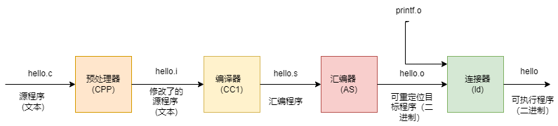

- 编译预处理：**在预编译过程中主要处理源代码中的预处理指令**，比如引入头文件（#include），去除注释，处理所有的条件编译指令（#ifdef, #ifndef, #else, #elif, #endif），宏的替换（#define），添加行号，保留所有的编译器指令；

- 编译：针对预处理后的文件进行词法分析、语法分析、语义分析、符号汇总、汇编代码生成，并针对程序的结构或者特定的 CPU 平台进行优化，其中涉及的过程较为复杂。**简单来说编译的过程即为将 .cpp 源文件翻译成 .s 的汇编代码；**

- 汇编：**将汇编代码 .s 翻译成机器指令 .o 文件**，一个 .cpp 文件只会生成一个 .o 文件；

- 链接：汇编程序生成的目标文件即为 .o 文件，单独的 .o 文件可能无法执行。因为一个程序可能由多个源文件组成，此时就存在多个 .o 文件。文件 A 中的函数引用了另一个文件 B 中定义的符号或者调用了某个库文件中的函数，这就需要链接处理。**那链接的目的就是将这些文件对应的目标文件连接成一个整体，从而生成一个可被操作系统加载执行的 ELF 程序文件**。链接的过程较为复杂，如有兴趣可以参考：「[Computer Systems: A Programmer's Perspective](https://leetcode.cn/link/?target=http://csapp.cs.cmu.edu/3e/pieces/preface3e.pdf)」。

3. **静态链接与动态链接:**

   > **在C++中，链接（linking）是指将编译器生成的目标文件（object file）或库文件（library file）合并成最终的可执行文件或库文件的过程**。C++中有两种链接方式：静态链接和动态链接。
   >
   > **静态链接（static linking）是指在编译时将库文件的代码完全复制到可执行文件中，生成一个独立的可执行文件**。这样的可执行文件可以在不依赖外部库文件的情况下运行。静态链接的优点是可执行文件比较小，运行时不需要依赖外部库文件，缺点是可执行文件的大小会增加，并且如果库文件的代码有更新，需要重新编译可执行文件。
   >
   > **动态链接（dynamic linking）是指在运行时将程序所需要的库文件加载到内存中，生成一个独立的可执行文件**。这样的可执行文件比较小，因为不需要将库文件的代码复制到可执行文件中。动态链接的优点是库文件的代码更新时只需要更新库文件即可，而不需要重新编译可执行文件，缺点是在运行时需要依赖外部库文件，如果库文件不存在或版本不兼容，程序将无法运行。
   >
   > 在C++中，可以使用静态库和动态库来进行静态链接和动态链接。静态库是将一组相关的目标文件打包成一个库文件，可执行文件在编译时将库文件的代码复制到可执行文件中。动态库是将一组相关的目标文件打包成一个共享库文件，可执行文件在运行时动态加载共享库文件的代码。

   **静态链接**：代码在生成可执行文件时，将该程序所需要的全部外部调用函数全部拷贝到最终的可执行程序文件中，在该程序被执行时，该程序运行时所需要的全部代码都会被装入到该进程的虚拟地址空间中。在 Linux 系统下，静态链接库一般以 .a 文件，我们可以将多个 .o 文件链接成一个静态链接库。

   **动态链接**：代码在生成可执行文件时，该程序所调用的部分程序被放到动态链接库或共享对象的某个目标文件中，链接程序只是在最终的可执行程序中记录了共享对象的名字等一些信息，最终生成的 ELF 文件中并不包含这些调用程序二进制指令。在程序执行时，当需要调用这部分程序时，操作系统会从将这些动态链或者共享对象进行加载，并将全部内容会被映射到该进行运行的虚拟地址的空间。在 Linux 系统下，动态链接库一般以 .so 文件，我们可以将多个 .o 文件链接成一个动态链接库。

- **二者的优缺点**：静态链接浪费空间，每个可执行程序都会有目标文件的一个副本，这样如果目标文件进行了更新操作，就需要重新进行编译链接生成可执行程序（更新困难），优点就是执行的时候运行速度快，因为可执行程序具备了程序运行的所有内容；动态链接节省内存、更新方便，但是动态链接是在程序运行时，每次执行都需要链接，相比静态链接会有一定的性能损失。静态链接是由连接器完成的，动态链接最终是由操作系统来完成链接的功能，动态链接在不同的操作系统下可能由不同的实现原理，比如在 
  Linux 系统下，动态链接库通常以 .so 文件存在，在 windows 下同下，动态链接库一般以 .dll 文件存在。


### 大端与小端

面试高频指数：★★★★☆

> **大端（Big Endian）和小端（Little Endian）是指在计算机内部存储数据时，字节顺序的不同方式。**
>
> 在**大端**字节顺序中，最高有效字节（即最左侧的字节）被存储在最低的内存地址处，而最低有效字节（即最右侧的字节）被存储在最高的内存地址处。**这种字节顺序常用于网络协议和文件格式中。**
>
> 在**小端**字节顺序中，最低有效字节被存储在最低的内存地址处，而最高有效字节被存储在最高的内存地址处。**这种字节顺序常用于x86架构的计算机中。**
>
> 例如，数字0x12345678在大端字节顺序中被存储为0x12 0x34 0x56 0x78，而在小端字节顺序中被存储为0x78 0x56 0x34 0x12。
>
> 在实际编程中，需要注意字节顺序的差异，以确保数据在不同计算机之间的正确传输和处理。

字节序
字节顺序又称端序或尾序（Endianness），在计算机科学领域中，指电脑内存中或在数字通信链路中，组成多字节的字的字节的排列顺序。在几乎所有的机器上，多字节对象都被存储为连续的字节序列。例如在 C 语言中，一个类型为 int 的变量 x 地址为 0x100，那么其对应地址表达式 &x 的值为 0x100，x 的四个字节将被存储在电脑内存的 0x100，0x101，0x102，0x103 位置。

**字节的排列方式常见的方式有两种：将一个多位数的低位放在较小的地址处，高位放在较大的地址处，则称小端序（Little-Endian）；反之则称大端序（Big-Endian）**。为什么需要字节序这个规定，主要是因为在网络应用中字节序是一个必须被考虑的因素，对于不同 CPU 可能采用不同标准的字节序，所以均按照网络标准转化成相应的字节序。

- Little-Endian：将低序字节存储在起始地址（低位编址），在变量指针转换的时候地址保持不变，比如 int64* 转到 int32*，对于机器计算来说更友好和自然。

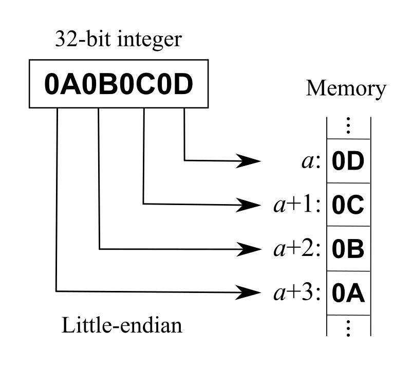

- Big-Endian：将高序字节存储在起始地址（高位编址），内存顺序和数字的书写顺序是一致的，对于人的直观思维比较容易理解，网络字节序统一规定采用 Big-Endian。

  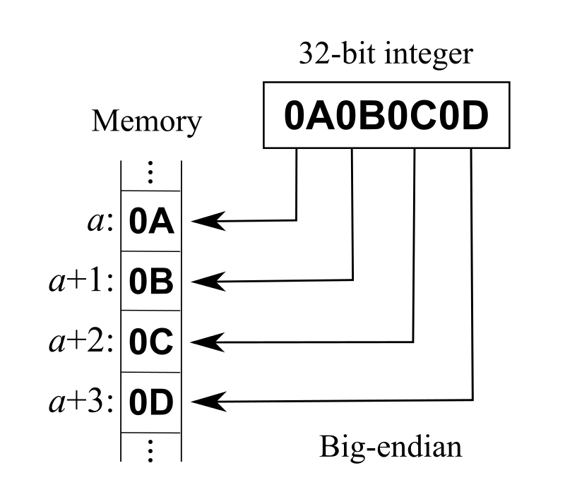

- **检测字节序:**

  一般情况下我们直接调用宏定义 __BYTE_ORDER 即可，可以通过引用 <bits/endian.h> 即可。或者我们也可以编写程序来判断当前的字节序。

  ```c++
  bool byteorder_check() {
      int a = 1;
      return (*(char *)&a); /* 1 为小端机，0 为大端机 */
  }
  ```

  **在 C++ 中，可以使用以下函数进行字节序转换：**

  1. `htons()` 和 `ntohs`() 函数：

  - `htons()` 函数将 16 位主机字节序转换为网络字节序（大端序）。

  - `ntohs()` 函数将网络字节序转换为 16 位主机字节序。

    ```c++
    short host_num = 0x1234; // 4660 in decimal
    unsigned short net_num = htons(host_num);
    ```

  2. `htonl() 和 ntohl()` 函数：

  - `htonl()` 函数将 32 位主机字节序转换为网络字节序（大端序）。

  - `ntohl()` 函数将网络字节序转换为 32 位主机字节序。

    ```c++
    unsigned long host_num = 0x12345678; // 305419896 in decimal
    unsigned long net_num = htonl(host_num);
    ```

  这些函数在头文件 `<arpa/inet.h>` 中定义，可以在网络编程中使用。需要注意的是，这些函数只能转换基本数据类型，不能用于结构体等复杂数据类型的字节序转换，需要手动编写转换函数。

  ```c++
  serv_addr.sin_addr.s_addr = htonl(INADDR_ANY);	//主机字节序转换为网络字节序，IP地址是32位，所以使用的是htonl
  serv_addr.sin_port = htons(atoi(argv[1]));		//主机字节序转换为网络字节序，端口号是16位，所以使用的是htons
  ```


### 内存泄漏

面试高频指数：★★★★☆

> **C++ 中的内存泄漏是指程序在分配内存后，未能正确地释放它，导致这些内存区域一直占用系统资源而无法被其他程序使用。**
>
> 以下是一些常见的导致内存泄漏的情况：
>
> 1. **忘记释放堆内存**：当使用 new 或 malloc 分配内存时，必须使用 delete 或 free 释放内存。如果忘记释放内存，则会导致内存泄漏。
> 2. **指针悬挂**：当一个指针指向了一个已经被释放的内存区域，那么当我们再次尝试访问该内存区域时，程序就会崩溃。这种情况称为指针悬挂。
> 3. **堆栈不匹配**：当我们在堆和栈之间进行混淆时，也可能会导致内存泄漏。例如，我们可能会分配堆内存并将其传递给一个函数，但在函数返回后却没有释放内存。
> 4. **异常处理不当**：如果我们在 try-catch 块中分配了内存，但在异常处理程序中未能正确地释放它，则可能会导致内存泄漏。
>
> 为了避免内存泄漏，我们应该在编写程序时尽可能避免使用裸指针，而是使用智能指针和容器等 RAII 类型，这些类型可以自动管理内存并确保内存的正确释放。此外，我们还可以使用内存检测工具（如 Valgrind）来帮助我们发现和修复内存泄漏问题。

1. 内存泄漏

   程序在堆中申请的动态内存，在程序使用完成时没有得到及时的释放。当这些变量的生命周期已结束时，该变量在堆中所占用的内存未能得到释放，从而就导致了堆中可使用的内存越来越少，最终可能产生系统运行较慢或者系统因内存不足而崩溃的问题。
   **内存泄漏并非指内存从物理上消失，而是指程序在运行过程中，由于疏忽或错误而失去了对该内存的控制，从而造成了内存的浪费。**
   内存泄漏主要指堆上分配的变量，因为栈中分配的变量，随着函数退出时会自动回收。而堆是动态分配的，一旦用户申请了内存分配而为及时释放，那么该部分内存在整个程序运行周期内都是被占用的，其他程序无法再使用这部分内存。
   对于实际的程序来说，我们在调用过程中使用 malloc、calloc、realloc、new 等分配内存时，使用完后要调用相应的 free 或 delete 释放内存，否则这块内存就会造成内存泄漏。当然在实际应用中，我们可能在使用系统资源或者在堆中创建对象时，没有及时将这些资源或者对象进行释放时，也会造成内存泄漏，这些资源或者对象的创建实际也占用了堆中的内存，在使用完成时应及时将其进行释放。

   ```c++
   // Program with memory leak
   #include <bits/stdc++.h>
   using namespace std;
   
   void func_to_show_mem_leak()
   {
   	int* ptr = new int(5);
       // 返回时未释放内存
   	return;
   }
   int main()
   {
   	func_to_show_mem_leak();
   	return 0;
   }
   ```

2. 内存泄漏导致的问题：
   由于内存未得到及时释放，从而可能导致可使用的动态内存空间会越来越少，一旦内存空间全部使用完，则程序可能会导致因为内存不够中止运行。由于内存泄漏导致的问题比较严重，现在许多语言都带有 GC 程序会自动对不使用的内存进行回收，从而避免内存泄漏。


### include " " 和 <> 的区别

面试高频指数：★★★★☆

在C++编程中，使用`#include`预处理指令来引入头文件。头文件通常包含函数和变量的声明，以及其他必要的信息。在`#include`语句中，文件名可以用双引号或尖括号括起来，以表示头文件的位置。

**使用双引号`""`括起来的文件名，表示在当前源代码文件所在的目录中查找该文件。**例如：`#include "example.h"` 将在与当前源文件相同的目录中查找名为 `example.h` 的文件。

**而使用尖括号`<>`括起来的文件名，表示在编译器预定义的系统路径中查找该文件。**例如：`#include <iostream>` 将在编译器预定义的路径中查找名为 `iostream` 的头文件。

因此，使用双引号`""`括起来的文件名用于引入用户自定义的头文件，而使用尖括号`<>`括起来的文件名用于引入系统提供的头文件。


## **C++ 语言对比**

### C++ 11 新特性

面试高频指数：★★★★★

C++11是C++语言的第11个标准版本，引入了一些新特性和改进，使得C++更加现代化、高效和易用。以下是一些C++11引入的主要特性：

1. **自动类型推导（auto关键字）**：可以让**编译器自动推导变量的类型**，使代码更加简洁和易读。

   > ```c++
   > auto x = 10;      // x的类型被推导为int
   > auto y = 3.14;    // y的类型被推导为double
   > auto z = "hello"; // z的类型被推导为const char*
   > ```
   >
   > 需要注意的是，`auto`关键字**不能用于函数的返回值类型、类的成员变量和参数类型**。此外，如果使用`auto`关键字声明的变量没有初始化，编译器无法推导出变量的类型，会导致编译错误。
   >
   > 自动类型推导可以使代码更加简洁和易读，特别是在涉及模板和迭代器的代码中。例如，使用`auto`关键字可以大大简化模板类型的声明，如下所示：
   >
   > ```c++
   > template<typename T, typename U>
   > auto add(T x, U y) -> decltype(x + y) {
   >     return x + y;
   > }
   > ```

   

2. **统一的初始化语法**：可以使用一致的语法来初始化各种类型的变量，包括数组、结构体和类对象。

   > C++11中引入了统一的初始化语法，即**使用花括号{}来初始化各种类型的变量，包括基本类型、数组、结构体和类对象**。具体来说，使用花括号{}来进行初始化可以有以下几种形式：
   >
   > 1. 初始化基本类型变量
   >
   >    用花括号{}来初始化基本类型变量，如下所示：
   >
   >    ```c++
   >    int x{10};        // x被初始化为10
   >    double y{3.14};   // y被初始化为3.14
   >    bool z{true};     // z被初始化为true
   >    ```
   >
   > 2. 初始化数组
   >
   >    使用花括号{}来初始化数组，如下所示：
   >
   >    ```c++
   >    int x{10};        // x被初始化为10
   >    double y{3.14};   // y被初始化为3.14
   >    bool z{true};     // z被初始化为true
   >    ```
   >
   > 3. 初始化结构体和类对象
   >
   >    使用花括号{}来初始化结构体和类对象，如下所示：
   >
   >    ```c++
   >    struct Point {   // 定义结构体
   >        int x;
   >        int y;
   >    };
   >                         
   >    Point p{10, 20};  // 初始化结构体对象
   >                         
   >    class Person {   // 定义类
   >    public:
   >        std::string name;
   >        int age;
   >    };
   >                         
   >    Person p{"John", 30};  // 初始化类对象
   >    ```
   >
   >    使用统一的初始化语法可以使代码更加简洁和易读，同时也可以避免一些初始化时的错误。例如，在使用花括号{}进行数组初始化时，如果初始化的元素数量超过了数组的大小，编译器会报错。

   

3. **Lambda表达式**：可以在代码中定义匿名函数，使得代码更加简洁和易读。

   > Lambda表达式是C++11引入的一种新的函数对象，它可以用于在局部范围内定**义匿名函数**，这些函数可以像普通函数一样被调用。Lambda表达式的语法如下：
   >
   > ```c++
   > [capture list] (parameter list) -> return type
   > {
   > function body;	//函数主体
   > };
   > ```
   >
   > 其中，`capture`指定了Lambda表达式所引用的外部变量，`parameters`指定了Lambda表达式的参数列表，`return_type`指定了Lambda表达式的返回类型，`body`指定了Lambda表达式的函数体。
   >
   > Lambda表达式中的`capture`可以是以下几种形式之一：
   >
   > - `[]`：不捕获任何外部变量。
   > - `[&]`：以引用的方式捕获所有外部变量。
   > - `[=]`：以值的方式捕获所有外部变量。
   > - `[var1, var2, ...]`：以值的方式捕获指定的外部变量。
   > - `[&var1, var2, ...]`：以混合的方式捕获指定的外部变量。
   >
   > Lambda表达式的`parameters`和`return_type`与普通函数的参数列表和返回类型相同。Lambda表达式的`body`可以是一段复杂的代码块，甚至可以包含`return`语句。
   >
   > **Lambda表达式的最大特点是可以在定义它的函数内部定义一个函数对象，从而实现局部范围内的函数定义和调用，这对于简化代码和提高程序可读性非常有帮助。Lambda表达式还可以作为函数参数传递，从而使函数接口更加灵活。**
   >
   > ```c++
   > int main()
   > {
   >     int a = 10;
   >     auto f = [&a](int x)-> int {
   >         a = 20;
   >         return a + x;
   >     };
   >     cout << a << endl; // 10
   >     cout< < f(10) << endl; // 30
   >     cout << a << endl; // 20
   >     return 0;
   > }
   > ```

   

4. **右值引用（&&符号）**：可以使用右值引用来实现移动语义，避免不必要的对象拷贝，提高程序的性能。

   > 在C++11中，右值引用是一种新的引用类型，其语法为 &&。右值引用可以绑定到临时对象（即右值），并用于实现移动语义和完美转发。
   >
   > 右值引用的一个重要应用是移动语义。当使用复制构造函数或赋值运算符对一个对象进行复制或赋值时，会将对象的内容从源对象复制到目标对象中。但是，对于动态分配内存的大型对象，这种复制操作可能会非常昂贵。移动语义提供了一种优化方法，它可以将源对象的内部指针或资源所有权“移动”到目标对象中，而不是进行复制。这样就可以避免不必要的内存分配和释放，提高程序的性能。
   >
   > 右值引用还可以用于完美转发，即在函数中将参数转发到其他函数，同时保留参数的值类别（左值或右值）。通过使用右值引用和std::forward函数，可以实现对任意类型的完美转发，包括标准类型、自定义类型、左值和右值。
   >
   > 例如，以下是一个使用右值引用和完美转发的函数模板，它可以接受任意类型的参数，并将其转发到其他函数中：
   >
   > ```c++
   > template<typename T>
   > void forwarder(T&& arg)
   > {
   >     other_function(std::forward<T>(arg));
   > }
   > ```
   >
   > 在调用forwarder函数时，可以传递任意类型的参数，包括左值和右值。如果传递的是左值，则arg将绑定到一个左值引用，并且在调用other_function时将被转发为左值。如果传递的是右值，则arg将绑定到一个右值引用，并且在调用other_function时将被转发为右值。这样就可以实现对任意类型的完美转发

   

5. **委托构造函数**：可以在一个构造函数中调用另一个构造函数，避免重复的代码。

   > C++11引入了委托构造函数的概念，它允许一个构造函数调用同一个类中的另一个构造函数来完成部分或全部初始化的工作。这种方式可以避免代码的重复，并提高代码的可读性。
   >
   > 委托构造函数是通过使用类的构造函数的初始化列表来实现的。一个构造函数可以通过使用其他构造函数的名称和参数列表来调用另一个构造函数。例如，以下代码演示了一个使用委托构造函数的示例：
   >
   > ```c++
   > class MyClass {
   > public:
   >   MyClass() : MyClass(0, 0) {}
   >   MyClass(int a) : MyClass(a, 0) {}
   >   MyClass(int a, int b) : a_(a), b_(b) {}
   > private:
   >   int a_;
   >   int b_;
   > };
   > ```
   >
   > C++11引入了委托构造函数的概念**，它允许一个构造函数调用同一个类中的另一个构造函数来完成部分或全部初始化的工作**。这种方式可以避免代码的重复，并提高代码的可读性。
   >
   > 委托构造函数是通过使用类的构造函数的初始化列表来实现的。**一个构造函数可以通过使用其他构造函数的名称和参数列表来调用另一个构造函数**。例如，以下代码演示了一个使用**委托构造函数**的示例：
   >
   > ```c++
   > class MyClass {
   > public:
   >   MyClass() : MyClass(0, 0) {}
   >   MyClass(int a) : MyClass(a, 0) {}
   >   MyClass(int a, int b) : a_(a), b_(b) {}
   > private:
   >   int a_;
   >   int b_;
   > };
   > ```
   >
   > 在上面的代码中，三个构造函数都定义在同一个类中。其中，第一个构造函数不需要参数，并且使用委托构造函数调用第二个构造函数。第二个构造函数接受一个整数参数，并使用委托构造函数调用第三个构造函数。最后，第三个构造函数接受两个整数参数，并执行实际的初始化工作。
   >
   > 需要注意的是，委托构造函数必须放在初始化列表的最开始处，并且不能使用成员初始化列表来初始化成员变量。此外，委托构造函数的返回类型必须与所调用的构造函数的返回类型相同。
   >
   > 使用委托构造函数可以让代码更加简洁、清晰，并且易于维护。它可以帮助开发者避免编写重复的代码，并且可以提高代码的可读性和可维护性。

   

6. **静态断言（static_assert）**：可以在编译期间检查某个条件是否满足，从而避免一些编译时错误。

   >  C++11中的静态断言是一种在编译期检查表达式的值是否为true的工具。它是通过`static_assert`关键字实现的。使用静态断言可以帮助程序员在编译期间发现一些常见的错误。

   

7. **线程支持库**：可以使用标准库提供的线程支持库来实现多线程编程。

   > C++11引入了一组用于支持多线程编程的标准库，其中最重要的是 `<thread>` 头文件。这个库允许开发者创建线程、等待线程结束、管理线程、处理线程间通信等等。

   

8. **新的智能指针类型（unique_ptr和shared_ptr）**：可以更方便地管理动态内存，并避免内存泄漏和空指针引用的问题。

   > 在C++11中，引入了两种新的智能指针类型：`unique_ptr`和`shared_ptr`。这些智能指针类型旨在更好地管理动态内存分配，避免常见的内存泄漏和空悬指针等问题。
   >
   > `unique_ptr`是一种独占所有权的智能指针，它管理动态分配的对象，并确保在其生命周期结束时正确地删除该对象。`unique_ptr`是使用模板类实现的，其中模板参数是指向对象类型的指针类型。`unique_ptr`是不可复制的，但可以通过移动语义转移其所有权。
   >
   > `shared_ptr`是一种共享所有权的智能指针，可以在多个`shared_ptr`之间共享指向同一动态分配对象的所有权。`shared_ptr`使用引用计数来跟踪对象的引用次数，当引用计数为0时，对象将被删除。`shared_ptr`的实现包括一个引用计数器和一个指向动态分配对象的指针。`shared_ptr`的复制会增加引用计数，销毁会减少引用计数。
   >
   > `unique_ptr`和`shared_ptr`可以帮助程序员避免常见的内存管理问题，提高程序的可靠性和安全性。

   

9. **可变参数模板**：可以使用可变参数模板来定义可变数量的参数的函数或类模板

   > C++11中引入了可变参数模板的概念，允许定义接受可变数量参数的模板函数和模板类。可变参数模板是通过省略号 `...` 来定义的，它允许模板接受任意数量的参数。
   >
   > 例如，下面是一个接受任意数量参数的模板函数的例子：
   >
   > ```c++
   > #include <iostream>
   > 
   > template<typename... Args>
   > void print(Args... args)
   > {
   >     std::cout << sizeof...(args) << std::endl;  // 打印参数数量
   > }
   > 
   > int main()
   > {
   >     print();         // 输出0
   >     print(1, 2, 3);  // 输出3
   >     print("hello");  // 输出1
   >     return 0;
   > }
   > ```
   >
   > 在上面的例子中，`print` 函数通过可变参数模板定义为接受任意数量的参数。在函数体内部，`sizeof...(args)` 表示参数数量。
   >
   > 我们也可以使用递归展开可变参数，例如：
   >
   > ```c++
   > #include <iostream>
   > 
   > void print()
   > {
   >     std::cout << std::endl;
   > }
   > 
   > template<typename T, typename... Args>
   > void print(T first, Args... args)
   > {
   >     std::cout << first << " ";
   >     print(args...);  // 递归展开
   > }
   > 
   > int main()
   > {
   >     print(1, 2, 3, "hello", "world");  // 输出: 1 2 3 hello world
   >     return 0;
   > }
   > ```
   >
   > 在上面的例子中，我们定义了一个 `print` 函数，它首先定义了一个不带参数的版本用于终止递归。然后定义了一个模板版本，用于处理第一个参数以及剩下的参数，并通过递归展开处理剩下的参数。
   >
   > 需要注意的是，在可变参数模板中，参数包中的所有参数都必须是同一类型。如果需要接受不同类型的参数，可以使用类型转换来实现。

   

10. **列表初始化**：可以使用花括号{}来进行列表初始化，支持对数组、结构体和类对象进行初始化。

    > C++11 中引入了列表初始化（List Initialization）语法，它提供了一种简单而统一的方法来初始化各种类型的对象，包括内置类型、自定义类型、数组、容器等。
    >
    > 列表初始化使用花括号 `{}` 来表示初始化列表，例如：
    >
    > ```c++
    > int x = { 1 };             // 初始化 x 为 1
    > vector<int> vec = { 1, 2 }; // 初始化 vec 为 { 1, 2 }
    > int arr[] = { 1, 2, 3 };   // 初始化数组 arr 为 { 1, 2, 3 }
    > ```
    >
    > 可以看到，使用列表初始化的语法非常简洁，可以在一个语句中完成多个对象的初始化。列表初始化也支持自动类型推导：
    >
    > ```c++
    > auto x = { 1, 2, 3 }; // 推导出类型为 std::initializer_list<int>
    > ```
    >
    > 其中，`auto` 推导出的类型是 `std::initializer_list<int>`，它是一个 C++11 中新引入的标准库类型，表示一个初始化列表。
    >
    > 除了支持基本类型和容器的初始化外，列表初始化还可以用来初始化自定义类型的对象，只需要在类的定义中添加相应的构造函数
    >
    > ```c++
    > class Point {
    > public:
    >     Point(int x, int y) : m_x(x), m_y(y) {}
    > 
    > private:
    >     int m_x, m_y;
    > };
    > 
    > Point p = { 1, 2 }; // 使用列表初始化初始化 Point 对象 p
    > ```
    >
    > 在这个例子中，我们定义了一个 `Point` 类，包含了两个整型成员变量 `m_x` 和 `m_y`。为了支持列表初始化，我们添加了一个构造函数，接受两个整数作为参数。然后我们可以使用 `{}` 来初始化一个 `Point` 对象。
    >
    > 总之，C++11 中的列表初始化是一种非常方便、灵活的语法，可以用来初始化各种类型的对象。它简化了代码的书写，并提高了代码的可读性。

    

11. 范围 for 语句

    > C++11 中的范围 for 语句（Range-based for loop）是一种简洁的循环结构，可以用来遍历一个容器或者一个数组的元素。其基本语法如下：
    >
    > ```c++
    > for (element_type variable : range ) statement
    > ```
    >
    > 其中，`variable` 表示当前遍历到的元素，`range` 则表示需要遍历的范围。这个范围可以是一个数组、一个容器，或者任何提供了 `begin()` 和 `end()` 成员函数的对象。`begin()` 函数返回一个指向第一个元素的迭代器，而 `end()` 函数返回一个指向最后一个元素下一个位置的迭代器。在循环的每次迭代中，`variable` 将会被赋值为当前遍历到的元素，然后执行 `statement`。
    >
    > ```c++
    > #include <iostream>
    > using namespace std;
    > 
    > int main() {
    >     int arr[] = { 1, 2, 3, 4, 5 };
    >     for (int x : arr) {
    >         cout << x << " ";
    >     }
    >     return 0;
    > }
    > ```

    

12. nullptr

    > C++11 中引入了一个新的关键字 `nullptr`，用来表示空指针常量。在 C++ 中，通常用 `NULL` 或 `0` 来表示空指针，但这种做法在某些情况下可能会导致问题，因为 `NULL` 或 `0` 可能被定义为整数类型，而不是指针类型。
    >
    > 例如，考虑以下代码：
    >
    > ```c++
    > void foo(int x) {
    >     std::cout << "foo(int)" << std::endl;
    > }
    > 
    > void foo(char* x) {
    >     std::cout << "foo(char*)" << std::endl;
    > }
    > 
    > int main() {
    >     foo(NULL);
    >     return 0;
    > }
    > ```
    >
    > 这个程序会输出 `foo(int)`，而不是我们预期的 `foo(char*)`。这是因为 `NULL` 在某些系统中被定义为整数 0，而不是空指针。因此，调用 `foo(NULL)` 实际上调用了 `foo(int)`，而不是我们想要的 `foo(char*)`。
    >
    > 为了避免这种问题，**C++11 引入了 `nullptr`。它是一个空指针常量，可以隐式转换为任何指针或指针成员类型**。例如，我们可以使用 `nullptr` 来调用 `foo(char*)`，而不需要担心类型转换的问题：
    >
    > ```c++
    > void foo(int x) {
    >     std::cout << "foo(int)" << std::endl;
    > }
    > 
    > void foo(char* x) {
    >     std::cout << "foo(char*)" << std::endl;
    > }
    > 
    > int main() {
    >     foo(nullptr);
    >     return 0;
    > }
    > ```
    >
    > 这个程序会输出 `foo(char*)`，与我们预期的相符。
    >
    > 因此，在 C++11 中，建议使用 `nullptr` 来表示空指针常量，而不是 `NULL` 或 `0`。

    

以上是C++11引入的一些主要特性，这些新特性使得C++更加现代化、高效和易用，也为开发人员提供了更多的工具和功能，使得开发更加方便和快速。


### C++ 14, C++ 17 新特性

面试高频指数：★★★★☆


## **C++ 关键字与关键库函数**

### sizeof 和 strlen 的区别

面试高频指数：★★★★★

strlen 是头文件 `<cstring>` 中的函数，sizeof 是 C++ 中的运算符。**strlen 测量的是字符串的实际长度（其源代码如下），以 \0 结束，而 sizeof 测量的是对象或者表达式类型占用的字节大小**。

strlen 源代码如下:

```c++
size_t strlen(const char *str) {
    size_t length = 0;
    while (*str++)
        ++length;
    return length;
}
```

举例

```c++
#include <iostream>
#include <cstring>

using namespace std;

int main()
{
    char arr[10] = "hello";
    cout << strlen(arr) << endl; // 5
    cout << sizeof(arr) << endl; // 10
    return 0;
}
```

若字符数组 arr 作为函数的形参，sizeof(arr) 中 arr 被当作字符指针来处理，strlen(arr) 中 arr 依然是字符数组，从下述程序的运行结果中就可以看出。

```c++
#include <iostream>
#include <cstring>

using namespace std;

void size_of(char arr[])
{
    cout << sizeof(arr) << endl; // warning: 'sizeof' on array function parameter 'arr' will return size of 'char*' .
    cout << strlen(arr) << endl; 
}

int main()
{
    char arr[20] = "hello";
    size_of(arr); 
    return 0;
}
/*
输出结果：
20
5
*/
```


**二者的不同之处:**

strlen 本身是库函数，因此在程序**运行**过程中，计算长度；

而 sizeof 是在**编译**时计算长度；sizeof 的参数可以是类型，也可以是变量，且必须是完整类型；strlen 的参数必须是 char * 类型的变量。
sizeof 接受的参数可以是对象也可以是表达式，但是 sizeof(expression) 在运行时不会对接受的表达式进行计算，编译器只会推导表达式的类型从而计算占用的字节大小；而 strlen 是一个函数，如果接受表达式则会对表达式进行运算。

```c++
  #include <iostream>
  using namespace std;
  int main(int argc, char * argv[])
  {
      int x = 4;
      char *s = "12345678";
      char *p = s;
      sizeof(x++);
      printf("%d\n", x);
      strlen(p++);
      return 0;
  }
```


### C 和 C++ static 中的作用

面试高频指数：★★★★★

在 C 和 C++ 中，`static` 这个关键字有多种用途，具体取决于它出现的位置和上下文。以下分别介绍其在不同场景下的作用：

1. **在函数内部：**

   在 C 和 C++ 中，将 `static` 关键字用于函数内部的变量或函数，可以使其变为静态的局部变量或函数。**静态局部变量只会在函数第一次被调用时被初始化，并且在函数调用结束后不会被销毁，直到程序结束时才被销毁**。静态函数只能在当前文件中被访问，其他文件无法访问。

   示例：

   ```c++
   void func() {
       static int count = 0;  // 静态局部变量
       count++;
       printf("%d\n", count);
   }
   
   int main() {
       func(); // 输出 1
       func(); // 输出 2
       func(); // 输出 3
       return 0;
   }
   ```

   

2. **在文件内部的全局变量和函数：**

   在 C 和 C++ 中，将 `static` 关键字用于文件内部的全局变量和函数，可以使其变为内部链接的（internal linkage）。这意味着，这些变量和函数只能在当前文件中被访问，其他文件无法访问。

   示例：

   ```c++
   // file1.c
   static int count = 0;  // 内部链接的全局变量
   static void func() {   // 内部链接的函数
       count++;
       printf("%d\n", count);
   }
   
   // file2.c
   int main() {
       func(); // 编译错误，func() 无法在其他文件中访问
       return 0;
   }
   ```

   

3. **在类中的成员变量和函数：**

   在 C++ 中，将 `static` 关键字用于类中的成员变量和函数，可以使其变为类的静态成员。**静态成员可以被类的所有对象所共享，并且可以通过类名来访问。静态成员变量必须在类定义外部进行定义和初始化，而静态成员函数不属于任何对象，因此无法访问非静态成员变量和函数。**

   示例：

   ```c++
   class MyClass {
   public:
       static int count;         // 静态成员变量声明
       static void increment();  // 静态成员函数声明
   };
   
   int MyClass::count = 0;       // 静态成员变量定义和初始化
   
   void MyClass::increment() {   // 静态成员函数定义
       count++;
       printf("%d\n", count);
   }
   
   int main() {
       MyClass::increment(); // 输出 1
       MyClass::increment(); // 输出 2
       MyClass::increment(); // 输出 3
       return 0;
   }
   ```


总的来说，`static` 关键字在不同的场景下有不同的作用，但都与作用域和生命周期有关。在函数内部使用 `static` 关键字可以使变量在函数调用结束后不被销毁，从而实现在多次函数调用之间共享变量的目的；在文件内部使用 `static` 关键字可以使变量或函数仅在当前文件内部可见，从而实现信息隐藏和模块化编程的目的；在类中使用 `static` 关键字可以使成员变量在所有对象之间共享，而成员函数则不属于任何对象而可以通过类名直接访问，从而实现在面向对象编程中的类级别操作的目的。


### const 作用及用法

面试高频指数：★★★★★

- **const 修饰普通变量或者成员变量，定义成 const 常量，相较于宏常量可进行类型检查，节省内存空间，提高了效率。**
- **const 修饰函数参数，使得传递过来的函数参数的值不能改变。**
- **const 修饰成员函数，使得成员函数不能修改任何类型的成员变量（mutable 修饰的变量除外），也不能调用非 const 成员函数，因为非 const 成员函数可能会修改成员变量。**

1. **const 变量:**
   定义成 const 常量，相较于宏常量，可进行类型检查，节省内存空间，提高了效率。被定义为 const 的变量是不可修改的。

```c++
#include <iostream>
using namespace std;

int main()
{
    const int y = 10;
    cout << y;
    y = 9; // error
    return 0;
}
```


2. **`const` 指针:**

- **`const` 修饰指针指向的内容，则指针指向的内容不可变，但是指针本身的内容可以改变。**

  常量指针，指针指向的是一个常量

  ```c++
  int x = 0;
  int *q = &x;
  const int *p = &x;
  *p = 10; // error
  p = q; // OK
  ```

- **`const` 修饰指针，则指针为不可变量，指针指向的内容可以变，但指针本身不能变。**

  ```c++
  int a = 8;
  int* const p = &a; // 指针为常量
  *p = 9;  // OK
  int  b = 7;
  p = &b; // error
  ```

- `const` 修饰指针和指针指向的内容，则指针和指针指向的内容都为不可变量。

  ```c++
  int a = 8;
  const int * const  p = &a;
  ```

  

3. **const 引用:**
   **const 引用是指向 const 对象的引用，可以读取变量，但不能通过引用修改指向的对象。**我们可以将 const 引用指向非 const 变量，但不能使用非 const 引用指向 const 变量。const 引用可以初始化为不同类型的对象或者右值（如字面值常量），但非 const 引用不可以。

   ```c++
   int i = 10;
   const int &ref = i;
   double d = 3.14;
   const int &ref2 = d;
   ```

   

4. **const 成员变量：**
   **const 成员变量只能在类内声明、定义，在构造函数初始化列表中初始化。**
   const 成员变量只在某个对象的生存周期内是常量，对于整个类而言却是可变的，因为类可以创建多个对象，不同类的 const 成员变量的值是不同的。因此不能在类的声明中初始化 const 成员变量。

   

5. **const 函数参数与返回值:**
   用 const 修饰函数参数，表明函数参数为常量，在函数内部不可以修改参数的内容，一般我们使用 const 指针或者 const 引用。函数返回值如果为指针或者引用，我们可以用 const 指针或者引用接受返回值，此时指向的内容则不可以修改。

   

6. **`const` 成员函数：**
   **不能修改成员变量的值，除非有 `mutable` 修饰；只能访问成员变量。**
   不能调用非常量成员函数，以防修改成员变量的值。

   - **const 对象只能访问 const 成员函数,而非 const 对象可以访问任意的成员函数，包括 const 成员函数。**
   - **加上 mutable 修饰符的数据成员,对于任何情况下通过任何手段都可修改,自然此时的 const 成员函数是可以修改它的。**

   ```c++
   #include <iostream>
   using namespace std;
   class A
   {
   public:
   	int var;
   	A(int tmp) : var(tmp) {}
   	void c_fun(int tmp) const // const 成员函数
   	{
   		var = tmp; // error: assignment of member 'A::var' in read-only object. 
           		   // 在 const 成员函数中，不能修改任何类成员变量。		
   		fun(tmp);  // error: passing 'const A' as 'this' argument discards qualifiers. 
           		   // const 成员函数不能调用非 const 成员函数，因为非 const 成员函数可能会修改成员变量。
   	}
   
   	void fun(int tmp)
   	{
   		var = tmp;
   	}
   };
   int main()
   {
       return 0;
   }
   ```

   

### define 和 const 的区别

面试高频指数：★★★★★

> `define` 和 `const` 是两种在程序中定义常量的方式，但它们的工作原理和应用方式有很大的不同。
>
> `define` 是一个预处理器指令，用于定义常量。在编译时，预处理器将所有出现在程序中的 `define` 常量名称替换为它们对应的值。例如：
>
> ```c++
> #define PI 3.1415926
> float radius = 5.0;
> float area = PI * radius * radius;
> ```
>
> 在编译时，`PI` 将被替换为 `3.1415926`，这样 `area` 的值将是 `78.539816`。由于 `define` 是在编译前处理的，因此无法在运行时修改常量值。
>
> 另一方面，`const` 是一个关键字，用于在程序中定义常量。与 `define` 不同，`const` 常量在编译时是实际存在的内存单元，因此它们可以在程序运行时保持不变，并且可以通过指针进行访问。例如：
>
> ```c++
> const float PI = 3.1415926;
> float radius = 5.0;
> float area = PI * radius * radius;
> ```
>
> 在这种情况下，`PI` 是一个实际的内存单元，它存储了值 `3.1415926`。`area` 的计算方式与前面的例子相同，但在运行时，`PI` 的值不能被修改。
>
> 因此，`const` 可以提供更好的类型检查和代码可读性，并且可以在运行时对常量进行访问和修改，而 `define` 则更适用于在编译时替换文本的常量。

二者之间的区别:

- **编译阶段：**define 是在**编译预处理**阶段进行替换，const 是在**编译**阶段确定其值。
- **安全性：**define 定义的宏常量没有数据类型，只是进行简单的代码替换，不会进行类型安全的检查；const 定义的常量是有类型的，是要进行判断的，可以避免一些低级的错误。
- **存储空间：**define 定义的宏定义只是作为代码替换的表达式而已，宏定义本身不占用内存空间，define 定义的宏常量，在程序中使用多少次就会进行多少次替换，内存中有多个备份，实际使用宏定义替换代码时占用的是代码段的空间；const 定义的常量占用静态存储区的只读空间，程序运行过程中常量只有一份。
- **调试：**define 定义的宏常量不能调试，因为在预编译阶段就已经进行替换了；const 定义的常量可以进行调试。
- define 可以接受参数构造非常复杂的表达式，const 不能接受参数。


### inline 作用及使用方法

面试高频指数：★★★★★

> `inline` 是一个关键字，用于告诉编译器将函数的代码直接嵌入到调用该函数的地方，而不是通过函数调用来执行函数。这样可以减少函数调用的开销，提高程序的执行效率。一般情况下，只有简短的函数才适合使用 `inline`，因为将函数代码嵌入到调用点会增加代码的大小。
>
> 使用 `inline` 的方法如下：
>
> ```c++
> inline int add(int a, int b) {
>   return a + b;
> }
> ```
>
> 在调用该函数时，编译器将会将其内联展开，如下所示：
>
> ```c++
> int x = add(3, 5);
> // 编译器将把函数调用展开为：
> int x = 3 + 5;
> ```
>
> 使用 `inline` 可以提高程序的执行效率，但也有一些限制。例如，函数体内不能使用循环、switch 语句或递归等复杂语句，否则编译器可能会忽略 `inline`，将其视为普通函数。
>
> 此外，`inline` 函数通常应该在头文件中定义，以便编译器能够在编译时对其进行优化。如果在不同的源文件中多次定义了同一个 `inline` 函数，编译器会抛出重复定义错误。可以使用 `static inline` 来解决这个问题，将函数声明为内部链接。

**inline 是一个关键字，可以用于定义内联函数。内联函数，像普通函数一样被调用，但是在调用时并不通过函数调用的机制而是直接在调用点处展开，这样可以大大减少由函数调用带来的开销，从而提高程序的运行效率。**

在内联函数出现之前，在 C/C++ 的大型工程中常见用 **#define** 定义一些“函数”来消除调用这些函数的开销。内联函数设计的目的之一，就是取代 #define 的这项功能。由于使用 #define 定义的“函数”，编译器不会检查其参数的正确性等，而使用 inline 定义的函数，可以指定参数类型，则会被编译器校验）。内联函数可以在头文件中被定义，并被多个 .cpp 文件 include，而不会有重定义错误。这也是设计内联函数的主要目的之一。

- **使用方法：类内定义成员函数默认是内联函数，除了虚函数以外，因为虚函数是在运行时决定的，在编译时还无法确定虚函数的实际调用。在类内定义成员函数，可以不用在函数头部加 inline 关键字，因为编译器会自动将类内定义的函数（构造函数、析构函数、普通成员函数等）声明为内联函数**，代码如下:

  ```c++
  #include <iostream>
  using namespace std;
  
  class A{
  public:
      int var;
      A(int tmp){ 
        var = tmp;
      }
      void fun(){ 
          cout << var << endl;
      }
  };
  
  int main()
  {    
      return 0;
  }
  ```

- 类外定义成员函数，若想定义为内联函数，需用关键字声明
  当在类内声明函数，在类外定义函数时，如果想将该函数定义为内联函数，则可以在类内声明时不加 inline 关键字，而在类外定义函数时加上 **inline** 关键字。关键字 inline 必须与函数定义体放在一起才能使函数成为内联，如果只是 inline 放在函数声明前面不起任何作用。

  ```c++
  #include <iostream>
  using namespace std;
  
  class A{
  public:
      int var;
      A(int tmp){ 
        var = tmp;
      }
      void fun();
  };
  
  inline void A::fun(){
      cout << var << endl;
  }
  
  int main()
  {    
      return 0;
  }
  ```

  

### new 和 malloc 的区别

面试高频指数：★★★★★

> `new` 和 `malloc` 都可以用于在堆上分配内存，但它们有以下区别：
>
> 1. `new` 是 C++ 中的运算符，`malloc` 是 C 标准库函数。
> 2. `new` 在分配内存时会同时进行构造函数的调用，而 `malloc` 只是分配了一段内存空间，其中的内容是未定义的。
> 3. `new` 返回一个类型安全的指针，即编译器会**自动进行类型转换**，而 `malloc` 返回 **`void*` 类型**的指针，需要手动进行类型转换。
> 4. `new` 可以直接调用类的构造函数来初始化内存，而 `malloc` 分配的内存空间需要手动进行初始化。
>
> 在 C++ 中使用 `new`，可以更容易地创建和初始化对象，并且代码更加类型安全。

1. malloc 的实现原理：

   malloc 为 C 语言的库函数，**主要用来从堆中申请指定大小且连续的内存空间**。实际的底层实现可能较为复杂，每个程序都带有自己的动态内存管理子模块，常见的动态内存分配算法有 best fit 和 first fit 等。由于现代操作系统用户程序都是采用虚拟地址空间，理论上对于一个程序来说，在 64 位地址空间下，它可见的地址空间为 0x 0000 0000 0000 0000 - 0x FFFF FFFF FFFF FFFF，而程序中的 heap 段是虚拟地址中的一段连续的空间。程序运行时，操作系统会预先为程序分配 heap 段，虽然程序的运行，使用的 heap 空间不断增大，当操作系统已分配的空间不够使用时，这时会通过 map 映射新的物理内存页加入到 heap 空间中，并将新加入的物理页映射到 heap 的末尾，从而形成连续的虚拟内存空间。

   [malloc()工作机制](https://www.nowcoder.com/questionTerminal/5aae63b290c542f0ab0582d293e6c791?)

   malloc函数的实质体现在，它有一个将可用的内存块连接为一个长长的列表的所谓空闲链表。调用malloc函数时，它沿连接表寻找一个大到足以满足用户请求所需要的内存块。然后，将该内存块一分为二（一块的大小与用户请求的大小相等，另一块的大小就是剩下的字节）。接下来，将分配给用户的那块内存传给用户，并将剩下的那块（如果有的话）返回到连接表上。调用free函数时，它将用户释放的内存块连接到空闲链上。到最后，空闲链会被切成很多的小内存片段，如果这时用户申请一个大的内存片段，那么空闲链上可能没有可以满足用户要求的片段了。于是，malloc函数请求延时，并开始在空闲链上翻箱倒柜地检查各内存片段，对它们进行整理，将相邻的小空闲块合并成较大的内存块。 

   **C++工作机制**

   在C++中，`new`是用来在堆上动态分配内存的操作符。其工作机制如下：

   1. 首先，`new`操作符会尝试分配所需大小的内存块。如果系统中有足够的空闲内存可用，那么分配成功，并返回一个指向新分配内存块的指针。如果没有足够的空闲内存可用，那么分配失败，并抛出一个`bad_alloc`异常。
   2. 一旦内存块分配成功，`new`会调用对象的构造函数（如果有）来初始化内存块。这个过程包括调用构造函数来初始化对象的成员变量，并分配和初始化虚函数表（如果对象是一个类的实例）。
   3. 最后，`new`返回指向新分配内存块的指针。程序员可以通过这个指针来访问和操作新分配内存块中的对象。

   

   

2. new 与 malloc 的区别：
   - new 在申请内存的同时，会调用对象的构造函数，对象会进行初始化，malloc 仅仅在堆中申请一块指定大小的内存空间，并不会对内存和对象进行初始化。
   - new 可以指定内存空间初始化对象，而 malloc 只能从堆中申请内存。
   - new 是 c++ 中的一个操作符，而 malloc 是 C 中的一个函数。
   - new 的返回值为一个对象的指针类型，而 malloc 统一返回 void * 指针。
   - new 内存分配成功，返回该对象类型的指针，分配失败，抛出 bad_alloc 异常；而 malloc 成功申请到内存，返回指向该内存的指针；分配失败，返回 NULL 指针。
   - new 的空间大小由编译器会自动计算，而 malloc 则需要指定空间大小。
   - new 作为一个运算符可以进行重载，而 malloc 作为一个函数不支持重载。
   - malloc 可以更改申请过的空间大小，我们可以 realloc 指定空间大小，而 new 一旦申请则无法更改。
   
   


### delete 与 free 的区别

面试高频指数：★★★★★

1. free 的简介：

   free 释放 heap 中申请的动态内存空间，只能释放 malloc，calloc，realloc 申请的内存。需要注意的是，**free 函数只是将参数指针指向的内存归还给操作系统，并不会把参数指针置 NULL**，为了以后访问到被操作系统重新分配后的错误数据，所以在调用 free 之后，通常需要手动将指针置 NULL。

   内存资源都是由操作系统来管理的，而不是编译器，编译器只是向操作系统提出申请，所以 free 函数是没有能力去真正的 free 内存的，只是向内存管理模块归还了内存，其他模块还可以继续申请使用这些内存。free 后指针仍然指向原来的堆地址，实际还可以使用，但操作系统可能将这块内存已经分配给其他模块使用，一般建议在 free 以后将指针置为空。一个指针经过两次 free，也是比较危险的操作，因为可能该段内存已被别的内存使用申请使用了，free 之后会造成严重后果。

   

2. delete 的简介：

   delete 是 C++ 中的一个操作符，**如果对象存在析构函数，它首先执行该对象所属类的析构函数，进而通过调用 operator delete 的标准库函数来释放所占的内存空间**。delete 用来释放单个对象所占的空间，只会调用一次析构函数；delete [] 用来释放数组空间，会对数组中的每个元素都调用一次析构函数。delete 只能用来释放 new 操作返回的指针，否则会产生不可预知的后果。在单个对象上的删除 使用 delete [] 的数组形式，以及对数组使用非数组形式的删除都会产生不可预知的后果。如果 new 的对象是指定地址，则不能直接调用 delete。

   

3. delete 与 free 的区别：


   delete 是 C++ 中的一个操作符，可以进行重载；而 free 是 C 中的一个函数，不能进行重载；

   free 只会释放指向的内存，不会执行对象的析构函数；delete 则可以执行对象的析构函数；


### volatile 的作用与使用场景

面试高频指数：★★★★★

> 在计算机编程中，`volatile` 是一个关键字，用于告诉编译器某个变量是易变的，需要在每次访问时重新读取。`volatile` 的作用是**保证在多线程或多进程中访问变量时的可见性和一致性，以避免因为优化等原因导致的数据不一致问题。**
>
> `volatile` 的使用场景通常涉及以下几个方面：
>
> 1. 中断处理程序：当一个变量被中断处理程序和主程序共享时，需要使用 `volatile` 来确保对该变量的读写都是实时的，避免中断处理程序读到过时的数据。
> 2. 多线程访问共享变量：多线程访问共享变量时，需要使用 `volatile` 来确保各个线程都能看到变量的最新值，避免线程之间出现数据不一致的情况。
> 3. 访问硬件寄存器：在访问硬件寄存器时，需要使用 `volatile` 来确保读取和写入的顺序是正确的，以避免硬件故障。
>
> 总之，`volatile` 的作用是告诉编译器不要对某个变量进行优化，以保证程序的正确性和可靠性。

1. volatile 的简介：

   volatile 的作用：当对象的值可能在程序的控制或检测之外被改变时，应该将该对象声明为 volatile，告知编译器不应对这样的对象进行优化。volatile 关键字修饰变量后，提醒编译器它后面所定义的变量随时都有可能改变，因此编译后的程序每次需要存储或读取这个变量的时候，都会直接从变量地址中读取数据。如果没有 volatile 关键字，则编译器可能优化读取和存储，可能暂时使用寄存器中的值，如果这个变量由别的程序更新了的话，将出现不一致的现象。
   使用 volatile 关键字试图阻止编译器过度优化，volatile 主要作用如下：

   - 阻止编译器为了提高速度将一个变量缓存到寄存器内而不写回；（缓存一致性协议、轻量级同步）
   - 阻止编译器调整操作 volatile 变量的指令排序。

   

2. volatile 的作用：
   **读取变量时，阻止编译器对缓存的优化:** volatile 关键字是一种类型修饰符，用它声明的类型变量表示可以被某些编译器未知的因素更改，比如：操作系统、硬件或者其它线程等。遇到这个关键字声明的变量，编译器对访问该变量的代码就不再进行优化，从而可以提供对特殊地址的稳定访问。比如声明时 volatile 变量，int volatile vInt; 当要求使用 volatile 声明的变量的值的时候，系统总是重新从它所在的内存读取数据，即使它前面的指令刚刚从该处读取过数据，而且读取的数据立刻被保存。

   ```c++
   volatile int i=10;
   int a = i;
   ...
   // 其他代码，并未明确告诉编译器，对 i 进行过操作
   int b = i;
   ```

   volatile 修饰 i 后，表明每次使用 i 时必须从 i 的地址中读取，因而编译器生成的汇编代码会重新从 i 的地址读取数据放在 b 中。如果不加 volatile，编译器会进行优化，编译器发现两次从 i 读数据的代码之间的代码没有对 i 进行过操作，它会自动把上次读的数据放在 b 中，而不是重新从 i 里面读，如果 i 是一个寄存器变量，则 i 可能已经被外部程序进行改写，因此 volatile可以保证对特殊地址的稳定访问。

   写入变量时，阻止编译器对指令顺序的优化: 在某些特定的场景下，比如读写寄存器或者操作某些硬件，需要按照某些特定的指令序列读写寄存器，而不能忽略其中的某些步骤，比如如下程序:

   ```c++
   #include <stdio.h>
   #include <stdlib.h>
   #include <string.h>
   
   int main() {
       int ra = 0;
       int rb = 0;
       ra = 0x1111;
       ra = 0x2222;
       ra = 0x3333;
       rb = ra;
       printf("%d\n", ra);
       return 0;
   }
   ```

   

3. volatile 的应用场景：
   在实际场景中除了操纵硬件需要用到 volatile 以外，更多的可能是多线程并发访问共享变量时，一个线程改变了变量的值，怎样让改变后的值对其它线程可见，此时我们就需要使用 volatile 进行修饰。一般说来，volatile 用在如下的几个地方：
   中断服务程序中修改的供其它程序检测的变量需要加 volatile；
   多任务环境下各任务间共享的标志应该加 volatile；
   存储器映射的硬件寄存器通常也要加 volatile 说明，因为每次对它的读写都可能有不同意义；


### 用宏实现比较大小，以及两个数中的最小值

面试高频指数：★★★★☆

实现比较简单，需要注意括号和作用域的问题，由于 #define 只是做简单的替换，而 #define 中替代时可能含有表达式，因此我们需要用括号进行作用域限制。

```c++
#include <iostream>
#define MAX(X, Y) ((X) > (Y) ? (X) : (Y))
#define MIN(X, Y) ((X) < (Y) ? (X) : (Y))
using namespace std;

int main ()
{
    int var1 = 10, var2 = 100;
    cout << MAX(var1, var2) << endl;
    cout << MIN(var1, var2) << endl;
    return 0;
}
/*
程序运行结果：
100
10
*/
```

上述可能存在重复计算的问题，比如表达式 `X,Y` 均计算了两次，多次计算在某些场景下性能较低或者会产生影响，我们可以进行简化如下:

```c++
#define MIN(x, y) ({				\
	typeof(x) _min1 = (x);			\
	typeof(y) _min2 = (y);			\
	(void) (&_min1 == &_min2);		\
	_min1 < _min2 ? _min1 : _min2; })

#define MAX(x, y) ({				\
	typeof(x) _max1 = (x);			\
	typeof(y) _max2 = (y);			\
	(void) (&_max1 == &_max2);		\
	_max1 > _max2 ? _max1 : _max2; })
```

上述的代码的优化如下：

首先定义两个临时变量分别指向 x 与 y 的计算结果，且临时变量的类型与 x 和 y 相同，这样可以有效防止 x 或 y 时，该表达式只计算一次。比如如下代码:

```c++
int x = 1, y = 2;
int z = MIN(x++, y); 
```

上述的宏定义展开为:

```c++
z = (x++) < y ? (x++) : y;
```

此时执行完成后 x 变为了 3，与我们设想的 x 只累加一次不符合，此时我们可以定义临时变量 _min1 等于表达式 x 的计算结果，这样即可有效防止表达式被计算多次。同时我们使用 (void) (&_max1 == &_max2) 来检测传入的两个参数类型是否相同，这样即可防止传入不同类型的元素进行比较，最终我们返回二者的比较结果即可。

> 不知道简化到了哪里，我觉得主要是防止自加吧…，小写一个，权当抛砖引玉。
>
> 宏实现最小值，一般会按照函数样式写成如下形式
>
> ```c++
> #define MIN(X, Y) X < Y ? X : Y
> ```
>
>
> 然后进行下式计算：
>
> ```c++
> int sum = 2 + MIN(3, 4) // 4
> ```
>
>
> 结果会出现错误，不是5，而是4，原因是因为宏是直接进行替换，即
>
> ```c++
> int sum = 2 + MIN(3, 4) // 4
> 2 + 3 < 4 ? 3 : 4 // + 优先级高于 <
> ```
>
>
> 那我们将它进行优化：
>
> ```c++
> #define MIN(X, Y) (X < Y ? X : Y)
> ```
>
>
> 然后进行下式计算：
>
> ```c++
> int sum = 2 + MIN(3, 4) // 5
> 2 + (3 < 4 ? 3 : 4)
> // 但是这个式子：
> int min = MIN(2 < 3 ? 6 : 5, 4) // 6
> ```
>
>
> 原因还是因为宏是直接进行替换，同时条件运算符具有右结合性，即
>
> ```c++
> int min = MIN(2 < 3 ? 6 : 5, 4) // 6
> (2 < 3 ? 6 : 5	<	4	?	2 < 3 ? 6 : 5	:	4)
> (2 < 3 ? 6 : (5 < 4 ? (2 < 3 ? 6 : 5) : 4))
> (2 < 3 ? 6 : (5 < 4 ? 6 : 4))
> (2 < 3 ? 6 : 4)
> 4
> ```
>
>
> 将参数都独立出来，即本文写法1：
>
> ```c++
> #define MIN(X, Y) ((X) < (Y) ? (X) : (Y))
> ```
>
> 然后进行下式计算：
>
> ```c++
> double x = 1.0
> double min = MIN(x++, 1.5) // 2
> ((x++) < (1.5) ? (x++) : (1.5))
> ```
>
>
> x 没有保留自加之前的值，所以结果并不正确
>
> 因此，我们进行下式优化，即本文方法2：
>
> ```c++
> #define MIN(x, y) ({				\
> 	typeof(x) _min1 = (x);			\
> 	typeof(y) _min2 = (y);			\
> 	(void) (&_min1 == &_min2);		\
> 	_min1 < _min2 ? _min1 : _min2; })
> ```
>
> 完美解决。
> 逐行注释如下：
>
> ```c++
> typeof(x) _min1 = (x);
> ```
>
>
> 使用一个与参数 x 相同数据类型的临时变量 _min1 来保存参数 x 的值，避免类似自增或自减带来的影响。
>
> ```c++
> typeof(y) _min2 = (y); 
> ```
>
>
> 使用一个与参数 y 相同数据类型的临时变量 _min2 来保存参数 y 的值，避免类似自增或自减带来的影响。
>
> ```c++
> (void) (&_min1 == &_min2); 
> ```
>
>
> 这个用于检测这个宏里的两个参数的数据类型是否相同，如果不相同，则编译器就会出现警告提示。
>
> ```c++
> _min1 < _min2 ? _min1 : _min2;
> ```
>
> 比较两个数哪一个比较小，返回较小数的数值。
> 参考资料：
> https://blog.csdn.net/qq_42247231/article/details/124528172
> https://blog.csdn.net/u012028275/article/details/118052249
>
> 作者：锦鲤
> 链接：https://leetcode.cn/leetbook/read/cmian-shi-tu-po/vw2muv/?discussion=MYvOAr
> 来源：力扣（LeetCode）


### 宏定义（define）和内联函数（inline）的区别

面试高频指数：★★★★☆

**二者的区别**

- 内联函数是在**编译**时展开，而宏在**编译预处理**时展开；在编译的时候，内联函数直接被嵌入到目标代码中去，而宏只是一个简单的文本替换。
- 内联函数是真正的**函数**，和普通函数调用的方法一样，在调用点处直接展开，避免了函数的参数压栈操作，减少了调用的开销，在编译后的代码段中可以看到内联函数的定义。宏定义编写较为复杂，常需要增加一些括号来避免歧义。宏定义只进行文本替换，不会对参数的类型、语句能否正常编译等进行检查，因此在实际使用宏时非常容易出错。而内联函数是真正的函数，会对参数的类型、函数体内的语句编写是否正确等进行检查。
- 内联函数可以进行调试，宏定义的“函数”无法调试。
- 由于类的成员函数全部为内联函数，通过内联函数，可以访问类的数据成员，而宏不能访问类的数据成员。
- 在 inline 函数传递参数只计算一次，而在使用宏定义的情况下，每次在程序中使用宏时都会计算表达式参数，因此宏会对表达式参数计算多次。


### C 和 C++ struct 的区别

面试高频指数：★★★★☆

- 在 C 语言中 struct 是用户自定义数据类型；在 C++ 中 struct 是抽象数据类型，支持成员函数的定义。C++ 中的 class 可以实现 struct 的所有功能，C++ 为了兼容 C 语言保留了 struct 关键字。
- C 语言中 struct 没有访问权限的设置，是一些变量的集合体，不能定义成员函数；C++ 中 struct 可以和类一样，有访问权限，并可以定义成员函数。
- C 语言中 struct 定义的自定义数据类型，在定义该类型的变量时，需要加上 struct 关键字，例如：struct A var;，定义 A 类型的变量；而 C++ 中，不用加该关键字，例如：A var。
- C++ 中 struct 可以继承，也可以实现多态，而 C 语言中不支持继承和多态。


### struct 和 union 的区别

面试高频指数：★★★★☆

- union 是联合体，struct 是结构体。union 中的所有成员变量共享同一段内存空间，struct 中的每个成员变量独占内存空间。

- 联合体和结构体都是由若干个数据类型不同的数据成员组成。使用时，联合体只有一个有效的成员；而结构体所有的成员都有效。

- 对联合体的不同成员赋值，将会对覆盖其他成员的值，而对于结构体的对不同成员赋值时，相互不影响。

- 联合体的大小为其内部所有变量的最大值，按照最大类型的倍数进行分配大小；结构体分配内存的大小遵循内存对齐原则。

- struct 可以定义变长数组成员变量 int a[]，union 中不能包含有这种不确定长度的变量。
  以下为示例程序:

  ```c++
  #include <iostream>
  using namespace std;
  
  typedef union
  {
      char c[10];
      char cc1; // char 1 字节，按该类型的倍数分配大小
  } u11;
  
  typedef union
  {
      char c[10];
      int i; // int 4 字节，按该类型的倍数分配大小
  } u22;
  
  typedef union
  {
      char c[10];
      double d; // double 8 字节，按该类型的倍数分配大小
  } u33;
  
  typedef struct s1
  {
      char c;   // 1 字节
      double d; // 1（char）+ 7（内存对齐）+ 8（double）= 16 字节
  } s11;
  
  typedef struct s2
  {
      char c;   // 1 字节
      char cc;  // 1（char）+ 1（char）= 2 字节
      double d; // 2 + 6（内存对齐）+ 8（double）= 16 字节
  } s22;
  
  typedef struct s3
  {
      char c;   // 1 字节
      double d; // 1（char）+ 7（内存对齐）+ 8（double）= 16 字节
      char cc;  // 16 + 1（char）+ 7（内存对齐）= 24 字节
  } s33;
  
  int main()
  {
      cout << sizeof(u11) << endl; // 10
      cout << sizeof(u22) << endl; // 12
      cout << sizeof(u33) << endl; // 16
      cout << sizeof(s11) << endl; // 16
      cout << sizeof(s22) << endl; // 16
      cout << sizeof(s33) << endl; // 24
  
      cout << sizeof(int) << endl;    // 4
      cout << sizeof(double) << endl; // 8
      return 0;
  }
  ```

  

### extern C 的作用

面试高频指数：★★★★☆


### strcpy 函数的缺陷

面试高频指数：★★★★☆


### lambda 表达式的应用

面试高频指数：★★★☆☆

`lambda` 表达式，又被称为 `lambda` 函数或者 `lambda` 匿名函数。
`lambda` 匿名函数的定义:

```c++
[capture list] (parameter list) -> return type
{
function body;
};
```

其中：

capture list：捕获列表，指 lambda 所在函数中定义的局部变量的列表。定义在与 lambda 函数相同作用域的参数引用也可以被使用，一般被称作 closure（闭包），以下为闭包的常见用法。

```c++
[]      // 没有定义任何变量。使用未定义变量会引发错误。
[x, &y] // x以传值方式传入（默认），y以引用方式传入。
[&]     // 任何被使用到的外部变量都隐式地以引用方式加以引用。
[=]     // 任何被使用到的外部变量都隐式地以传值方式加以引用。
[&, x]  // x显式地以传值方式加以引用。其余变量以引用方式加以引用。
[=, &z] // z显式地以引用方式加以引用。其余变量以传值方式加以引用。
```

比如下面以引用的方式调用 `a`：

```c++
int main()
{
    int a = 10;
    auto f = [&a](int x)-> int {
        a = 20;
        return a + x;
    };
    cout<<a<<endl; // 10
    cout<<f(10)<<endl; // 30
    cout<<a<<endl; // 20
    return 0;
}
```

`return type`、`parameter list`、`function body`：分别表示返回值类型、参数列表、函数体，和普通函数一样。
举例

```c++
#include <iostream>
#include <algorithm>
using namespace std;

int main()
{
    int arr[4] = {4, 2, 3, 1};
    //对 a 数组中的元素进行升序排序
    sort(arr, arr + 4, [=](int x, int y) -> bool{ return x < y; } );
    auto f = [&](int x)-> int {
        return arr[0] + x;
    }

    for(int n : arr){
        cout << n << " ";
    }
    return 0;
}
```

需要注意的是 lambda 函数按照值方式捕获的环境中的变量，在 lambda 函数内部是不能修改的，否则编译器会报错。其值是 lambda 函数定义时捕获的值，不再改变。如果在 lambda 函数定义时加上 mutable 关键字，则该捕获的传值变量在 lambda 函数内部是可以修改的，对同一个 lambda 函数的随后调用也会累加影响该捕获的传值变量，但对外部被捕获的那个变量本身无影响。

```
#include <iostream> 
using namespace std;
int main()
{
	size_t t = 9;
	auto f = [t]() mutable{
		t++;
		return t; 
	};
	cout << f() << endl; // 10
	t = 100;
	cout << f() << endl; // 11
	cout << "t:" << t << endl; // t: 100
	return 0;
}
```

引用捕获可能带来悬挂引用常见于使用 lambda 表达式使用引用捕获某个局部变量，而调用 lambda 表达式时，局部变量已经被清理导致捕获的引用指向被清理的内存空间，从而产生悬挂引用。比如下面程序实例中，当 GetFunc 返回时，s 的对象已经被销毁，此时 s 的引用则会出现问题，应将其修改为值传递。

```c++
#include <iostream>
#include <cstring>
#include <functional>

auto GetFunc(){
    std::string s = "112234234234";
    return [&](){ std::cout << s << std::endl; };
}

int main(int, char*[]){
    auto func = GetFunc();
    func();
    return 0;
}
```

- 在 `C++ 14` 以后，`lambda` 函数的形式参数允许泛型和初始化捕获。
  返回值和参数均使用泛型，编译器会根据实际进行类型推导。

```c++
auto lambda = [](auto x, auto y) {return x + y;}
lambda(1, 2);
lambda(1.0, 2.0);
```

允许在 `lambda` 捕获列表中对变量进行表达式赋值，并且支持定义新的变量并进行初始化。

```c++
auto lambda = [value = 1] {return value;}
```

- `C++ 17` 以后，`lambda` 函数也支持使用用 `constexpr` 修饰，此时 `lambda` 函数内部应当满足 `constexpr` 的要求。

```c++
int y = 32;
auto answer = [y]() constexpr
{
    int x = 10;
    return y + x;
};

constexpr int Increment(int n)
{
    return [n] { return n + 1; }();
}
```


### explicit 的作用

面试高频指数：★★★☆☆


### define 和 typedef 的区别

面试高频指数：★★★☆☆


### inline 函数工作原理

面试高频指数：★★★☆☆


### class 和 struct 的异同

面试高频指数：★★★☆☆

C++ 中为了兼容 C 语言而保留了 C 语言的 struct 关键字，并且加以扩充。在 C 语言中，struct 只能包含成员变量，不能包含成员函数。而在 C++ 中，struct 类似于 class，既可以包含成员变量，又可以包含成员函数。
C++ 中的 struct 和 class 基本是通用的，唯有几个细节不同：

class 中类中的成员默认都是 private 属性的；而在 struct 中结构体中的成员默认都是 public 属性的。
class 继承默认是 private 继承，而 struct 继承默认是 public 继承。
class 可以用于定义模板参数，struct 不能用于定义模板参数。

```c++
struct A{}；
class B : A{}; // private 继承 
struct C : B{}； // public 继承
```

举例：

```c++
#include<iostream>

using namespace std;

class A{
public:
    void funA(){
        cout << "class A" << endl;
    }
};

struct B: A{ // 由于 B 是 struct，A 的默认继承级别为 public
public:
    void funB(){
        cout << "class B" << endl;
    }
};

class C: B{ // 由于 C 是 class，B 的默认继承级别为 private，所以无法访问基类 B 中的 printB 函数

};

int main(){
    A ex1;
    ex1.funA(); // class A

    B ex2;
    ex2.funA(); // class A
    ex2.funB(); // class B

    C ex3;
    ex3.funB(); // error: 'B' is not an accessible base of 'C'.
    return 0;
}
```


### 返回函数中静态变量的地址会发生什么

面试高频指数：★★★☆☆


### sizeof(1==1) 在 C 和 C++ 中的结果

面试高频指数：★★★☆☆


### auto 类型推导的原理

面试高频指数：★★★☆☆


### new 的作用

面试高频指数：★★☆☆☆


## C++ 面向对象

### 面向对象及其三大特性

面试高频指数：★★★★★

- 面向对象：对象是指具体的某一个事物，这些事物的抽象就是类，类中包含数据（成员变量）和动作（成员方法）。
- 面向对象的三大特性：
  - **封装**：将具体的实现过程和数据封装成一个函数，只能通过接口进行访问，降低耦合性。
  - **继承**：子类继承父类的特征和行为，子类有父类的**非 private** 方法或成员变量，子类可以对父类的方法进行**重写**，增强了类之间的耦合性，但是当父类中的成员变量、成员函数或者类本身被 **final** 关键字修饰时，修饰的类不能继承，修饰的成员不能重写或修改。
  - **多态**：多态就是不同继承类的对象，对同一消息做出不同的响应，父类的指针指向或绑定到子类的对象，使得父类指针呈现不同的表现方式。在 C++ 中多态一般是使用**虚函数**来实现的，使用父类指针调用函数方法时，如果该指针指向的是一个父类的对象，则调用的是父类的虚函数；如果该指针指向的是一个子类的对象，则调用的是子类的虚函数。


### 重载、重写、隐藏的区别

面试高频指数：★★★★★

1. **函数重载:**
   **重载是指同一可访问区内被声明几个具有不同参数列（参数的类型、个数、顺序）的同名函数，根据参数列表确定调用哪个函数，重载不关心函数返回类型。**

   ```c++
   class A
   {
   public:
       void fun(int tmp);
       void fun(float tmp);       	   // 重载 参数类型不同（相对于上一个函数）
       void fun(int tmp, float tmp1); // 重载 参数个数不同（相对于上一个函数）
       void fun(float tmp, int tmp1); // 重载 参数顺序不同（相对于上一个函数）
       int fun(int tmp);              // error:'int A::fun(int)'cannot be overloaded 错误：注意重载不关心函数返回类型
   };
   ```

   

2. **函数隐藏：**
   **函数隐藏是指派生类的函数屏蔽了与其同名的基类函数，只要是与基类同名的成员函数，不管参数列表是否相同，基类函数都会被隐藏。**

   ```c++
   #include <iostream>
   using namespace std;
   
   class Base
   {
   public:
       void fun(int tmp, float tmp1) { cout << "Base::fun(int tmp, float tmp1)" << endl; }
   };
   
   class Derive : public Base
   {
   public:
       void fun(int tmp) { cout << "Derive::fun(int tmp)" << endl; }// 隐藏基类中的同名函数
   };
   
   int main()
   {
       Derive ex;
       ex.fun(1);       // Derive::fun(int tmp)
       ex.fun(1, 0.01); // error: candidate expects 1 argument, 2 provided
       return 0;
   }
   ```

   说明: 上述代码中 ex.fun(1, 0.01); 出现错误，说明派生类中将基类的同名函数隐藏了。若是想调用基类中的同名函数，可以加上类型名指明 ex.Base::fun(1, 0.01);，这样就可以调用基类中的同名函数。

   

3. **函数重写（覆盖）：**
   函数覆盖是指派生类中存在重新定义的函数。**函数名、参数列表、返回值类型都必须同基类中被重写的函数一致，只有函数体不同。**派生类调用时会调用派生类的重写函数，不会调用被重写函数。重写的基类中被重写的函数必须有 virtual 修饰。

   ```c++
   #include <iostream>
   using namespace std;
   
   class Base
   {
   public:
       virtual void fun(int tmp) { cout << "Base::fun(int tmp) : " << tmp << endl; }
   };
   
   class Derived : public Base
   {
   public:
       virtual void fun(int tmp) { cout << "Derived::fun(int tmp) : " << tmp << endl; } // 重写基类中的 fun 函数
   };
   int main()
   {
       Base *p = new Derived();
       p->fun(3); // Derived::fun(int) : 3
       return 0;
   }
   ```

   

4. **重写和重载的区别：**
   **范围区别**：对于类中函数的重载或者重写而言，重载发生在同一个类的内部，重写发生在不同的类之间（子类和父类之间）。
   **参数区别**：重载的函数需要与原函数有相同的函数名、不同的参数列表，不关注函数的返回值类型；重写的函数的函数名、参数列表和返回值类型都需要和原函数相同，父类中被重写的函数需要有 **virtual** 修饰。
   **virtual 关键字**：重写的函数基类中必须有 virtual 关键字的修饰，重载的函数可以有 virtual 关键字的修饰也可以没有。

   

5. **隐藏和重写，重载的区别：**
   **范围区别**：隐藏与重载范围不同，隐藏发生在不同类中。
   **参数区别**：隐藏函数和被隐藏函数参数列表可以相同，也可以不同，但函**数名**一定相同；当参数不同时，无论基类中的函数是否被 virtual 修饰，基类函数都是被隐藏，而不是重写。
   利用重写可以实现多态，而隐藏不可以。如果使用基类指针 p 指向派生类对象，利用这个指针调用函数时，对于隐藏的函数，会根据指针的类型去调用函数；对于重写的函数，会根据指针所指对象的类型去调用函数。重写必须使用 virtual 关键字，此时会更改派生类虚函数表的表项。
   隐藏是发生在编译时，即在编译时由编译器实现隐藏，而重写一般发生运行时，即运行时会查找类的虚函数表，决定调用函数接口。

   

   

   ### 多态及其实现方法

   面试高频指数：★★★★★
   **多态的概念：**
   **多态就是不同继承类的对象，对同一消息做出不同的响应，基类的指针指向或绑定到派生类的对象，使得基类指针呈现不同的表现方式。在基类的函数前加上 virtual 关键字，在派生类中重写该函数，运行时将会根据对象的实际类型来调用相应的函数。如果对象类型是派生类，就调用派生类的函数；如果对象类型是基类，就调用基类的函数。**
   程序示例如下:

   ```c++
   #include <iostream>
   using namespace std;
   
   class Base
   {
   public:
   	virtual void fun() { cout << "Base::fun()" << endl; }
   
   	virtual void fun1() { cout << "Base::fun1()" << endl; }
   
   	virtual void fun2() { cout << "Base::fun2()" << endl; }
   };
   
   class Derive : public Base
   {
   public:
   	void fun() { cout << "Derive::fun()" << endl; }	//子类重写父类中的fun方法
   
   	virtual void D_fun1() { cout << "Derive::D_fun1()" << endl; }
   
   	virtual void D_fun2() { cout << "Derive::D_fun2()" << endl; }
   };
   
   int main()
   {
   	Base *p = new Derive();
   	p->fun(); // Derive::fun() 调用派生类中的虚函数
       //如果在Base中将fun前面的virtual去掉，那么输出为Base::fun, p是一个Base类
   	return 0;
   }
   ```


### 虚函数和纯虚函数详解

试高频指数：★★★★★

1. **虚函数：**
   被 `virtual` 关键字修饰的成员函数，`C++` 的虚函数在运行时动态绑定，从而实现多态。

   ```c++
   #include <iostream>
   using namespace std;
   
   class A
   {
   public:
       virtual void v_fun() // 虚函数
       {
           cout << "A::v_fun()" << endl;
       }
   };
   
   class B : public A
   {
   public:
       void v_fun()		//重写，函数名和参数必须和被重写的函数一致
       {
           cout << "B::v_fun()" << endl;
       }
   };
   
   int main()
   {
       A *p = new B();
       p->v_fun(); // B::v_fun()
       return 0;
   }
   ```

2. **纯虚函数：**

   - 纯虚函数在类中声明时，用 virtual 关键字修饰且加上 =0，且没有函数的具体实现；

   - 含有纯虚函数的类称为**抽象类**（只要含有纯虚函数这个类就是抽象类），类中只有接口定义，没有具体的实现方法；

   - 继承纯虚函数的派生类，如果没有完全实现基类纯虚函数，依然是抽象类，不能实例化对象。

     对于抽象类需要说明的是:

   - 抽象类对象不能作为函数的参数，不能创建对象，不能作为函数返回类型；

   - 可以声明抽象类指针，可以声明抽象类的引用；

   - **抽象类只能作为基类来使用，其纯虚函数的实现由派生类给出**。如果派生类中没有重新定义纯虚函数，而只是继承基类的纯虚函数，则这个派生类仍然还是一个抽象类。如果派生类中给出了基类纯虚函数的实现，则该派生类就不再是抽象类了，它是一个可以建立对象的具体的类。

   纯虚函数的作用：**含有纯虚函数的基类要求任何派生类都要定义自己的实现方法，以实现多态性**。实现了纯虚函数的子类，该纯虚函数在子类中就变成了虚函数。定义纯虚函数是为了实现统一的接口属性，用来规范派生类的接口属性，也即强制要求继承这个类的程序员必须实现这个函数。纯虚函数的意义在于，让所有的类对象（主要是派生类对象）都可以要求实现纯虚函数的属性，在面对对象设计中非常有用的一个特性。

   

### 虚函数和纯虚函数的区别

面试高频指数：★★★★★

- 虚函数和纯虚函数可以出现在同一个类中，该类称为抽象基类（**含有纯虚函数的类称为抽象基类**）。

- **使用方式不同**：虚函数可以直接使用，纯虚函数必须在派生类中实现后才能使用；

- **定义形式不同**：虚函数在定义时在普通函数的基础上加上 virtual 关键字，纯虚函数定义时除了加上 virtual 关键字还需要加上 =0;

  纯虚函数语法：`virtual 返回值类型 函数名 （参数列表）= 0 ;`

- 虚函数必须实现，否则编译器会报错；

- 对于实现纯虚函数的派生类，该纯虚函数在派生类中被称为虚函数，虚函数和纯虚函数都可以在派生类中重写；

- **析构函数最好定义为虚函数**，特别是对于含有继承关系的类；析构函数可以定义为纯虚函数，此时，其所在的类为抽象基类，不能创建实例化对象。

  > 在C++中，如果一个类拥有虚函数，它就会有一个虚函数表（vtable），其中存储了该类的虚函数的地址。当我们使用一个指向派生类对象的基类指针或引用来调用一个虚函数时，实际上会根据虚函数表中存储的地址来调用派生类对象的虚函数。
  >
  > **如果一个类没有定义虚函数，那么它的析构函数就不会被自动定义为虚函数。如果我们使用一个指向派生类对象的基类指针或引用来删除该对象，只有基类的析构函数会被调用，而派生类的析构函数则不会被调用。这可能导致派生类的资源没有被正确释放，造成内存泄漏等问题。**
  >
  > 因此，在使用基类指针或引用来删除派生类对象时，**如果我们希望派生类的析构函数也能够被正确调用，就需要将基类的析构函数定义为虚函数**。这样，当我们使用基类指针或引用来删除派生类对象时，就会根据虚函数表中存储的地址来调用派生类的析构函数，从而确保所有的资源都能够被正确释放。


### 虚函数的实现机制

面试高频指数：★★★★★

**虚函数的实现原理:**
**实现机制：**虚函数通过虚函数表来实现。虚函数的地址保存在虚函数表中，在类的对象所在的内存空间中，保存了指向虚函数表的指针（称为“虚表指针”），通过虚表指针可以找到类对应的虚函数表。虚函数表解决了基类和派生类的继承问题和类中成员函数的覆盖问题，当用基类的指针来操作一个派生类的时候，这张虚函数表就指明了实际应该调用的函数。

每个使用虚函数的类（或者从使用虚函数的类派生）都有自己的虚函数表。该表是编译器在编译时设置的静态数组，一般我们称为 vtable。虚函数表包含可由该类调用的虚函数，此表中的每个条目是一个函数指针，指向该类可访问的虚函数。

每个对象在创建时，编译器会为对象生成一个指向该类的虚函数表的指针，我们称之为 vptr。vptr 在创建类实例时自动设置，以便指向该类的虚拟表。如果对象（或者父类）中含有虚函数，则编译器一定会为其分配一个 vptr；如果对象不包含（父类也不含有），此时编译器则不会为其分配 vptr。与 this 指针不同，this 指针实际上是编译器用来解析自引用的函数参数，vptr 是一个真正的指针。


**虚函数表相关知识点：**

**虚函数表存放的内容**：类的虚函数的地址。
**虚函数表建立的时间：**编译阶段，即程序的编译过程中会将虚函数的地址放在虚函数表中。
**虚表指针保存的位置**：虚表指针存放在对象的内存空间中最前面的位置，这是为了保证正确取到虚函数的偏移量。
虚函数表和类绑定，虚表指针和对象绑定。即类的不同的对象的虚函数表是一样的，但是每个对象在创建时都有自己的虚表指针 vptr，来指向类的虚函数表 vtable。

实例：
无虚函数覆盖的情况：

```c++
#include <iostream>
using namespace std;

class Base
{
public:
    virtual void B_fun1() { cout << "Base::B_fun1()" << endl; }
    virtual void B_fun2() { cout << "Base::B_fun2()" << endl; }
    virtual void B_fun3() { cout << "Base::B_fun3()" << endl; }
};

class Derive : public Base
{
public:
    virtual void D_fun1() { cout << "Derive::D_fun1()" << endl; }
    virtual void D_fun2() { cout << "Derive::D_fun2()" << endl; }
    virtual void D_fun3() { cout << "Derive::D_fun3()" << endl; }
};
int main()
{
    Base *p = new Derive();
    p->B_fun1(); // Base::B_fun1()
    return 0;
}
```

基类和派生类的继承关系：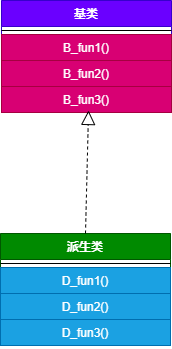


基类的虚函数表：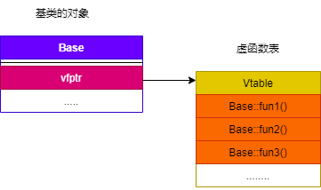


派生类的虚函数表：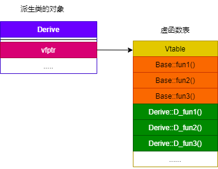

主函数中基类的指针 `p` 指向了派生类的对象，当调用函数 `B_fun1()` 时，通过派生类的虚函数表找到该函数的地址，从而完成调用。


**虚拟函数表指针 vptr:**
带有虚函数的类，通过该类所隐含的虚函数表来实现多态机制，该类的每个对象均具有一个指向本类虚函数表的指针，这一点并非 C++ 标准所要求的，而是编译器所采用的内部处理方式。实际应用场景下，不同平台、不同编译器厂商所生成的虚表指针在内存中的布局是不同的，有些将虚表指针置于对象内存中的开头处，有些则置于结尾处。如果涉及多重继承和虚继承，情况还将更加复杂。因此永远不要使用 C 语言的方式调用 memcpy() 之类的函数复制对象，而应该使用初始化（构造和拷构）或赋值的方式来复制对象。
程序示例，我们通过对象内存的开头处取出 vptr，并遍历对象虚函数表。

```c++
#include <iostream>
#include <memory>
using namespace std;
 
 
typedef void (*func)(void);

class A {
public:
	void f() { cout << "A::f" << endl; }
	void g() { cout << "A::g" << endl; }
	void h() { cout << "A::h" << endl; }
};

class Base {
public:
	virtual void f() { cout << "Base::f" << endl; }
	virtual void g() { cout << "Base::g" << endl; }
	virtual void h() { cout << "Base::h" << endl; }
};

class Derive: public Base {
public:
	void f() { cout << "Derive::f" << endl; }
    void g() { cout << "Derive::g" << endl; }
	void h() { cout << "Derive::h" << endl; }
};
 
int main() 
{
	Base base;
    Derive derive;
	//获取vptr的地址，运行在gcc  x64环境下，所以将指针按unsigned long *大小处理
    //另外基于C++的编译器应该是保证虚函数表的指针存在于对象实例中最前面的位置
	unsigned long* vPtr = (unsigned long*)(&base);
	//获取vTable 首个函数的地址
	func vTable_f = (func)*(unsigned long*)(*vPtr);
	//获取vTable 第二个函数的地址
	func vTable_g = (func)*((unsigned long*)(*vPtr) + 1);//加1 ，按步进计算
	func vTable_h = (func)*((unsigned long*)(*vPtr) + 2);//同上
	vTable_f();
	vTable_g();
	vTable_h();
    vPtr = (unsigned long*)(&derive);
	//获取vTable 首个函数的地址
	vTable_f = (func)*(unsigned long*)(*vPtr);
	//获取vTable 第二个函数的地址
	vTable_g = (func)*((unsigned long*)(*vPtr) + 1);//加1 ，按步进计算
	vTable_h = (func)*((unsigned long*)(*vPtr) + 2);//同上
	vTable_f();
	vTable_g();
	vTable_h();
    cout<<sizeof(A)<<endl;
    cout<<sizeof(base)<<endl;
    cout<<sizeof(derive)<<endl;
	return 0;
}
/*
Base::f
Base::g
Base::h
Derive::f
Derive::g
Derive::h
1
8
8
*/
```

我们可以看到同样的函数实现，对象在分配空间时，编译器会为对象多分配一个 `vptr` 指针的空间。


**虚函数的使用场景:**
构造函数不能为虚函数：构造函数不能定义为虚函数。构造函数是在实例化对象的时候进行调用，如果此时将构造函数定义成虚函数，需要通过访问该对象所在的内存空间才能进行虚函数的调用（因为需要通过指向虚函数表的指针调用虚函数表，虽然虚函数表在编译时就有了，但是没有虚函数的指针，虚函数的指针只有在创建了对象才有），但是此时该对象还未创建，便无法进行虚函数的调用。所以构造函数不能定义成虚函数。
析构函数为虚函数：一般建议析构函数定义成虚函数，这样做可以有效是防止内存泄漏，实际应用时当基类的指针或者引用指向或绑定到派生类的对象时，如果未将基类的析构函数定义成虚函数，当我们对基类指针执行 delete 操作时，此时只会调用基类的析构函数，将基类的成员所占的空间释放掉，而派生类中特有的资源就会无法释放而导致内存泄漏。
static 函数不能定义为虚函数。


### 构造函数、析构函数是否可以定义成虚函数

面试高频指数：★★★★★

**构造函数一般不定义为虚函数:**

- 从存储空间的角度考虑：构造函数是在实例化对象的时候进行调用，如果此时将构造函数定义成虚函数，需要通过访问该对象所在的内存空间才能进行虚函数的调用（因为需要通过指向虚函数表的指针调用虚函数表，虽然虚函数表在**编译**时就有了，但是没有虚函数的指针，虚函数的指针只有在创建了对象才有），但是此时该对象还未创建，便无法进行虚函数的调用。所以构造函数不能定义成虚函数。
- 从使用的角度考虑：虚函数是基类的指针指向派生类的对象时，通过该指针实现对派生类的虚函数的调用，构造函数是在创建对象时自动调用的。
- 从实现上考虑：虚函数表指针是在创建对象之后才有的，因此不能定义成虚函数。
- 从类型上考虑：在创建对象时需要明确其类型。

**析构函数一般定义成虚函数：**
析构函数定义成虚函数是为了防止内存泄漏，因为当基类的指针或者引用指向或绑定到派生类的对象时，如果未将基类的析构函数定义成虚函数，会调用基类的析构函数，那么只能将基类的成员所占的空间释放掉，派生类中特有的就会无法释放内存空间导致内存泄漏。
比如以下程序示例:

```c++
#include <iostream>

using namespace std;

class A {
private:
    int val;
public:
    ~A() {
        cout<<"A destroy!"<<endl;
    }
};

class B: public  A {
private:
    int *arr;
public:
    B() {
        arr = new int[10];
    }
    ~B() {
        cout<<"B destroy!"<<endl;
        delete arr;
    }
};

int main() {
    A *base = new B();
    delete base;
    return 0;
}
// A destroy!
```

我们可以看到如果析构函数不定义为虚函数，此时执行析构的只有基类，而派生类没有完成析构。我们将析构函数定义为虚函数，在执行析构时，则根据对象的类型来执行析构函数，此时派生类的资源得到释放。

```c++
#include <iostream>

using namespace std;

class A {
private:
    int val;
public:
    virtual ~A() {
        cout<<"A destroy!"<<endl;
    }
};

class B: public  A {
private:
    int *arr;
public:
    B() {
        arr = new int[10];
    }
    virtual ~B() {
        cout<<"B destroy!"<<endl;
        delete arr;
    }
};

int main() {
    A *base = new B();
    delete base;
    return 0;
}
// B destroy!
// A destroy!
```


### 多重继承的常见问题及避免方法

面试高频指数：★★★★★

多重继承（多继承）：是指从多个直接基类中产生派生类。多重继承容易出现命名冲突和数据冗余问题。
程序示例如下:

```c++
#include <iostream>
using namespace std;

// 间接基类
class Base1
{
public:
    int var1;
};

// 直接基类
class Base2 : public Base1
{
public:
    int var2;
};

// 直接基类
class Base3 : public Base1
{
public:
    int var3;
};

// 派生类
class Derive : public Base2, public Base3
{
public:
    void set_var1(int tmp) { var1 = tmp; } // error: reference to 'var1' is ambiguous. 命名冲突
    void set_var2(int tmp) { var2 = tmp; }
    void set_var3(int tmp) { var3 = tmp; }
    void set_var4(int tmp) { var4 = tmp; }

private:
    int var4;
};

int main()
{
    Derive d;
    return 0;
}
```

上述程序的继承关系如下：（菱形继承）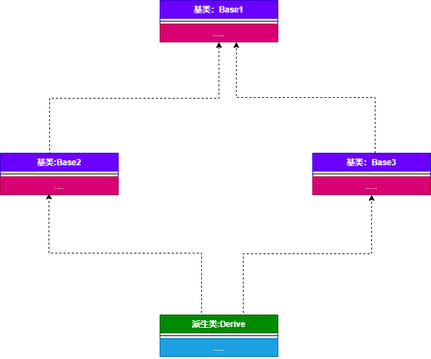

上述代码中存的问题：
对于派生类 Derive 上述代码中存在直接继承关系和间接继承关系。

直接继承：Base2 、Base3
间接继承：Base1
对于派生类中继承的的成员变量 var1 ，从继承关系来看，实际上保存了两份，一份是来自基类 Base2，一份来自基类 Base3。因此，出现了命名冲突。

1 解决方法：显式声明出现冲突的成员变量来源于哪个类。

```c++
#include <iostream>
using namespace std;

// 间接基类
class Base1
{
public:
    int var1;
};

// 直接基类
class Base2 : public Base1
{
public:
    int var2;
};

// 直接基类
class Base3 : public Base1
{
public:
    int var3;
};

// 派生类 
class Derive : public Base2, public Base3
{
public:
    void set_var1(int tmp) { Base2::var1 = tmp; } // 这里声明成员变量来源于类 Base2，当然也可以声明来源于类 Base3
    void set_var2(int tmp) { var2 = tmp; }
    void set_var3(int tmp) { var3 = tmp; }
    void set_var4(int tmp) { var4 = tmp; }

private:
    int var4;
};

int main()
{
    Derive d;
    return 0;
}
```

2 解决方法： 虚继承

```c++
#include <iostream>
using namespace std;

// 间接基类，即虚基类
class Base1
{
public:
    int var1;
};

// 直接基类 
class Base2 : virtual public Base1 // 虚继承
{
public:
    int var2;
};

// 直接基类 
class Base3 : virtual public Base1 // 虚继承
{
public:
    int var3;
};

// 派生类
class Derive : public Base2, public Base3
{
public:
    void set_var1(int tmp) { var1 = tmp; } 
    void set_var2(int tmp) { var2 = tmp; }
    void set_var3(int tmp) { var3 = tmp; }
    void set_var4(int tmp) { var4 = tmp; }

private:
    int var4;
};

int main()
{
    Derive d;
    return 0;
}
```

类之间的继承关系：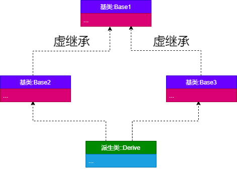

由于使用多重继承很容易出现二义性的问题，将使得程序调试和维护工作变得非常复杂，C++ 之后的很多面向对象的编程语言，例如 Java、C#、PHP 等，都不支持多继承。


### 深拷贝和浅拷贝的区别

面试高频指数：★★★★★

> 浅拷贝是指仅复制对象的指针或引用，而不是实际的数据。这意味着新对象和原始对象共享相同的数据，因此对其中一个对象所做的更改将影响另一个对象。
>
> 深拷贝是指复制对象及其指针所指向的数据。这意味着新对象将拥有自己的数据副本，而不是与原始对象共享相同的数据。
>
> **浅拷贝：简单的赋值拷贝操作**
>
> **深拷贝：在堆区重新申请空间，进行拷贝操作**

如果一个类拥有资源，该类的对象进行复制时，如果资源重新分配，就是深拷贝，否则就是浅拷贝。

深拷贝：该对象和原对象占用不同的内存空间，既拷贝存储在栈空间中的内容，又拷贝存储在堆空间中的内容。
浅拷贝：该对象和原对象占用同一块内存空间，仅拷贝类中位于栈空间中的内容。

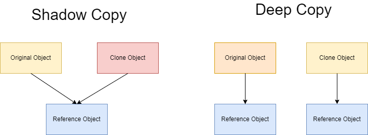

当类的成员变量中有指针变量时，最好使用深拷贝。因为当两个对象指向同一块内存空间，如果使用浅拷贝，当其中一个对象的删除后，该块内存空间就会被释放，另外一个对象指向的就是垃圾内存。

```c++
#include <iostream>

using namespace std;

class Test
{
private:
	int *p;

public:
	Test(int tmp)
	{
		this->p = new int(tmp);
		cout << "Test(int tmp)" << endl;
	}
	~Test()
	{
		if (p != NULL)
		{
			delete p;
		}
		cout << "~Test()" << endl;
	}
};

int main()
{
	Test ex1(10);	
	Test ex2 = ex1; 
	return 0;
}
/*
运行结果：
Test(int tmp)
~Test()
*/
```

说明：上述代码中，类对象 ex1、ex2 实际上是指向同一块内存空间，对象析构时，ex2 先将内存释放了一次，之后析构对象 ex1 时又将这块已经被释放过的内存再释放一次。对同一块内存空间释放了两次，会导致程序崩溃。

深拷贝实例：

```c++
#include <iostream>

using namespace std;

class Test
{
private:
	int *p;

public:
	Test(int tmp)
	{
		p = new int(tmp);
		cout << "Test(int tmp)" << endl;
	}
	~Test()
	{
		if (p != NULL)
		{
			delete p;
		}
		cout << "~Test()" << endl;
	}
	Test(const Test &tmp) // 定义拷贝构造函数
	{
		p = new int(*tmp.p);
		cout << "Test(const Test &tmp)" << endl;
	}

};

int main()
{
	Test ex1(10);	
	Test ex2 = ex1; 
	return 0;
}
/*
Test(int tmp)
Test(const Test &tmp)
~Test()
~Test()
*/
```

编译器生成的默认拷贝函数均大部分都是浅拷贝，所有在特定场景下需要禁止编译器生成默认拷贝构造函数。在遇到需要使用堆内存的构造函数中，我们需要特别注意浅拷贝和深拷贝的使用方式，防止两个不同的对象指向同一块内存区域。


### 单继承和多继承的虚函数表结构

面试高频指数：★★★★☆


### 如何禁止构造函数的使用

面试高频指数：★★★★☆


### 什么是类的默认构造函数

面试高频指数：★★★★☆


### 如何减少构造函数开销

面试高频指数：★★★★☆


### 如何减少构造函数开销

面试高频指数：★★★★☆


### 成员初始化列表效率高的原因

面试高频指数：★★★★☆

对象的成员函数数据类型可分为语言内置类型和用户自定义类，对于用户自定义类型，利用成员初始化列表效率高。用户自定义类型如果使用类初始化列表，直接调用该成员变量对应的构造函数即完成初始化；如果在构造函数中初始化，由于 C++ 规定对象的成员变量的初始化动作发生在进入自身的构造函数本体之前，那么在执行构造函数之前首先调用默认的构造函数为成员变量设初值，在进入函数体之后，再显式调用该成员变量对应的构造函数。因此使用列表初始化会减少调用默认的构造函数的过程，效率更高一些。

```c++
#include <iostream>
using namespace std;
class A
{
private:
    int val;
public:
    A()
    {
        cout << "A()" << endl;
    }
    A(int tmp)
    {
        val = tmp;
        cout << "A(int " << val << ")" << endl;
    }
};

class Test1
{
private:
    A ex;

public:
    Test1() : ex(1) // 成员列表初始化方式
    {
    }
};

class Test2
{
private:
    A ex;

public:
    Test2() // 函数体中赋值的方式
    {
        ex = A(2);
    }
};
int main()
{
    Test1 ex1;
    cout << endl;
    Test2 ex2;
    return 0;
}
/*
运行结果：
A(int 1)

A()
A(int 2)
*/
```

说明：从程序运行结果可以看出，使用成员列表初始化的方式会省去调用默认的构造函数的过程。如果自定义的类型没有默认构造函数，此时必须使用初始化列表提供初值对这些类型进行初始化。


### 友元函数的作用及使用场景

面试高频指数：★★★★☆


### 静态绑定和动态绑定的实现

面试高频指数：★★★★☆


### 编译时多态和运行时多态的区别

面试高频指数：★★★★☆


### C++ 模板编程

面试高频指数：★★★☆☆

模板是 C++ 编程语言的一个特性，它允许函数和类使用泛型类型进行操作。这允许一个函数或类在许多不同的数据类型上工作，而无需为每个类型重写。C++ 模板是泛型编程的基础，泛型编程即以一种独立于任何特定类型的方式编写代码，C++ 中使用 template 关键字。模板是创建泛型类或函数的蓝图或公式。库容器，比如迭代器和算法，都是泛型编程的例子，它们都使用了模板的概念。
共有三种模板：函数模板、类模板以及自 C++ 14 以来的变量模板:

1. 函数模板:
   函数模板的行为类似于函数，只是模板可以有许多不同类型的参数。一个函数模板代表一个函数族。使用类型参数声明函数模板的格式是：

   ```c++
   template<class identifier> declaration;
   template<typename identifier> declaration;
   ```

   上述两种表达方式完全相同，引入后一种时为了防止混淆。比如 `C++` 标准库包含 `max(x, y)` 返回较大的 `x` 和的函数模板 `y` 。该函数模板可以这样定义:

   ```c++
   template<typename T> T max(T &a, T &b) { return a > b ? a : b; }
   std :: cout << max ( 3 , 7 ) << '\n' ;         
   std :: cout << max ( 3.0 , 7.0 ) << '\n' ;         
   ```

   这个单一的函数定义适用于许多数据类型。具体来说，它适用于定义了 >（大于运算符）的所有数据类型。除了限制对一个函数描述的更改并使代码更易于阅读之外，函数模板的使用减少了源代码的编写，与为特定程序中使用的所有不同数据类型编写单独的函数相比，模板不会产生更小的目标代码，实际编译器在编译时，会为根据不同的类型编译产生不同的函数。

   

2. 类模板：
   类模板提供了基于参数生成类的规范。类模板通常用于实现容器。类模板通过将一组给定的类型作为模板参数传递给它来实例化。C++ 标准库包含许多类模板，特别是改编自标准模板库的容器，例如 vector，list。

   ```c++
   template <class T>
   class Stack { 
     private: 
       vector<T> elements;     // 元素 
    
     public: 
       void push(T const&);  // 入栈
       void pop();               // 出栈
       T top() const;            // 返回栈顶元素
       bool empty() const{       // 如果为空则返回真。
           return elements.empty(); 
       } 
   };
   ```

3. 变量模板：
   在 `C++14` 以后，变量也可以参数化为特定的类型，这称为变量模板。

   ```c++
   template<typename T> 
   constexpr T pi = T{3.141592653589793238462643383L}; // (Almost) from std::numbers::pi
   ```

   使用变量模板时，必须显式地指定它的类型：

   ```c++
   std::cout << pi<double> << '\n';
   std::cout << pi<float> << '\n';
   ```

4. 函数重载与模板的区别:
   函数重载和模板都是面向对象多态特性的例子。当多个函数执行非常相似（不相同）的操作时使用函数重载，当多个函数执行相同操作时使用模板。当模板类或者模板函数中含有静态变量时，则每个模板的实例类型都含有一个静态成员。

   ```c++
   template <class T>
   class A { 
     public: 
   	static T val; 
   }; 
   A<int> a; // 含有静态成员 val;
   A<string> b; // 含有静态成员 val;
   ```

   


### 如何避免拷贝

面试高频指数：★★★☆☆


### 为什么拷贝构造函数必须声明为引用

面试高频指数：★★★☆☆


### 如何禁止一个类被实例化

面试高频指数：★★★☆☆


### 实例化一个对象需要哪几个阶段

面试高频指数：★★★☆☆


### 不允许修改类的成员变量的函数实现方法

面试高频指数：★★★☆☆


### 对象创建限制在堆或栈

面试高频指数：★★☆☆☆


### 空类字节数及对应生成的成员函数

面试高频指数：★★☆☆☆


### 类的大小

面试高频指数：★★☆☆☆


### 如何让类不能被继承

面试高频指数：★★☆☆☆


## C++ 语言特性相关

### 左值和右值：区别、引用及转化

面试高频指数：★★★★★
1 左值与右值:
左值：指表达式结束后依然存在的持久对象。可以取地址，可以通过内置（不包含重载） & 来获取地址，我们可以将一个右值赋给左值。
右值：表达式结束就不再存在的临时对象。不可取地址，不可以通过内置（不包含重载） & 来获取地址。由于右值不可取地址，因此我们不能将任何值赋给右值。
使用 = 进行赋值时，= 的左边必须为左值，右值只能出现在 = 的右边。
程序示例:

```c++
// x 是左值，666 为右值
int x = 666;   // ok 
int *y = x; // ok
int *z = &666 // error
666 = x; // error
int a = 9; // a 为左值
int b = 4; // b 为左值
int c = a + b // c 为左值 , a + b 为右值
a + b = 42; // error
```

- 函数返回值即可以是左值，也可以是右值:

```c++
int setValue()
{
    return 6;
}

int global = 100;

int& setGlobal()
{
    return global;    
}
setValue() = 3; // error!
setGlobal() = 400; // OK
```

2 左值引用和右值引用：
引用的定义在之前的章节中已经介绍过。
左值引用：
左值引用可以区分为常量左值引用和非常量左值引用。左值引用的底层实现是指针实现。
非常量左值引用只能绑定到非常量左值，不能绑定到常量左值和右值。如果绑定到非常量右值，就有可能指向一个已经被销毁的对象。
常量左值引用能绑定到非常量左值，常量左值和右值；

```c++
int y = 10;
int& yref = y;  // ok
int& xref = 10; // error， 非常量左值引用绑定右值
const &xref = 10; // ok, 常量左值引用绑定右值
int a = 10;
int b = 20;
int& zref = a + b // error， a + b为右值


int &aref1 = a;  //ok, 非常量左值引用绑定非常量左值
const int &aRef2 = a; //ok, 常量左值引用绑定非常量左值
const int c = 4;   
int &cref1 = c;  // error，非常量左值不能绑定常量右值
const int &cref2 = c; //ok, 常量左值引用绑定常量左值
const int &ref2 = a + b;    //ok, 常量左值引用绑定到右值（表达式）
```

我们来观察一下函数运行:

- 如果函数的形参定义为非常量的左值引用，则会出现错误，因为此时我们将一个左值引用绑定到右值上：

```c++
void fnc(int& x)
{
}
int main()
{
    fnc(10);  // error!
}
```

- 如果函数的形参定义为常量的左值引用，则可以正常运行，因为此时我们将一个常量左值引用绑定到一个右值上：

```c++
void fnc(const int& x)
{
}
int main()
{
    int x = 10;
    fnc(x);   // ok!
    fnc(10);  // ok!
}
```

右值引用：
右值引用 （Rvalue Referene） 是 C++ 11 中引入的新特性 , 它实现了转移语义 （Move Sementics）和精确传递 （Perfect Forwarding），&& 作为右值引用的声明符。右值引用必须绑定到右值的引用，通过 && 获得。右值引用只能绑定到一个将要销毁的对象上，因此可以自由地移动其资源。
从实践角度讲，它能够完美解决 C++ 中长久以来为人所诟病的临时对象效率问题。从语言本身讲，它健全了 C++ 中的引用类型在左值右值方面的缺陷。从库设计者的角度讲，它给库设计者又带来了一把利器。从使用者的角度来看，可以获得效率的提升，避免对象在传递过程中重复创建。
右值引用两个主要功能：

消除两个对象交互时不必要的对象拷贝，节省运算存储资源，提高效率。
能够更简洁明确地定义泛型函数。

```c++
#include <iostream>
using namespace std;

int g_val = 10;

void ProcessValue(int &i) {                         // 左值引用
    cout << "lValue processed: " << i << endl;
}

void ProcessValue(int &&i) {                        // 右值引用
    cout << "rValue processed: " << i << endl;
}

int GetValue() { // 返回右值
    return 3; 
} 

int& getVal() { // 返回左值引用
    return g_val; 
}

int main() {
    int a = 0;
    int b = 1;
    int &alRef = a;             // 左值引用
    int &&rRef1 = 1;            // 临时对象是右值
    int &&rRef2 = GetValue();   // 调用的函数为右值
    ProcessValue(a);            // 左值
    ProcessValue(getVal());     // 左值引用
    ProcessValue(1);            // 临时对象是右值
    ProcessValue(GetValue());   // 调用的函数为右值
    ProcessValue(a+b);          // 表达式为右值
    return 0;
}
/*
lValue processed: 0
lValue processed: 10
rValue processed: 1
rValue processed: 3
rValue processed: 1
*/
```

有了右值引用后，函数调用可以写为如下，此时我们用右值引用绑定到右值上：

```c++
void fnc(int&& x)
{

}

int main()
{
    int x = 10;
    fnc(x);   // error, 右值引用不能绑定到左值上
    fnc(10);  // ok!
}
```

3 左值转换成右值:
左值转换为右值
我们可以通过 std::move 可以将一个左值强制转化为右值，继而可以通过右值引用使用该值，以用于移动语义，从而完成将资源的所有权进行转移。

```c++
#include <iostream>
using namespace std;

void fun(int& tmp) 
{ 
  cout << "fun lvalue bind:" << tmp << endl; 
} 

void fun(int&& tmp) 
{ 
  cout << "fun rvalue bind:" << tmp << endl; 
} 

void fun1(int& tmp) 
{ 
  cout << "fun1 lvalue bind:" << tmp << endl; 
} 

int main() 
{ 
    int var = 11; 
    fun(12); // 右值引用
    fun(var); // 左值引用
    fun(std::move(var)); // 使用std::move转为右值引用
    fun(static_cast<int&&>(var));  // 使用static_cast转为右值引用
    fun((int&&)var); // 使用C风格强转为右值引用
    fun(std::forward<int&&>(var)); // 使用std::forwad<T&&>为右值引用
    fun1(12); // error
    return 0;
}
/*
fun rvalue bind:12
fun lvalue bind:11
fun rvalue bind:11
fun rvalue bind:11
fun rvalue bind:11
fun rvalue bind:11
*/
```

4 引用折叠:
通过类型别名或者通过模板参数间接定义，多重引用最终折叠成左值引用或者右值引用。有两种引用（左值和右值），所以就有四种可能的引用+引用的组合（左值 + 左值，左值 + 右值，右值 + 左值，右值 + 右值）。如果引用的引用出现在允许的语境，该双重引用会折叠成单个引用，规则如下：
所有的右值引用叠加到右值引用上仍然还是一个右值引用；T&& && 折叠成 T&&
所有的其他引用类型之间的叠加都将变成左值引用。T& &&,T&& &, T&& 折叠成 T&。

```c++
#include <iostream>
using namespace std;

typedef int&  lref;
typedef int&& rref;

void fun(int&& tmp) 
{ 
    cout << "fun rvalue bind:" << tmp << endl; 
} 

void fun(int& tmp) 
{ 
    cout << "fun lvalue bind:" << tmp << endl; 
} 

int main() 
{ 
    int n = 11; 
    fun((lref&)n);
    fun((lref&&)n);
    fun((rref&)n);
    fun((rref&&)n);
    return 0;
}
/*
fun lvalue bind:11
fun lvalue bind:11
fun lvalue bind:11
fun rvalue bind:11
*/
```

5 万能引用类型:
在模板中 T&& t 在发生自动类型推断的时候，它是未定的引用类型（universal references），它既可以接受一个左值又可以接受一个右值。如果被一个左值初始化，它就是一个左值；如果它被一个右值初始化，它就是一个右值，它是左值还是右值取决于它的初始化。
示例代码如下:

```c++
template<typename T>
void f(T&& param); 

template<typename T>
class Test {
    Test(Test&& rhs); 
};
```

对于函数 template<typename T>void f(T&& t)，当参数为右值 10 的时候，根据 universal references 的特点，t 被一个右值初始化，那么 t 就是右值；当参数为左值 x 时，t 被一个左值引用初始化，那么 t 就是一个左值。
上面的例子中，param 是 universal reference，rhs 是 Test&& 右值引用，因为模版函数 f 发生了类型推断，而 Test&& 并没有发生类型推导，因为 Test&& 是确定的类型了。正是因为右值引用可能是左值也可能是右值，依赖于初始化，我们可以利用这一点来实现移动语义和完美转发。


### std::move() 函数的实现原理

面试高频指数：★★★★★

1. `std::move()` 函数原型：
   `move` 函数是将任意类型的左值转为其类型的右值引用。

   ```c++
   template <typename T>
   typename remove_reference<T>::type&& move(T&& t)
   {
   	return static_cast<typename remove_reference<T>::type &&>(t)
           ;
   }
   ```
   
   首先需要了解一下，引用折叠原理:
   
   右值传递给上述函数的形参 T&& 依然是右值，即 T&& && 相当于 T&&。
   左值传递给上述函数的形参 T&& 依然是左值，即 T&& & 相当于 T&。
   我们已经知道折叠原理，通过引用折叠原理可以知道，move() 函数的形参既可以是左值也可以是右值。
   再次详细描述 move 函数的处理流程:
   
   首先利用万能模板将传入的参数 t 进行处理，我们知道右值经过 T&& 传递类型保持不变还是右值，而左值经过 T&& 变为普通的左值引用，以保证模板可以传递任意实参，且保持类型不变；对参数 t 做一次右值引用，根据引用折叠规则，右值的右值引用是右值引用，而左值的右值引用是普通的左值引用。万能模板既可以接受左值作为实参也可以接受右值作为实参。
   通过 remove_refrence 移除引用，得到参数 t 具体的类型 type；
   最后通过 static_cast<> 进行强制类型转换，返回 type && 右值引用。
   
   
   
2. `remove_reference` 具体实现：
   `remove_reference` 主要作用是解除类型中引用并返回变量的实际类型。

   ```c++
   //原始的，最通用的版本
   template <typename T> struct remove_reference{
       typedef T type;  //定义 T 的类型别名为 type
   };
    
   //部分版本特例化，将用于左值引用和右值引用
   template <class T> struct remove_reference<T&> //左值引用
   { typedef T type; }
    
   template <class T> struct remove_reference<T&&> //右值引用
   { typedef T type; }   
     
   //举例如下,下列定义的a、b、c三个变量都是int类型
   int i;
   remove_refrence<decltype(42)>::type a;             //使用原版本，
   remove_refrence<decltype(i)>::type  b;             //左值引用特例版本
   remove_refrence<decltype(std::move(i))>::type  b;  //右值引用特例版本 
   ```

   

3. forward 的实现：
   forward 保证了在转发时左值右值特性不会被更改，实现完美转发。主要解决引用函数参数为右值时，传进来之后有了变量名就变成了左值。比如如下代码:

   ```c++
   #include <iostream>
   using namespace std;
   
   template<typename T>
   void fun(T&& tmp) 
   { 
       cout << "fun rvalue bind:" << tmp << endl; 
   } 
   
   template<typename T>
   void fun(T& tmp) 
   { 
       cout << "fun lvalue bind:" << tmp << endl; 
   } 
   
   template<typename T>
   void test(T&& x) {
       fun(x);
       fun(std::forward<T>(x));
   }
   
   int main() 
   { 
       int a = 10;
       test(10);
       test(a);
       return 0;
   }
   /*
   fun lvalue bind:10
   fun rvalue bind:10
   fun lvalue bind:10
   fun lvalue bind:10
   */
   ```

   forward 函数的处理流程:

   forward 同样利用引用折叠的特性，对参数 t 做一次右值引用，根据引用折叠规则，右值的右值引用是右值引用，而左值的右值引用是普通的左值引用。forward 的实现有两个函数：
   第一个，接受的参数是左值引用，只能接受左值。
   第二个，接受的参数是右值引用，只能接受右值。
   根据引用折叠的原理：
   如果传递的是左值，_Tp 推断为 T &，则返回变成static_cast<T& &&>，也就是 static_cast<T&>，所以返回的是左值引用。
   如果传递的是右值，_Tp 推断为 T&& 或者 T，则返回变成 static_cast<T && &&>，所以返回的是右值引用。
   forward 与 move 最大的区别是，move 在进行类型转换时，利用 remove_reference 将外层的引用全部去掉，这样可以将 t 强制转换为指定类型的右值引用，而 forward 则利用引用折叠的技巧，巧妙的保留了变量原有的属性。
   以下示例代码就可以观察到 move 与 forward 的原理区别:

   ```c++
   #include <iostream>
   using namespace std;
   
   typedef int&  lref;
   typedef int&& rref;
   
   void fun(int&& tmp) 
   { 
       cout << "fun rvalue bind:" << tmp << endl; 
   } 
   
   void fun(int& tmp) 
   { 
       cout << "fun lvalue bind:" << tmp << endl; 
   } 
   
   int main() 
   { 
       int a = 11; 
   	int &b = a;
   	int &&c = 100;
   	fun(static_cast<lref &&>(b));
   	fun(static_cast<rref &&>(c));
   	fun(static_cast<int &&>(a));
   	fun(static_cast<int &&>(b));
   	fun(static_cast<int &&>(c));
       return 0;
   }
   /*
   fun lvalue bind:11
   fun rvalue bind:100
   fun rvalue bind:11
   fun rvalue bind:11
   fun rvalue bind:100
   */
   
   ```

   


### 指针及其大小、用法

指针的定义:

> 指针是一种变量类型，其值为另一个变量的地址，即内存位置的直接地址。就像其他变量或常量一样，必须在使用指针存储其他变量地址之前，对其进行声明。在 64 位计算机中，指针占 8 个字节空间。

使用指针时可以用以下几个操作：

- 定义一个指针变量；
- 把变量地址赋值给指针；
- 访问指针变量中可用地址的值；
- 通过使用一元运算符 * 来返回位于操作数所指定地址的变量的值；

```c++
#include<iostream>
using namespace std;

int main(){
    int *p = nullptr;
    cout << sizeof(p) << endl; // 8

    char *p1 = nullptr;
    cout << sizeof(p1) << endl; // 8
    return 0;
}
```

**指针的用法：**
空指针：C 语言中定义了空指针为 NULL，实际是一个宏，它的值是 0，即 #define NULL 0。

C++ 中使用 `nullptr` 表示空指针，它是 C++ 11 中的关键字，是一种特殊类型的字面值，可以被转换成任意其他类型。

**指针的运算:**

- 两个同类型指针可以比较大小；
- 两个同类型指针可以相减；
- 指针变量可以和整数类型变量或常量相加；
- 指针变量可以减去一个整数类型变量或常量；
- 指针变量可以自增，自减；

```c++
int a[10];
int *p1 = a + 1; // 指针常量相加
int *p2 = a + 4;
bool greater = p2 > p1; // 比较大小
int offset = p2 - a; // 相减
p2++; // 自增
p1--; // 自减
```


**指向普通对象的指针:**

```c++
#include <iostream>
using namespace std;

class A
{
};

int main()
{
    A *p = new A();
    return 0;
}
```


**指向常量对象的指针：指针常量，const 修饰表示指针指向的内容不能更改。**

```c++
#include <iostream>
using namespace std;

int main(void)
{
    const int c_var = 10;
    const int * p = &c_var;
    cout << *p << endl;
    return 0;
}
```


**指向函数的指针：函数指针。** ❤

```c++
#include <iostream>
using namespace std;

int add(int a, int b){
    return a + b;
}

typedef int (*fun_p) (int, int);	
//函数指针，函数的返回值类型是int, 函数名为fun_p, 参数类型是(int int)
//如果将*fun_p前的()去掉
//那么int *fun_p(int, int), fun_p会优先与后面的()结合，fun_p是一个函数，返回值是int*

int main(void)
{
    fun_p fn = add;	//函数名等价于函数的地址	
    cout << fn(1, 6) << endl;//使用时传入函数名和参数
    return 0;
}
```


**指向对象成员的指针，包括指向对象成员函数的指针和指向对象成员变量的指针。**
**特别注意：定义指向成员函数的指针时，要标明指针所属的类。**

```c++
#include <iostream>
using namespace std;

class A
{
public:
    int var1, var2; 
	static int x;
	static int get() {
		return 100;
	}

    int add(){
        return var1 + var2;
    }

};


int main()
{
    A ex;
    ex.var1 = 3;
    ex.var2 = 4;
    int *p = &ex.var1; // 指向对象成员变量的指针
    cout << *p << endl;

    int (A::*fun_p)();
    int (*fun_q)();
    fun_p = &A::add; // 指向对象非静态成员函数的指针 fun_p
    fun_q = A::get;  // 指向对象静态成员函数的指针 fun_q
    cout << (ex.*fun_p)() << endl;
    cout << (*fun_q)() << endl;
    return 0;

}
```


而对于函数类型到函数指针类型的默认转换，只有当函数类型是左值的时候才行。所有对于非静态的成员函数，就不存在这种从函数类型到函数指针类型的默认转换，于是编译器也就不知道这个 p = A::add 该怎么确定。

由于非静态成员函数指针可以有多态行为，在编译期函数地址可能无法确定。

静态成员函数指针在编译期函数地址则可以确定。

**this 指针：指向类的当前对象的指针常量。**

```c++
#include <iostream>
#include <cstring>
using namespace std;

class A
{
public:
    void set_name(string tmp)
    {
        this->name = tmp;
    }
    
    void set_age(int tmp)
    {
        this->age = age;
    }
    
    void set_sex(int tmp)
    {
        this->sex = tmp;
    }
    
    void show()
    {
        cout << "Name: " << this->name << endl;
        cout << "Age: " << this->age << endl;
        cout << "Sex: " << this->sex << endl;
    }

private:
    string name;
    int age;
    int sex;
};

int main()
{
    A *p = new A();
    p->set_name("Alice");
    p->set_age(16);
    p->set_sex(1);
    p->show();

    return 0;

}
```


### 指针和引用的区别

指针：指针是一个变量，它保存另一个变量的**内存地址**。需要使用 * 运算符指针才能访问它指向的内存位置。
引用：引用变量是**别名**，即已存在变量的另一个名称。对于编译器来说，引用和指针一样，也是通过存储对象的地址来实现的。**实际可以将引用视为具有自动间接寻址的常量指针**，编译器自动为引用使用 * 运算符。
**二者的区别**

> [引用](C:\Users\hp-pc\Desktop\C++\Essential C++\Essential C++ Notes.md)

- 是否可变:
  指针所指向的内存空间在程序运行过程中可以改变，而引用所绑定的对象一旦初始化绑定就不能改变。
- 是否占内存:
  指针本身在内存中占有内存空间，引用相当于变量的别名，在内存中不占内存空间（实际底层编译器可能用指针实现的引用），当我们使用 & 对引用取地址时，将会得到绑定对象的地址。

```c++
#include <iostream>
using namespace std;

int main() 
{ 
    int a = 10;
    int &b = a;
    cout << &a << endl;
    cout << &b << endl;
    return 0;
}
```

- 是否可为空：
  指针可以定义时不用初始化直接悬空，但是引用初始化时必须绑定对象。
- 是否能为多级
  指针可以有多级，但是引用只能一级。我们可以定义指针的指针，但不能定义引用的引用。


### 常量指针和指针常量的区别 ❤

> 指针常量和常量指针的区别在于它们的“常量”是指针本身还是所指向的值。指针常量是指针本身是不可更改的，所指向的值可以更改；而常量指针是指针所指向的值是不可更改的，指针本身可以更改。

**常量指针：**
**常量指针本质上是个指针，只不过这个指针指向的对象是常量。**
特点：**const 的位置在指针声明运算符 * 的左侧**。只要 const 位于 * 的左侧，无论它在类型名的左边或右边，都表示指向常量的指针。（可以这样理解：* 左侧表示指针指向的对象，该对象为常量，那么该指针为常量指针。）

```c++
const int * p;
int const * p;
```

- 注意 1：指针指向的对象不能通过这个指针来修改，也就是说常量指针可以被赋值为变量的地址，之所以叫做常量指针，是**限制了通过这个指针修改变量的值**。
  例如：

  ```c++
  #include <iostream>
  using namespace std;
  
  int main()
  {
      const int c_var = 8;
      const int *p = &c_var; 
      *p = 6;            // error: assignment of read-only location '* p'
      return 0;
  }
  ```

- 注意 2：**虽然常量指针指向的对象不能变化，可是因为常量指针本身是一个变量，因此，可以被重新赋值。**
  例如：

  ```c++
  #include <iostream>
  using namespace std;
  
  int main()
  {
      const int c_var1 = 8;
      const int c_var2 = 8;
      const int *p = &c_var1; 
      p = &c_var2;
      return 0;
  }
  
  ```


**指针常量：**
指针常量的本质上是个常量，只不过这个常量的值是一个指针。
**特点：const 位于指针声明操作符右侧，表明该对象本身是一个常量，***

 左侧表示该指针指向的类型，即以 * 为分界线，其左侧表示指针指向的类型，右侧表示指针本身的性质。

```c++
const int var;
int * const c_p = &var; 
```

- 注意 1：**指针常量的值是指针，这个值因为是常量，所以指针本身不能改变。**

  ```c++
  #include <iostream>
  using namespace std;
  
  int main()
  {
      int var, var1;
      int * const c_p = &var;
      c_p = &var1; // error: assignment of read-only variable 'c_p'
      return 0;
  }
  ```

- 注意 2：指针的内容可以改变。

  ```c++
  #include <iostream>
  using namespace std;
  
  int main()
  {
      int var = 3;
      int * const c_p = &var;
      *c_p = 12; 
      return 0;
  }
  ```


**指向常量的指针常量:**
指向常量的指针常量，指针的指向不可修改，指针所指的内存区域中的值也不可修改。

```c++
#include <iostream>
using namespace std;

int main()
{
    int var, var1;
    const int * const c_p = &var;
    c_p = &var1; // error: assignment of read-only variable 'c_p'
    *c_p = 12; // error: assignment of read-only location '*c_p'
    return 0;
}
```

部分特例:
根据前三部分的结论，我们可以得到以下代码的表示内容:

```c++
int ** const p;  // p 是一指针常量，它是一个指向指针的指针常量；
int * const * p; // p 是一个指针，它是一个指向指针常量的指针；
int const ** p;  // p 是一个指针，它是一个指向常量的指针的指针；
int * const * const p; // p 是一指针常量，它是一个指向指针常量的指针常量；
```


### 函数指针的定义

**函数指针：**
**函数指针本质是一个指针变量，只不过这个指针指向一个函数。**函数指针即指向函数的指针。我们知道所有的函数最终的编译都生成代码段，每个函数的都只是代码段中一部分而已，在每个函数在代码段中都有其调用的起始地址与结束地址，因此我们可以用指针变量指向函数的在代码段中的起始地址。

```c++
#include <iostream>
using namespace std;

int fun1(int tmp1, int tmp2)
{
  return tmp1 * tmp2;
}

int fun2(int tmp1, int tmp2)
{
  return tmp1 / tmp2;
}

int main()
{
  int (*fun)(int x, int y); //声明一个函数指针，返回值为int型 函数名为fun 参数为(int, int)
  fun = fun1; // ok
  fun = &fun1; // ok 两种写法均可以
  cout << fun(15, 5) << endl; 
  fun = fun2;
  cout << fun(15, 5) << endl; 
  cout<<sizeof(fun1)<<endl; // error
  cout<<sizeof(&fun1)<<endl;
  return 0;
}
/*
运行结果：
75
3
*/
```

需要注意的是，对于 fun1 和 &fun1:

函数名 fun1 存放的是函数的首地址，它是一个函数类型 void，&fun1 表示一个指向函数对象 fun1 的地址，是一个指针类型。它的类型是 int (*)(int,int)，因此 fun1 和 &fun1 的值是一样的；
&fun1 是一个表达式，函数此时作为一个对象，取对象的地址，该表达式的值是一个指针。
通过打印 `sizeof` 即可知道 fun1 与 &fun1 的区别；


### 参数传递中：值传递、引用传递、指针传递的区别

面试高频指数：★★★★★

1. 参数传递的三种方式：
   **值传递**：形参是实参的拷贝，函数对形参的所有操作不会影响实参。形参是实参的拷贝，改变形参的值并不会影响外部实参的值。从被调用函数的角度来说，值传递是单向的（实参->形参），参数的值只能传入。当函数内部可能需要改变参数具体的内容时，我们则采用形参，在组成原理上来说，对于值传递的方式我们采用直接寻址。
   **指针传递**：本质上是值传递，只不过拷贝的是指针的值，拷贝之后实参和形参是不同的指针，但指向的地址都相同。通过指针可以间接的访问指针所指向的对象，从而可以修改它所指对象的值。在组成原理上来说，对于指针传递的方式一般采用间接寻址。
   **引用传递**：当形参是引用类型时，我们说它对应的实参被引用传递。当然不同的编译器对于引用有不同的实现，部分编译器在底层也是使用指针来实现引用传递。

   ```c++
   #include <iostream>
   using namespace std;
   
   void fun1(int tmp){ // 值传递
       cout << &tmp << endl;
   }
   
   void fun2(int * tmp){ // 指针传递
       cout << tmp << endl;
   }
   
   void fun3(int &tmp){ // 引用传递
       cout << &tmp << endl;
   }
   
   int main()
   {
       int var = 5;
       cout << "var 在主函数中的地址：" << &var << endl;
   
       cout << "var 值传递时的地址：";
       fun1(var);
   
       cout << "var 指针传递时的地址：";
       fun2(&var);
   
       cout << "var 引用传递时的地址：";
       fun3(var);
       return 0;
   }
   
   /*
   运行结果：
   var 在主函数中的地址：0x23fe4c
   var 值传递时的地址：0x23fe20
   var 指针传递时的地址：0x23fe4c
   var 引用传递时的地址：0x23fe4c
   */
   ```

   说明：从上述代码的运行结果可以看出，只有在值传递时，形参和实参的地址不一样，在函数体内操作的不是变量本身。引用传递和指针传递，在函数体内操作的是变量本身。
   我们知道函数调用的方式，大部分的编译器按照函数形参定义的逆序，依次将参数压入栈内，上述提到参数的形式，如果是值传递，则压入栈中的是一个临时变量，该变量与传入的值内容相同；如果是指针传递或者引用传递，则压入栈的可能是一个临时的指针变量，该指针指向与传入的指针指向的内容相同。从函数调用机制来开，不管何种调用所有实参的传入时都在栈中开辟了空间。

   


### 迭代器的作用

面试高频指数：★★★★★

迭代器：一种抽象的设计概念，在设计模式中有迭代器模式，即提供一种方法，使之能够依序寻访某个容器所含的各个元素，而无需暴露该容器的内部表述方式。迭代器只是一种概念上的抽象，具有迭代器通用功能和方法的对象都可以叫做迭代器。迭代器有很多不同的能力，可以把抽象容器和通用算法有机的统一起来。迭代器基本分为五种，输入输出迭代器，前向逆向迭代器，双向迭代器和随机迭代器。

- 输入迭代器(Input Iterator)：只能向前单步迭代元素，不允许修改由该迭代器所引用的元素；

- 输出迭代器(Output Iterator)：只能向前单步迭代元素，对由该迭代器所引用的元素只有写权限；

- 向前迭代器(Forward Iterator)：该迭代器可以在一个区间中进行读写操作，它拥有输入迭代器的所有特性和输出迭代器的部分特性，以及向前单步迭代元素的能力；

- 双向迭代器(Bidirectional Iterator)：在向前迭代器的基础上增加了向后单步迭代元素的能力；

- 随机访问迭代器(Random Access Iterator)：不仅综合以后 4 种迭代器的所有功能，还可以像指针那样进行算术计算；

  

  在 C++ STL 中，容器 vector、deque 提供随机访问迭代器，list 提供双向迭代器，set 和 map 提供向前迭代器。

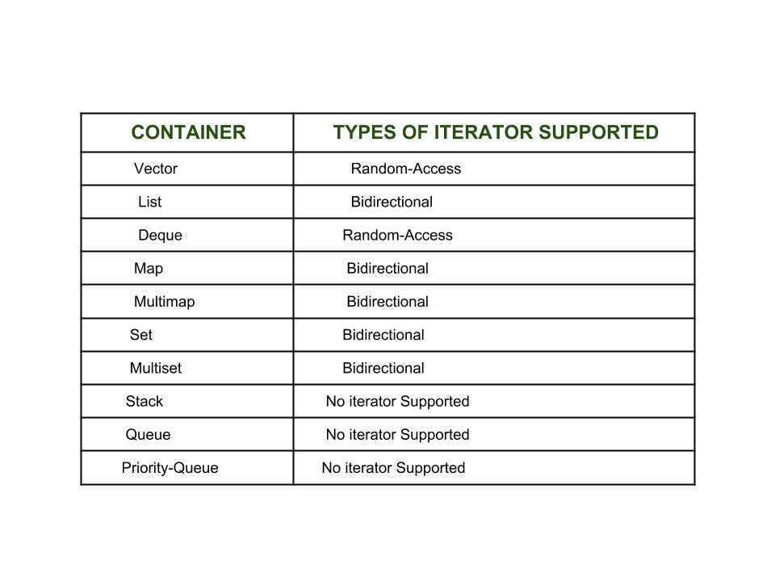

使用迭代器的优点：

- 代码编写方便：迭代器提供了通用接口来遍历元素，不用担心容器的大小，使用迭代器我们可以简单地使用成员函数 end() 来判断容器的结尾，遍历内容方便而简洁；
- 代码可重用性高：：迭代器提供了一组通用的 api 访问和遍历容器中的元素。迭代器支持代码的可重用性，它们可以被使用访问任何容器的元素。
- 容器可以动态处理：迭代器能够在需要时方便地从容器中动态添加或删除元素。

```c++
#include <iostream>
#include <vector>
using namespace std;

int main()
{
    vector<int> arr = {1, 2, 3, 4, 5, 6, 7, 8, 9, 0};
    vector<int>::iterator iter = arr.begin(); // 定义迭代器
    for (; iter != arr.end(); ++iter)
    {
        cout << *iter << " ";
    }
    return 0;
}
/*
运行结果：
1 2 3 4 5 6 7 8 9 0
*/
```


### 野指针和悬空指针详解

面试高频指数：★★★★☆


### 强制类型转换的类型

面试高频指数：★★★★☆


### 什么是类型萃取

面试高频指数：★★★★☆


### C++ 11 nullptr 比 NULL 的优势比较

面试高频指数：★★★☆☆


### 结构体相等的判断方式及 memcmp 函数的使用

面试高频指数：★★★☆☆


### 模板及其实现

面试高频指数：★★★☆☆


### 函数模板和类模板的区别

面试高频指数：★★★☆☆

- 实例化方式不同：函数模板实例化由编译程序在处理函数调用时自动完成，类模板实例化需要在程序中显式指定。
- 实例化的结果不同：函数模板实例化后是一个函数，类模板实例化后是一个类。
- 默认参数：函数模板不允许有默认参数，类模板在模板参数列表中可以有默认参数。
- 特化：函数模板只能全特化；而类模板可以全特化，也可以偏特化。

- 调用方式不同：函数模板可以进行类型推导，可以隐式调用，也可以显式调用；类模板只能显式调用。

  

函数模板调用方式举例：

```c++
#include<iostream>

using namespace std;

template <typename T>
T add_fun(const T & tmp1, const T & tmp2){
    return tmp1 + tmp2;
}

int main(){
    int var1, var2;
    cin >> var1 >> var2;
    cout << add_fun<int>(var1, var2); // 显式调用

    double var3, var4;
    cin >> var3 >> var4;
    cout << add_fun(var3, var4); // 隐式调用
    return 0;
}
```


### 什么是模板特化

面试高频指数：★★★☆☆

模板特化的原因：模板并非对任何模板实参都合适、都能实例化，某些情况下，通用模板的定义对特定类型不合适，可能会编译失败，或者得不到正确的结果。因此，当不希望使用模板版本时，可以定义类或者函数模板的一个特例化版本。
模板特化：模板参数在某种特定类型下的具体实现。分为函数模板特化和类模板特化

- 函数模板特化：将函数模板中的全部类型进行特例化，称为函数模板特化。

- 类模板特化：将类模板中的部分或全部类型进行特例化，称为类模板特化。

  

特化分为全特化和偏特化：

- 全特化：模板中的模板参数全部特例化。
- 偏特化：模板中的模板参数只确定了一部分，剩余部分需要在编译器编译时确定。
  说明：要区分下函数重载与函数模板特化
  定义函数模板的特化版本，本质上是接管了编译器的工作，为原函数模板定义了一个特殊实例，而不是函数重载，函数模板特化并不影响函数匹配。

```c++
#include <iostream>
#include <cstring>

using namespace std;
//函数模板
template <class T>
bool compare(T t1, T t2)
{
    cout << "通用版本：";
    return t1 == t2;
}

template <> //函数模板特化
bool compare(char *t1, char *t2)
{
    cout << "特化版本：";
    return strcmp(t1, t2) == 0;
}

int main(int argc, char *argv[])
{
    char arr1[] = "hello";
    char arr2[] = "abc";
    cout << compare(123, 123) << endl;
    cout << compare(arr1, arr2) << endl;

    return 0;
}
/*
运行结果：
通用版本：1
特化版本：0
*/
```


### 泛型编程如何实现

面试高频指数：★★★☆☆


### 泛型编程如何实现

面试高频指数：★★★☆☆


### 什么是可变参数模板

面试高频指数：★★☆☆☆


## C++ I/O 与进程同步

### C++ 条件变量

面试高频指数：★★★★★

1. 条件变量（condition variable）：
   在 C 语言中我们使用 pthread_cond_wait 函数作为条件变量，它是由操作系统实现的条件变量，需要详细了解它的运行机制就可以了解 C++ 中条件变量的实现。在 C++ 11 以后，我们可以使用条件变量（condition_variable）实现多个线程间的同步操作；当条件不满足时，相关线程被一直阻塞，直到某种条件出现，这些线程才会被唤醒。C++ 中包含的头文件在 #include <condition_variable> 中。
   条件变量是利用线程间共享的全局变量进行同步的一种机制，主要包括两个动作：

   - 一个线程因等待条件变量的条件成立而挂起；

   - 另外一个线程使条件成立从而给出唤醒线程的信号，从而唤醒被等待的线程；

   - 为了防止竞争，条件变量的使用总是和一个互斥锁结合在一起；通常情况下这个锁是 std::mutex，并且管理这个锁只能是 std::unique_lock std::mutex 等 

     RAII 模板类。分别是使用以下两个方法实现：

     - 等待条件成立使用的是 condition_variable 类成员 wait、wait_for 或 wait_until。
     - 唤醒信号使用的是 condition_variable 类成员 notify_one 或者 notify_all 函数。

     

condition_variable 支持的函数如下:

构造函数: 它只有默认构造函数，拷贝构造函数和赋值符号重载均被禁止 condition_variable(const condition_variable&) = delete;，operator= [delete]；

wait：wait 目前支持 wait，wait_for，wait_until 等三种操作，分别对应不同的场景:

wait: 对应的函数原型为:

```c++
void wait( std::unique_lock<std::mutex>& lock ); 
```

当前线程执行时就被阻塞，直到等到被 notify 唤醒。在阻塞线程的那一刻，该函数自动调用 lck.unlock()，允许其他被 lck 锁定的线程继续运行。阻塞时被一旦某个线程 notify 时，实际可能为虚假唤醒，该函数将解除阻塞并调用 lck.lock()，获取互斥锁。

```c++
template <class Predicate>
void wait (unique_lock<mutex>& lck, Predicate pred);
```

调用时检查 pred，如果为 false, 则阻塞线程，并且调用 lock.unlock(), 否则，继续执行。阻塞时被一旦某个线程 notify 时，实际可能为虚假唤醒，该函数将再次检查 pred，如果为 true，则解除阻塞并调用 lck.lock()，获取互斥锁；否则继续阻塞线程。

wait_for: 对应的函数原型为:

```c++
template< class Rep, class Period, class Predicate >
bool wait_for( std::unique_lock<std::mutex>& lock,
    const std::chrono::duration<Rep, Period>& rel_time,
    Predicate stop_waiting);
```

调用时，检查两个条件是否满足: stop_waiting 返回是否为 true，时间是否超时，如果两个条件都不满足，则阻塞线程，并调用 lock.unlock(), 否则，到达一定等待时间或满足条件被唤醒。注意等待超过时间段后自动唤醒，判断条件一般需要使用者自己在合适的时候判断，并通过 notify_one() 或 notify_all() 唤醒，所以在使用时应当通过判断返回值来检测是其由于超时返回还是被正常唤醒，即状态是否为 std::cv_status::timeout。程序示例如下:

```c++
#include <iostream>
#include <atomic>
#include <condition_variable>
#include <thread>
#include <chrono>
using namespace std::chrono_literals;

std::condition_variable cv;
std::mutex cv_m;
int i;

void waits(int idx)
{
    std::unique_lock<std::mutex> lk(cv_m);
    if (cv.wait_for(lk, idx*100ms, []{return i == 1;})) {
        std::cerr << "Thread " << idx << " finished waiting. i == " << i << '\n';
    } else {
        std::cerr << "Thread " << idx << " timed out. i == " << i << '\n';
    }
}

void signals()
{
    std::this_thread::sleep_for(120ms);
    std::cerr << "Notifying...\n";
    cv.notify_all();
    std::this_thread::sleep_for(100ms);
    {
        std::lock_guard<std::mutex> lk(cv_m);
        i = 1;
    }
    std::cerr << "Notifying again...\n";
    cv.notify_all();
}

int main()
{
    std::thread t1(waits, 1), t2(waits, 2), t3(waits, 3), t4(signals);
    t1.join(); // t1 等待 100ms 后未被唤醒，自动超时；
    t2.join(); // t2 在 120 ms 处被唤醒，但 condition 未满足，再此进入阻塞，200ms 时由于超时返回
    t3.join(); // t3 在 120 ms 处被唤醒，但 condition 未满足，再此进入阻塞，220ms 时被 notify ，正常返回。
    t4.join();
}
/*
Thread 1 timed out. i == 0
Notifying...
Thread 2 timed out. i == 0
Notifying again...
Thread 3 timed out. i == 0
*/
```

- `wait_until`: 对应的函数原型为:

  


### 线程同步与异步

面试高频指数：★★★★★

线程同步操作：
C++ 标准库提供了以下几种线程同步的方式:

- 互斥量（支持超时加锁、递归加锁）；
- 读写锁（共享互斥量，也支持超时加锁）；
- 互斥量包装器（基于 RAII 的思想）；
- 条件变量；
- 信号量（二元信号量、计数信号量）；
- barrier；
- call_once；

不同的同步方式具有不同的使用场景和性能，实际使用时根据不同的场景选择不同的同步方式，分别就几种以上几种方式进行简要介绍:

1. 互斥量（mutex）：
   互斥量（mutex）是防止同时访问共享资源的程序对象。为避免线程更新共享变量时所出现问题，必须使用互斥量（mutex 是 mutual exclusion 的缩写）来确保同时仅有一个线程可以访问某项共享资源。 即使用互斥量来实现原子访问操作，防止多个线程对临界区同时操作而产生不一致的问题。mutex 只有锁定（locked）和未锁定（unlocked）两种状态。任何时候，至多只有一个线程可以锁定互斥量。试图对已经锁定的互斥量再次加锁，将可能阻塞线程或者报错失败，mutex 的底层可能封装的是操作系统 spinlock，不同的操作系统下可能有不同的实现。C++ 中关于 mutex 的头文件为 #include <mutex>。

   ```c++
   #include <iostream>       
   #include <thread>        
   #include <mutex>          
   
   std::mutex mtx;     
   
   void print_block (int n, char c) {
     mtx.lock();
     for (int i=0; i<n; ++i) { std::cout << c; }
     std::cout << '\n';
     mtx.unlock();
   }
   
   int main ()
   {
     std::thread th1 (print_block,50,'*');
     std::thread th2 (print_block,50,'$');
   
     th1.join();
     th2.join();
   
     return 0;
   }
   /*
   ****************************************
   $$$$$$$$$$$$$$$$$$$$$$$$$$$$$$$$$$$$$$$$
   */
   
   ```

   C++ 中还定义了 timed_mutex：在 mutex 的基础上增加了超时加锁的功能。
   recursive_mutex：在 mutex 的基础上增加了递归加锁的功能（此时，lock() 函数可以被同一线程在不释放锁的情况下多次调用）。

   ```c++
   std::recursive_mutex mtx;
   
   void fun1() {
       mtx.lock();
       mtx.unlock();
   }
   
   void fun2() {
       mtx.lock();
       fun1(); // recursive lock 
       mtx.unlock();
   };
   ```

   

2. 共享互斥量:
   std::shared_mutex 是 C++ 17 标准中引入的，由 unique_lock 和 shared_lock 两个类模板配合 shared_mutex 使用，主要用于读写共享锁。unique_lock 用于写入时加锁，shared_lock 用于读取时加锁。对象在构造时自动对 std::shared_mutex 加锁，析构时自动对其解锁。头文件主要包含在 #include <shared_mutex>。shared_mutex 可用于保护共享数据不被多个线程同时访问。与其他便于独占访问的互斥锁类型相比，shared_mutex 具有两个访问级别：

   - shared：多个线程可以共享同一个互斥锁的所有权。
   - exclusive ：只有一个线程可以拥有互斥锁。

   共享互斥锁通常用于多个读取操作可以同时访问同一资源而不会导致数据竞争，但只有一个写入操作的场景。

   ```c++
   #include <iostream>
   #include <mutex>  // For std::unique_lock
   #include <shared_mutex>
   #include <thread>
    
   class ThreadSafeCounter {
    public:
     ThreadSafeCounter() = default;
    
     // 多个线程可以同时读取 countter 计数
     unsigned int get() const {
       std::shared_lock lock(mutex_);
       return value_;
     }
    
     // 只有1个线程可以修改 countter 计数
     void increment() {
       std::unique_lock lock(mutex_);
       value_++;
     }
    
     // 只有1个线程可以修改 countter 计数
     void reset() {
       std::unique_lock lock(mutex_);
       value_ = 0;
     }
    
    private:
     mutable std::shared_mutex mutex_;
     unsigned int value_ = 0;
   };
    
   int main() {
     ThreadSafeCounter counter;
    
     auto increment_and_print = [&counter]() {
       for (int i = 0; i < 3; i++) {
         counter.increment();
         std::cout << std::this_thread::get_id() << ' ' << counter.get() << '\n';
    
         // Note: Writing to std::cout actually needs to be synchronized as well
         // by another std::mutex. This has been omitted to keep the example small.
       }
     };
    
     std::thread thread1(increment_and_print);
     std::thread thread2(increment_and_print);
    
     thread1.join();
     thread2.join();
   }
   /*
   139677317637888 2
   139677317637888 3
   139677309245184 4
   139677309245184 5
   139677309245184 6
   139677317637888 6
   */
   ```

   我们可以看到 increment 同时只能有一个线程对计数进行增加，但可能同时存在多个线程读取同一个计数。
   shared_timed_mutex 是在 shared_mutex 的基础上增加了超时加锁的功能。

   

3. 互斥量包装器
   `lock_guard`：使用了 `RAII` 的机制对互斥量进行类模板封装，构造时加锁，析构时解锁。

   ```c++
   #include <mutex>
   std::mutex mtx;
   void f()
   {
     const std::lock_guard<std::mutex> lock(mtx);
     // ...
     // mtx is automatically released when lock goes out of scope
   }
   ```

   互斥量包装器对比原生的 mutex 来说，创建即加锁，作用域结束自动析构并解锁，无需手动解锁。缺点是不能中途解锁，不支持复制和移动。在需要加锁的地方，只需要任意实例化一个 lock_guard，调用构造函数成功上锁，出作用域时则 lock_guard 对象会被销毁，调用析构函数自动解锁可以有效避免死锁问题，但是提供的功能单一且不够灵活。

   unique_lock：unique_lock 类模板也是采用 RAII 的方式对锁进行了封装，并且也是以独占所有权的方式管理 mutex 对象的上锁和解锁操作，即其对象之间不能发生拷贝。在构造（或移动 move 赋值）时，unique_lock 对象需要传递一个 mutex 对象作为它的参数，新创建的 unique_lock 对象负责传入的 mutex 对象的上锁和解锁操作。使用以上类型互斥量实例化 unique_lock 的对象时，自动调用构造函数上锁，unique_lock 对象销毁时自动调用析构函数解锁，可以很方便的防止死锁问题。与 lock_guard 不同的是，unique_lock 更加的灵活，提供了更多的成员函数：

   上锁/解锁操作：lock、try_lock、try_lock_for、try_lock_until 和 unlock；

   修改操作：支持移动赋值、交换（swap：与另一个 unique_lock 对象互换所管理的互斥量所有权）、释放（release：返回它所管理的互斥量对象的指针，并释放所有权）。

   获取属性：owns_lock （返回当前对象是否上了锁）、operator bool() （与 owns_lock() 的功能相同）、mutex（返回当前 unique_lock 所管理的互斥量的指针）。

   

4. 条件变量（condition variable）：
   在 C++ 11 以后，我们可以使用条件变量（condition_variable）实现多个线程间的同步操作；当条件不满足时，相关线程被一直阻塞，直到某种条件出现，这些线程才会被唤醒。C++ 中包含的头文件在 #include <condition_variable> 中。
   条件变量是利用线程间共享的全局变量进行同步的一种机制，主要包括两个动作：
   一个线程因等待 条件变量的条件成立 而挂起；
   另外一个线程使 条件成立 从而给出唤醒线程的信号，从而唤醒被等待的线程；
   为了防止竞争，条件变量的使用总是和一个互斥锁结合在一起；通常情况下这个锁是 std::mutex，并且管理这个锁只能是 std::unique_lock std::mutex 等 RAII 模板类。分别是使用以下两个方法实现：
   等待条件成立使用的是 condition_variable 类成员 wait 、wait_for 或 wait_until。
   唤醒信号使用的是 condition_variable 类成员 notify_one 或者 notify_all 函数。
   我们可以看到 wait 函数如下：

   ```c++
   template< class Predicate >
   void wait( std::unique_lock<std::mutex>& lock, Predicate stop_waiting );
   ```

   线程会一直挂起，直到 `stop_waiting` 为 `true` 为止。程序示例如下:

   ```
   #include <iostream>
   #include <string>
   #include <thread>
   #include <mutex>
   #include <condition_variable>
    
   std::mutex m;
   std::condition_variable cv;
   std::string data;
   bool ready = false;
   bool processed = false;
    
   void worker_thread()
   {
       std::unique_lock<std::mutex> lk(m);
       // worker 线程等待 ready
       cv.wait(lk, []{return ready;});
    
       // 唤醒执行
       std::cout << "Worker thread is processing data\n";
       data += " after processing";
    
       // processed 设置为 true, 唤醒 main 线程
       processed = true;
       std::cout << "Worker thread signals data processing completed\n";
    
       // 释放锁，防止再次被唤醒。
       lk.unlock();
       // 唤醒 main 线程
       cv.notify_one();
   }
    
   int main()
   {
       std::thread worker(worker_thread);
       // 让 worker 线程先执行，再进行唤醒，否则可能出现 ready = true 先于 worker 线程的执行
       worker.detach();
       
       data = "Example data";
       // 设置 ready 为 true, 唤醒 worker 线程
       {
           std::lock_guard<std::mutex> lk(m);
           ready = true;
           std::cout << "main() signals data ready for processing\n";
       }
       // 唤醒 worker 线程
       cv.notify_one();
       // 等待 worker 线程
       {
           std::unique_lock<std::mutex> lk(m);
           cv.wait(lk, []{return processed;});
       }
       std::cout << "Back in main(), data = " << data << '\n';
       return 0;
   }
   ```

   

5. 信号量：
   C++ 20 中添加了 C++ 中的信号量为二元信号量与计数信号量，二元信号量实际为计数信号量模板的特化。

   - binary_semaphore：二元信号量类似于互斥量，信号量只有 0 与 1 。

   - counting_semaphore：计数信号量
     所有关于信号量的定义参考头文件 #include <semaphore>，计数信号量是一种轻量级同步原语，可以控制对共享资源的访问。与 std::mutex 不同的是，acounting_semaphore 至少允许 LeastMaxValue 并发访问者对同一资源进行多个并发访问。Acounting_semaphore 包含一个由构造函数初始化的内部计数器。该计数器可以通过 acquire() 获取资源访问权限，并通过调用 release() 来释放资源从而递增计数器。当计数器为零时，调用 acquire() 时就会阻塞直到计数器增加，但是调用 try_acquire( ) 不阻塞；try_acquire_for() 和 try_acquire_until() 阻塞直到计数器增加或达到超时。

     ```c++
     #include <iostream>
     #include <thread>
     #include <chrono>
     #include <semaphore>
      
     std::binary_semaphore
     	smphSignalMainToThread{0},
     	smphSignalThreadToMain{0};
      
     void ThreadProc()
     {	
         // 第一次进入阻塞
     	smphSignalMainToThread.acquire();
     	std::cout << "[thread] Got the signal\n"; // response message
     	using namespace std::literals;
     	std::this_thread::sleep_for(3s);
     	std::cout << "[thread] Send the signal\n"; // message
         // 唤醒 main 线程
     	smphSignalThreadToMain.release();
     }
      
     int main()
     {
     	std::thread thrWorker(ThreadProc);
     	std::cout << "[main] Send the signal\n"; // message
         // 唤醒 ThreadProc 
     	smphSignalMainToThread.release();
         // main 线程阻塞
     	smphSignalThreadToMain.acquire();
     	std::cout << "[main] Got the signal\n"; // response message
     	thrWorker.join();
     }
     /*
     [main] Send the signal
     [thread] Got the signal
     [thread] Send the signal
     [main] Got the signal
     */
     ```

     

### C++ 互斥信号量

面试高频指数：★★★★☆

1. std::thread：
   我们可以通过 thread 创建一个线程（C++ 11 以后才支持 thread 标准库），thread 在构造相关线程对象完成后立即开始执行（实际需要等待 OS 对于线程的调度延迟）。thread 需要配合与 join 或者 detach 配合使用，不然可能出现不可预料的后果。

   - join 代表阻塞当前主线程，等待当前的 join 的子线程完成后主线程才会继续；

   - detach 表明当前子线程不阻塞主线程，且与主线程分离，子线程的运行不会影响到主线程。

     ```c++
     #include <iostream>
     #include <thread>
     #include <string>
     using namespace std;
     void fn2(string st2) {
         cout<<st2<<endl;
     }
     
     void fn1(string st1) {
         cout<<st1<<endl;
     }  
     
     int main()
     {
         thread thr1(fn1, "111111111\n"); 
         thread thr2(fn2, "222222222\n"); 
         return 0;
     }
     ```

     如在一个类中间，一个成员函数需要异步调用另一个函数的时候，需要绑定 `this`：

     ```c++
     class Test{
     private:
         void func1(const std::string s1, int i) {
         	std::cout << s1 << std::endl;
     	}
     public:
         void func2() {
             std::thread t1(&Test::func1, this, "test", 0);
             t1.detach();
             std::cout << "func2" << std::endl;
         }
     }
     ```

     

2. std::async:
   我们进行异步编程时，需要得到子进程的计算结果，常见的手段是我们可以通过共享变量或者消息队列的方式告知另一个线程当前的计算结果，但是操作和实现都比较麻烦，同时还要考虑线程间的互斥问题。C++11 中提供了一个相对简单的异步接口 std::async，通过这个接口可以简单地创建线程并通过 std::future 中获取结果，极大的方便了 C++ 多线程编程。std::async 适合与需要取得结果的异步线程。C++11 中的 std::async 是个模板函数。std::async 异步调用函数，在某个时候以 Args 作为参数（可变长参数）调用函数，无需等待函数执行完成就可返回，返回结果是个 std::future 对象。函数返回的值可通过 std::future 对象的 get 成员函数获取。一旦完成函数的执行，共享状态将包含函数返回的值并 ready。


### C++ I/O 操作

面试高频指数：★★★☆☆

++ 保持与 C 兼容，因此也保留支持 printf 和 scanf 进行输出和输人的方法。c++ 具有面向对象的特性，引入了新的输入输出。C++ 通过 I/O 类库来实现丰富的 I/O 功能。在 C++ 中，输入和输出以字节序列或更通常称为 stream 的形式执行。

输入流（inputstream）：如果字节流的方向是从设备（例如键盘）到主存，那么这个过程称为输入。
输出流（outputstream）：如果字节流的方向相反，即从主存到设备（显示屏），那么这个过程称为输出。

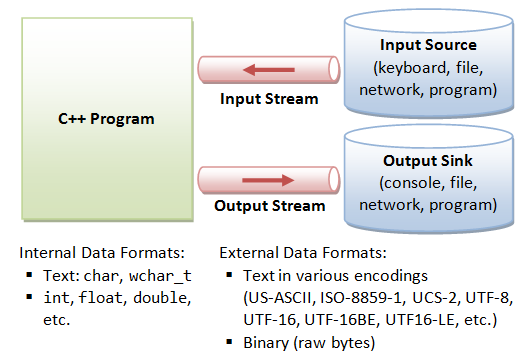

C++ 采用了面向对象的思想对所有涉及 I/O 的操作进行了统一的封装，涉及到 I/O 操作的主要由 <iostream>,<iomanip>,<fstream> 三个头文件组成，stream 是其行为由类定义的对象，其中主要的类的继承关系如下图所示:


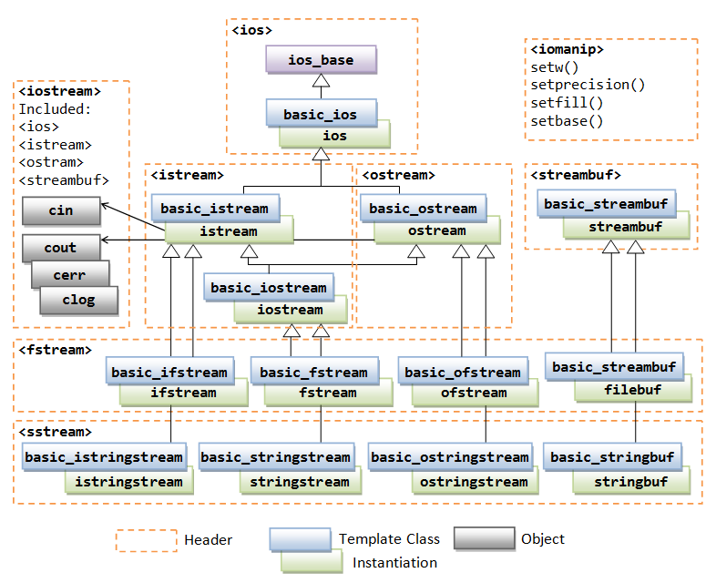


## 计算机网络

#### http和https

面试难度：🌟🌟🌟🌟🌟 面试考核频率：🌟🌟🌟🌟🌟


**2.2.6.1 http 使用过程中存在安全性问题**

使用明文通信，内容可能会被窃听
不验证通信方的身份，通信方的身份有可能遭遇伪装
无法证明报文的完整性，报文有可能遭篡改
所以引入了 https，通过 ssl(Secure Sockets Layer)/tls(Transport Layer Security) 的方式使 http 变成了安全的 https

http 数据发送时 request 直接通过 tcp 发送；数据接收时，tcp 接收的数据作为 response
httpsv数据发送时 request 通过 ssl/tls 进行处理，然后再通过 tcp 进行发送；数据接收时，同样也是要通过 ssl/tls 进行处理。相当于在应用层 http 和传输层 tcp 之间多加了一步处理

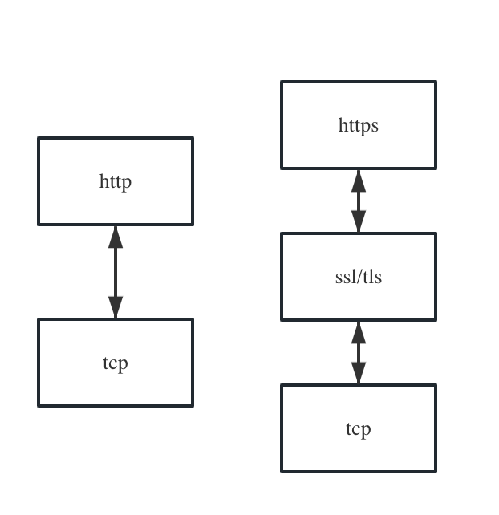

注意：http3.0 传输协议已经从 tcp切换为 udp


**2.2.6.2 https 如何处理这些安全问题**
数据加密
数字证书认证
通过 ssl/tls 报文摘要功能检验报文完整性


**2.2.6.3 数据加密：**
加密方式有两种：对称加密和非对称加密

对称加密：加密和解密使用同一密钥。运算速度快，但无法安全地将密钥传输给数据接收方。
非对称加密：加密和解密使用不同密钥。
非对称加密的密钥分为公钥和私钥，公开密钥所有人都可以获得，数据发送方获得接收方的公开密钥，通过公开密钥进行加密，接收方收到数据后，通过私有密钥解密，获取数据内容。这种方式更安全一点，但运算速度很慢
https 的数据加密分别利用了这两种加密方式的优点。首先通过非对称加密，传输对称加密所需的密钥，然后使用密钥进行通信加密。这样既兼顾了安全性，又有了更高的运算速度。这个流程看似完美无瑕，但其实过程中第一步发送方获取的公开密钥可能被篡改。可以通过数字证书的方式来解决这个问题。


**2.2.6.4 数字证书认证**
数字证书认证机构 (CA, Certificate Authority) 是客户端和服务器双方都信任的第三方机构

服务器事先向数字证书机构申请数字证书，数字证书机构对数据做数字签名，然后将数据和数字签名打包在一起，做成数字证书，发送给服务端
https通信时，服务器把数字证书发给客户端。客户端取得其中的数据和数字签名，使用数字证书机构的公开密钥验证数据和数字签名是否合法
这里数字证书机构的公开密钥不是通过网络获取，而是事先在浏览器内部植入的。浏览器事先会植入常用认证机构的公开密钥。

数字证书中数据可以包含很多的信息。比如：服务端的身份信息，可以非对称加密的公开密钥等等

通过这种方式，即能验证了通信方身份，也可以实现安全加密。


**2.2.6.5 完整性验证**
通过 ssl/tls 报文摘要功能检验报文完整性

http 也提供了 MD5 报文摘要功能，但不是安全的。因为MD5报文摘要的值也是可以被篡改的
https 的报文摘要功能之所以安全，是因为它结合了加密和认证这两个操作；加密 + 摘要检验 + 认证 = 数据完整
2.2.6.6 http和https的区别
https: 使用价格昂贵;速度稍慢;默认端口为 443;通信安全。
http： 免费;速度稍快;默认端口为80;通信不安全。


#### HTTPS为什么比HTTP更安全

⭐⭐⭐⭐⭐ 

在HTTP基础上我们通过加密后，又衍生出了新的通信协议——HTTPS。HTTPS 协议（HyperText Transfer Protocol over Secure Socket Layer）：可以理解为HTTP+SSL/TLS， 即 HTTP 下加入 SSL层，HTTPS 的安全基础是 SSL，因此加密的详细内容就需要 SSL，用于安全的 HTTP 数据传输。


#### HTTPS和HTTP的区别

⭐⭐⭐⭐⭐

1.http是是明文传输，https则是具有安全性的tls加密传输协议。 

2.https除了三次握手以外，还要进行ssl握手，协商加密使用对称密钥 

3.https需要服务端申请证书，浏览器端安装根证书 4. 端口也不一样，前者是80，后者是443


#### HTTPS的通信建立过程

⭐⭐⭐⭐⭐ 

1. 在使用HTTPS是需要保证服务端配置正确了对应的安全证书 

2. 客户端发送请求到服务端 

3. 服务端返回公钥和数字证书到客户端 
4. 客户端接收后会验证证书的安全性，如果通过，则会随机生成一个随机数，用公钥对其加密，发送到 服务端

5. 服务端接受到这个加密后的随机数后，会用私钥对其解密得到真正的随机数，随后用这个随机数当做 对称加密密钥对需要发送的数据进行对称加密

6. 客户端在接收到加密后的数据对称加密密钥与服务器通信。

7. SSL加密建立
